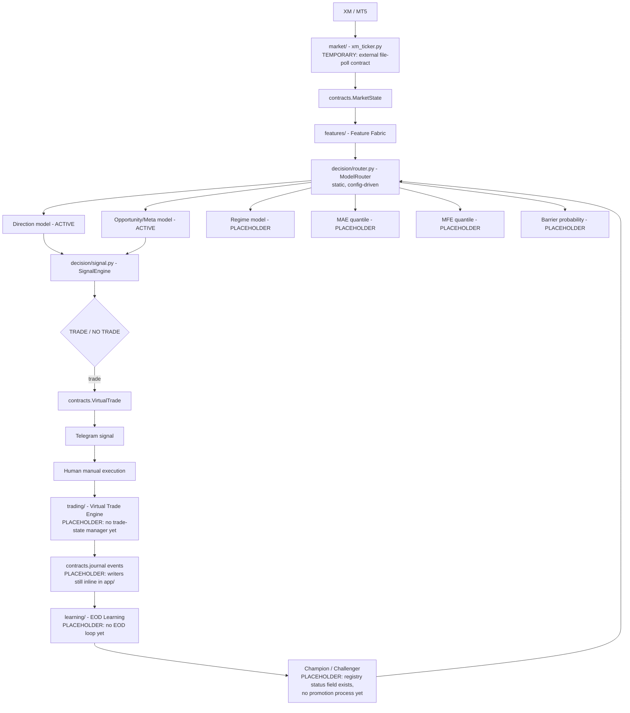

# Golex V3 Architecture

Status: Phase 1 (foundation) complete, 2026-08-18. This document describes
the target architecture and marks explicitly which parts are real today
versus placeholders for later phases — see the diagram's PLACEHOLDER
labels and §Phase 1 status below.

## Purpose

A live quantitative XAUUSD decision system connected to XM through
MT5/Python that continuously observes the market, calculates quantitative
state, uses specialized models, produces one clean Telegram signal with
dynamically justified Entry/SL/TP, tracks the trade virtually, journals
everything, and performs a controlled end-of-day learning process with
champion/challenger validation. The human manually executes the Telegram
signal — this is not an autonomous EA.

## System boundaries

Two zones, one direction of dependency:

- **Live-importable** (reachable from `app/`): `market/`, `features/`,
  `decision/`, `trading/`, `journal/`, `contracts/`, `config/`.
- **Research-only** (never imported by `app/`): `learning/`, `research/`,
  `scripts/`. These may import live-importable modules (e.g.
  `learning/train.py` imports `features/` to build training data) — the
  boundary is one-directional and enforced by `tests/test_boundary.py`,
  an automated import-graph check, not just convention.

## Data flow (target)

## Component responsibilities

| Package | Responsibility |
|---|---|
| `app/` | Live orchestrator entrypoints (`engine.py`, `shadow.py`) — the process that wires market → decision → trading → journal |
| `market/` | MT5 feed connector (`xm_ticker.py`) + `MarketState` contract usage. **Not integrated live infra yet** — see below |
| `features/` | Causal feature computation (`features.py`, `fracdiff.py`, `hurst.py`, `kalman.py`, `volatility.py`) + event/label detection (`labeling.py`, live-critical: `cusum_filter`) |
| `decision/` | The only model-inference code `app/` is allowed to import: `signal.py` (scorer), `router.py` (`ModelRouter`), `calibration.py` (live probability recalibration) |
| `trading/` | Process supervision (`watchdog.py`, `disk_monitor.py`, `space_guard.py`). `VirtualTrade` contract exists in `contracts/`; no trade-state manager built yet |
| `journal/` | Re-exports `contracts/journal.py`'s event schemas. Actual journal files still live in the external `cron/output/` dir, written inline by `app/` — not yet refactored onto these contracts |
| `learning/` | Research/batch-only: `data.py`, `train.py`, `cv.py`, `evaluate.py`, `backtest.py`, `retrain_daily.py`, `seed_refresh.py`. Never imported by `app/` |
| `research/` | Deep empirical research (feature engineering experiments, calibration audits, MAE/MFE studies) — untouched by this refactor |
| `contracts/` | Canonical pydantic schemas: `market_state.py`, `feature_schema.py`, `virtual_trade.py`, `journal.py`, `model_registry.py`. Single authoritative location — no domain redeclares these |
| `config/` | Single source of truth: `schema.py` (pydantic `Config`) + `loader.py` (`load_config()`) + 9 YAML files. No threshold/path/model-ID hardcoded in touched modules |
| `models/` | `registry/` (metadata per model_id) + `active/` (deployed artifacts) + `candidates/` (challengers, e.g. the v2 model paper-traded by `gold-shadow.service`) + `archive/` (superseded) |
| `data/` | The three live-referenced datasets: `gold_seed.csv`, `gold_seed_merged_full6yr.csv`, `xm_bars_backfill.csv` |
| `tests/` | Plain-assert test scripts (no pytest), mirrors the module tree |
| `scripts/` | One-off utilities: data downloaders, the legacy-registry backfill script |
| `services/` | Shell wrappers + process-supervision scripts for the two systemd units |

## Model responsibilities (router roles)

The target architecture routes six specialist roles through one static,
config-driven `ModelRouter`:

- **Direction** — ACTIVE (`direction_catboost_20260818`, CatBoost, 28 features)
- **Opportunity/Meta** — ACTIVE (`opportunity_meta_catboost_20260818`, CatBoost)
- **Regime** — PLACEHOLDER (no model trained yet; `config/models.yaml` has `regime: null`)
- **MAE quantile** — PLACEHOLDER
- **MFE quantile** — PLACEHOLDER
- **Barrier probability** — PLACEHOLDER

A `direction`/`opportunity_meta` **candidate pair** also exists
(`*_v2_20260818`, 26 features, excludes spread/tick_volume) — currently
paper-traded by `gold-shadow.service` (stopped, not restarted in Phase 1).
The router never compares live performance or picks a model dynamically;
model *selection* is exclusively a research/champion-challenger decision
(a later phase) — the router's only job at inference time is loading
whatever `config/models.yaml` says research has approved.

## Research/live separation

Enforced two ways: (1) directory convention — `learning/` and `research/`
are never imported by `app/`; (2) `tests/test_boundary.py` — an automated
AST-based import-graph check that fails loudly if that ever becomes false.
This is not a runtime sandbox; it's a cheap, automated tripwire.

## Versioning

Every model artifact is described by a `contracts.model_registry.ModelRegistryEntry`
(pydantic-validated JSON in `models/registry/`): `model_id`, `family`,
`algorithm`, `artifact_path`, `feature_schema_version`, `feature_cols`
(locked), `training_config` (locked), `training_period`,
`validation_period`, `created_at`, `status`
(`candidate`/`active`/`archived`/`rejected`), `is_champion`, `metrics`,
`lineage`. Old v7 LightGBM artifacts have best-effort backfilled entries
(`scripts/backfill_legacy_registry.py`) with empty `feature_cols`/
`training_config` rather than fabricated values — what's not honestly
recoverable is left `null`, not invented.

## Journal lineage

`contracts/journal.py` defines one pydantic model per lifecycle stage —
`SignalEvent`, `MarketStateEvent`, `ManagementEvent`, `ExecutionEvent`,
`ResolutionEvent`, `LearningEvent` — each carrying `schema_version` and a
`trade_id` linking key. **Not yet wired into the write path**: `app/engine.py`
and `app/shadow.py` still write their own ad hoc dicts directly to
`trade_journal_ai.jsonl`/`live_outcomes.jsonl`/`shadow_journal.jsonl` in
the external `cron/output/` directory. Adopting the pydantic contracts in
the actual write path is later-phase work.

## Future learning architecture

`learning/retrain_daily.py` already implements a guarded nightly retrain
(refuse to promote if OOF accuracy regresses beyond a tolerance,
`config/learning.yaml`'s `acc_regression_tolerance`) that promotes into
`models/active/` with a timestamped archive of what it replaces. It does
**not** yet write a `models/registry/*.json` entry on promotion — the
registry will go stale relative to `active/`'s actual contents after an
automated promotion until a later phase wires registry writes into this
flow. The full EOD learning window (calibration analysis, feature/regime
drift, MAE/MFE error, EV error) and champion/challenger promotion process
from the original spec are not built — Phase 1 only established the
registry/router foundation they'll plug into.

## Phase 1 status: what's real vs placeholder

**Real:** contracts (all 5), config (single source of truth, 9 categories),
model registry (registry/active/candidates/archive split, 4 CatBoost
entries + 39 backfilled legacy entries), model router (works for the 2
populated roles), production/research boundary (tested), the two live
engines relocated and re-wired to the router/config (behavior-preserving).

**Placeholder:** `market/`'s live feed integration (still the external
file-polling contract), `trading/`'s virtual trade engine (contract exists,
no manager), `journal/`'s contract adoption in the write path, all four
unpopulated router roles, EOD learning, champion/challenger promotion
execution. These are explicitly Phase 2+ scope, not oversights.
