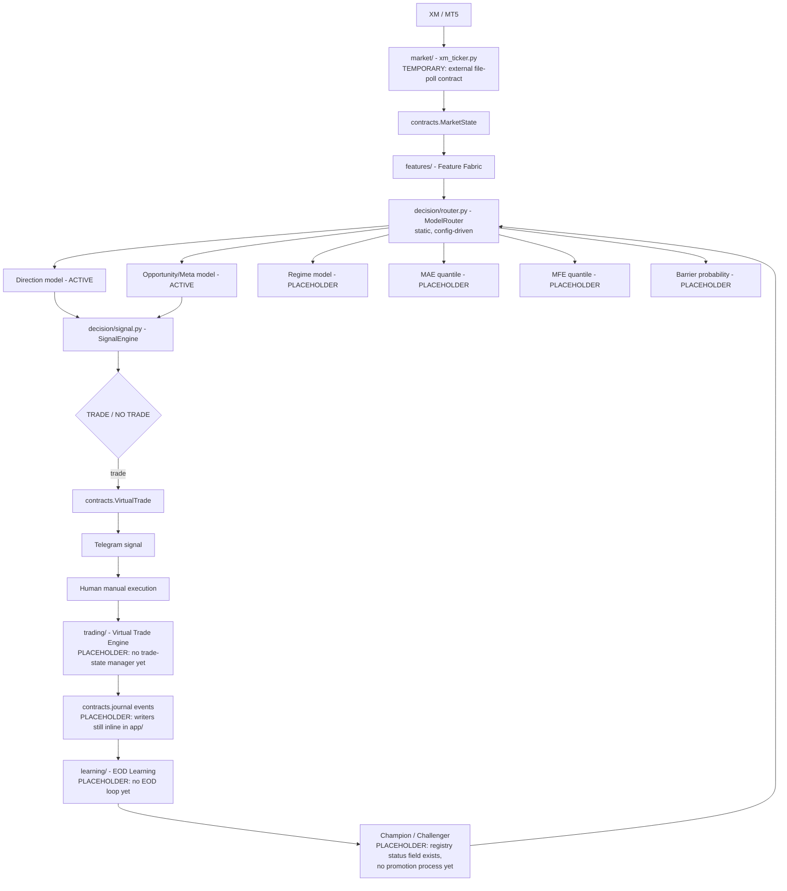
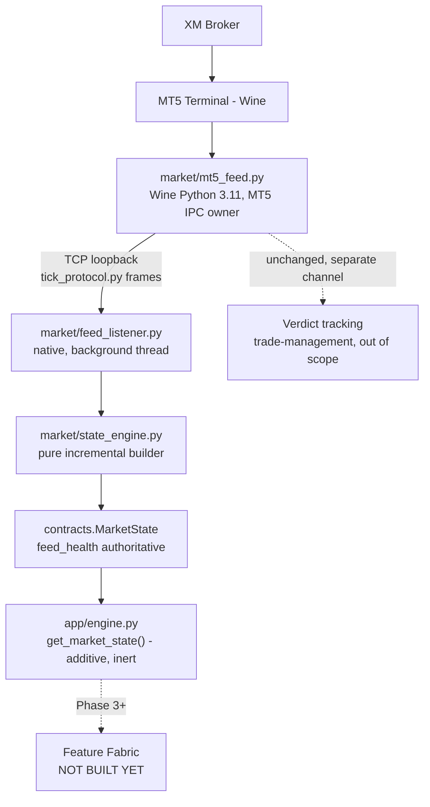
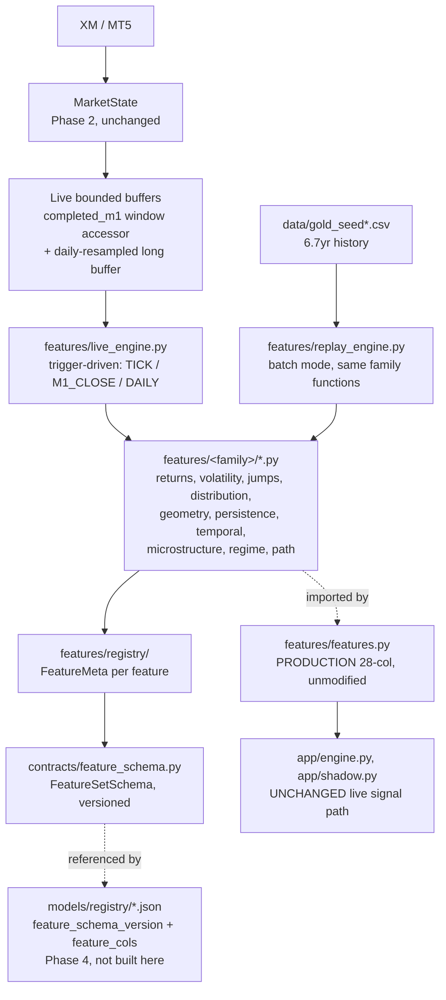
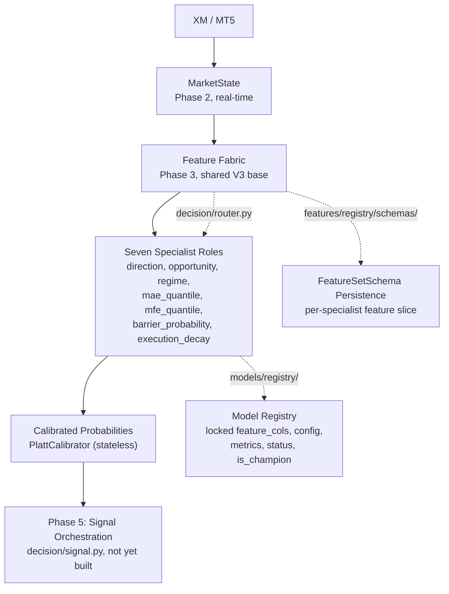

# Golex V3 Architecture

Status: Phase 1 (foundation) complete, 2026-08-18. This document describes
the target architecture and marks explicitly which parts are real today
versus placeholders for later phases — see the diagram's PLACEHOLDER
labels and §Phase 1 status below.

## Purpose

A live quantitative XAUUSD decision system connected to XM through
MT5/Python that continuously observes the market, calculates quantitative
state, uses specialized models, produces one clean Telegram signal with
dynamically justified Entry/SL/TP, tracks the trade virtually, journals
everything, and performs a controlled end-of-day learning process with
champion/challenger validation. The human manually executes the Telegram
signal — this is not an autonomous EA.

## System boundaries

Two zones, one direction of dependency:

- **Live-importable** (reachable from `app/`): `market/`, `features/`,
  `decision/`, `trading/`, `journal/`, `contracts/`, `config/`.
- **Research-only** (never imported by `app/`): `learning/`, `research/`,
  `scripts/`. These may import live-importable modules (e.g.
  `learning/train.py` imports `features/` to build training data) — the
  boundary is one-directional and enforced by `tests/test_boundary.py`,
  an automated import-graph check, not just convention.

## Data flow (target)

## Component responsibilities

| Package | Responsibility |
|---|---|
| `app/` | Live orchestrator entrypoints (`engine.py`, `shadow.py`) — the process that wires market → decision → trading → journal |
| `market/` | MT5 feed connector (`xm_ticker.py`) + `MarketState` contract usage. **Not integrated live infra yet** — see below |
| `features/` | Causal feature computation (`features.py`, `fracdiff.py`, `hurst.py`, `kalman.py`, `volatility.py`) + event/label detection (`labeling.py`, live-critical: `cusum_filter`) |
| `decision/` | The only model-inference code `app/` is allowed to import: `signal.py` (scorer), `router.py` (`ModelRouter`), `calibration.py` (live probability recalibration) |
| `trading/` | Process supervision (`watchdog.py`, `disk_monitor.py`, `space_guard.py`). `VirtualTrade` contract exists in `contracts/`; no trade-state manager built yet |
| `journal/` | Re-exports `contracts/journal.py`'s event schemas. Actual journal files still live in the external `cron/output/` dir, written inline by `app/` — not yet refactored onto these contracts |
| `learning/` | Research/batch-only: `data.py`, `train.py`, `cv.py`, `evaluate.py`, `backtest.py`, `retrain_daily.py`, `seed_refresh.py`. Never imported by `app/` |
| `research/` | Deep empirical research (feature engineering experiments, calibration audits, MAE/MFE studies) — untouched by this refactor |
| `contracts/` | Canonical pydantic schemas: `market_state.py`, `feature_schema.py`, `virtual_trade.py`, `journal.py`, `model_registry.py`. Single authoritative location — no domain redeclares these |
| `config/` | Single source of truth: `schema.py` (pydantic `Config`) + `loader.py` (`load_config()`) + 9 YAML files. No threshold/path/model-ID hardcoded in touched modules |
| `models/` | `registry/` (metadata per model_id) + `active/` (deployed artifacts) + `candidates/` (challengers, e.g. the v2 model paper-traded by `gold-shadow.service`) + `archive/` (superseded) |
| `data/` | The three live-referenced datasets: `gold_seed.csv`, `gold_seed_merged_full6yr.csv`, `xm_bars_backfill.csv` |
| `tests/` | Plain-assert test scripts (no pytest), mirrors the module tree |
| `scripts/` | One-off utilities: data downloaders, the legacy-registry backfill script |
| `services/` | Shell wrappers + process-supervision scripts for the two systemd units |

## Model responsibilities (router roles)

The target architecture routes six specialist roles through one static,
config-driven `ModelRouter`:

- **Direction** — ACTIVE (`direction_catboost_20260818`, CatBoost, 28 features)
- **Opportunity/Meta** — ACTIVE (`opportunity_meta_catboost_20260818`, CatBoost)
- **Regime** — PLACEHOLDER (no model trained yet; `config/models.yaml` has `regime: null`)
- **MAE quantile** — PLACEHOLDER
- **MFE quantile** — PLACEHOLDER
- **Barrier probability** — PLACEHOLDER

A `direction`/`opportunity_meta` **candidate pair** also exists
(`*_v2_20260818`, 26 features, excludes spread/tick_volume) — currently
paper-traded by `gold-shadow.service` (stopped, not restarted in Phase 1).
The router never compares live performance or picks a model dynamically;
model *selection* is exclusively a research/champion-challenger decision
(a later phase) — the router's only job at inference time is loading
whatever `config/models.yaml` says research has approved.

## Research/live separation

Enforced two ways: (1) directory convention — `learning/` and `research/`
are never imported by `app/`; (2) `tests/test_boundary.py` — an automated
AST-based import-graph check that fails loudly if that ever becomes false.
This is not a runtime sandbox; it's a cheap, automated tripwire.

## Versioning

Every model artifact is described by a `contracts.model_registry.ModelRegistryEntry`
(pydantic-validated JSON in `models/registry/`): `model_id`, `family`,
`algorithm`, `artifact_path`, `feature_schema_version`, `feature_cols`
(locked), `training_config` (locked), `training_period`,
`validation_period`, `created_at`, `status`
(`candidate`/`active`/`archived`/`rejected`), `is_champion`, `metrics`,
`lineage`. Old v7 LightGBM artifacts have best-effort backfilled entries
(`scripts/backfill_legacy_registry.py`) with empty `feature_cols`/
`training_config` rather than fabricated values — what's not honestly
recoverable is left `null`, not invented.

## Journal lineage

`contracts/journal.py` defines one pydantic model per lifecycle stage —
`SignalEvent`, `MarketStateEvent`, `ManagementEvent`, `ExecutionEvent`,
`ResolutionEvent`, `LearningEvent` — each carrying `schema_version` and a
`trade_id` linking key. **Not yet wired into the write path**: `app/engine.py`
and `app/shadow.py` still write their own ad hoc dicts directly to
`trade_journal_ai.jsonl`/`live_outcomes.jsonl`/`shadow_journal.jsonl` in
the external `cron/output/` directory. Adopting the pydantic contracts in
the actual write path is later-phase work.

## Future learning architecture

`learning/retrain_daily.py` already implements a guarded nightly retrain
(refuse to promote if OOF accuracy regresses beyond a tolerance,
`config/learning.yaml`'s `acc_regression_tolerance`) that promotes into
`models/active/` with a timestamped archive of what it replaces. It does
**not** yet write a `models/registry/*.json` entry on promotion — the
registry will go stale relative to `active/`'s actual contents after an
automated promotion until a later phase wires registry writes into this
flow. The full EOD learning window (calibration analysis, feature/regime
drift, MAE/MFE error, EV error) and champion/challenger promotion process
from the original spec are not built — Phase 1 only established the
registry/router foundation they'll plug into.

## Phase 1 status: what's real vs placeholder

**Real:** contracts (all 5), config (single source of truth, 9 categories),
model registry (registry/active/candidates/archive split, 4 CatBoost
entries + 39 backfilled legacy entries), model router (works for the 2
populated roles), production/research boundary (tested), the two live
engines relocated and re-wired to the router/config (behavior-preserving).

**Placeholder:** `market/`'s live feed integration (still the external
file-polling contract), `trading/`'s virtual trade engine (contract exists,
no manager), `journal/`'s contract adoption in the write path, all four
unpopulated router roles, EOD learning, champion/challenger promotion
execution. These are explicitly Phase 2+ scope, not oversights.

## Phase 2: Real-Time Market-State Pipeline

Status: complete, 2026-08-18. Replaces Phase 1's placeholder `market/`
(external file-polling) with a managed MT5 feed process and an
incremental `MarketState` builder — live-verified against a real XM
connection.

### The Wine/native process boundary

`MetaTrader5` (the Python package) is Windows-only and is not, and
cannot be, installed in this repo's native venv — confirmed by a direct
`ModuleNotFoundError`. It wraps IPC to the Windows MT5 terminal, which
here runs under Wine. This means a managed MT5 feed process is
unavoidably a **separate OS process across a Wine↔native boundary** —
no design eliminates this, only makes it fast and clean. `market/mt5_feed.py`
runs under `wine python.exe`, a completely separate Python 3.11
interpreter with no third-party packages beyond `MetaTrader5` itself
(confirmed pydantic-free by an automated import-set check).

### Live data flow

Two processes, bridged by a TCP loopback socket with the **native side as
server**: `feed_listener.py` binds a port and persists/restarts
independently of the Wine side; `mt5_feed.py` (Wine) is the client and
owns reconnect, extending the same MT5-reconnect discipline one level
out. Wire format (`tick_protocol.py`) is newline-delimited JSON, stdlib-only
on both sides — no pydantic dependency added to the Wine process.

### Tick and MarketState contracts

`contracts/tick.py`'s `Tick` carries `market_timestamp` (broker-clock,
offset-corrected to true UTC) and `ingestion_timestamp` (native-side wall
clock) as two distinct fields, plus `bid`/`ask`/`mid`/`spread`/optional
`tick_volume`. `last` stays `Optional`/unset — confirmed `UNSUPPORTED_BY_DATA`
for `GOLD.i#` (never read anywhere in the proven ticker code this was
ported from). `internal_seq` is `feed_listener.py`'s own monotonic
counter, explicitly not a broker sequence (MT5 provides none).

`contracts/market_state.py`'s `MarketState` adds identity/versioning
(`symbol`, `source`, `state_version`, `sequence`), three named timestamps
(`market_timestamp`/`ingestion_timestamp`/`processing_timestamp`, never
mixed), price with `DataQuality` on `last`, activity counts, `current_m1`/
`completed_m1` (`M1BarState.complete` is explicit, never inferred),
window-bounded volatility inputs, and `FeedHealthState` — authoritative:
a consumer must check it before trusting price fields.

### Timestamp handling

Three points, always kept separate: `market_timestamp` (MT5 server time,
offset-corrected — the offset is measured live, not assumed, and rounds
to the nearest 0.5h), `ingestion_timestamp` (stamped by `feed_listener.py`
at actual socket receipt — **never** sent over the wire by `mt5_feed.py`,
which cannot know when the native side will receive a tick; an earlier
draft got this backwards and was caught before Task 10 could inherit the
mistake). `processing_timestamp` is stamped by `state_engine.py` when it
finishes updating state. UTC internally, everywhere — presentation-layer
conversion only at the log-formatting boundary.

### Latency measurement

`feed_latency_sec` (ingestion − market), `state_update_latency_sec`
(processing − ingestion), and a decision-ready latency measured at
`app/engine.py`'s accessor call site. **Live-measured** (2026-08-18, 90s
window, real XM connection, 504 ticks): `state_update_latency_sec`
consistently ~100–400μs. `feed_latency_sec` ran ~0.15–1.2s — real, but
attributable to the 0.5h-granularity offset measurement rather than true
network/processing delay (residual sub-offset broker clock skew shows up
directly as apparent feed latency); documented as a limitation, not
hidden. **Synthetic** (`tests/test_performance.py`, labeled throughout,
never blended with the live numbers): 20,000 ticks in 22.2s → 902
ticks/sec sustained, p50=1274μs p95=1646μs p99=1892μs per-tick processing,
~762KB steady-state memory.

### Feed health and reconnect

`FeedHealthState`: `CONNECTED`/`STALE`/`RECONNECTING`/`DISCONNECTED`/
`INVALID`/`UNKNOWN`. `feed_listener.py` classifies every anomaly
explicitly (malformed frame, timestamp reversal, duplicate tick, spread
anomaly) rather than silently continuing — a duplicate is identical
`market_timestamp`+`bid`+`ask`; out-of-order is any earlier
`market_timestamp` than the last accepted tick; both are rejected, never
crash the listener. Reconnect is `mt5_feed.py`-side, bounded exponential
backoff (1s/2s/4s/8s, capped), independent of the MT5 connection itself —
a socket failure never blocks or pauses the tick loop. Live-verified:
`feed_health` stayed `CONNECTED` for the entire 90s/504-tick window.

### M1 construction

Ported behavior-preserving from the proven bar-build logic (MT5
convention: OHLC from bid, minute-bucketed). `current_m1` (`complete=False`)
updates in place; on minute rollover the finished bar copies into
`completed_m1` (`complete=True`) and a fresh `current_m1` starts.
Downstream code reads `complete` explicitly — never infers it from field
presence, which is what actually prevents lookahead.

### State buffering and incremental correctness

Bounded, in-memory only: a 300s tick ring buffer plus a separate 60s
ring buffer (added after profiling showed the original single-buffer
rescan was O(window) per tick where O(1) was achievable — see below), and
up to 480 completed M1 bars (~8h). No historical dataset load in the live
process — `StateEngine.bootstrap()` is the one explicit, startup-only
exception, seeded via a `backfill` wire frame sent once per connection.
Incremental spread statistics are proven to match a from-scratch reference
calculation on the same window (`tests/test_state_engine.py`).

Two real performance bugs were found and fixed via `tests/test_performance.py`,
not left as an "unoptimized baseline": `tick_count_60s` originally rescanned
the full 300s buffer every tick (fixed with a dedicated O(1)-amortized 60s
buffer), and `spread_std_60s` used `statistics.pstdev`, which profiled at
~94% of `on_tick`'s total runtime (it uses exact `Fraction` arithmetic
internally) — replaced with plain float variance, re-verified against the
correctness reference to 1e-9.

### Legacy retirement — precise scope

`market/xm_ticker.py` is archived (`.archive/legacy-xm-ticker-2026-08-18/`),
`trading/watchdog.py` now launches/monitors `mt5_feed.py`. **Scope
correction made during implementation:** `mt5_feed.py` is a
behavior-preserving *superset* of `xm_ticker.py`, not a replacement of
its market-data half — it keeps every existing STATE/BARS_LIVE/
BARS_BACKFILL/OFFSET_FILE write unchanged (`app/engine.py`'s real signal
generation, market-closed gating, and trade-verdict tracking still depend
on those files) and *additively* pushes the new socket frames alongside.
The original plan draft considered splitting market-data from
verdict-tracking file writes; that was reconsidered while writing the
file as unnecessary risk to live trading behavior for a phase whose
charter is infrastructure, not trading changes. Verdict-tracking itself
is untouched, unmigrated, exactly as confirmed in scope discussions.

### Model routing compatibility

No change to `decision/router.py`, `models/registry/`, or
`config/models.yaml`. `MarketState`'s shape is deliberately
family-agnostic raw state, not a feature vector tied to any one model's
input schema — Phase 1's router already supports arbitrary future model
families via the `ModelFamily` literal; Phase 2 adds no new roles and
hardcodes nothing beyond what was already CatBoost-specific in Phase 1.

### MT5/XM limitations discovered

- `last` and `real_volume` are `UNSUPPORTED_BY_DATA` for `GOLD.i#` —
  never read by any proven code path.
- No MT5 session-hours API is used or assumed to exist; XM session hours
  (Fri ≥21:00 UTC close, Sat all day, Sun <22:00 UTC, daily break
  21:00–22:00 UTC Mon–Thu) are empirically reverse-engineered from live
  bars, ported unchanged into `state_engine.is_market_closed()`.
- MT5 server clock offset is not fixed, must be measured live, and is
  only known to 0.5h granularity — the dominant contributor to measured
  `feed_latency_sec` in the live-verification window (Section above),
  not real network delay.
- No raw tick-level history is persisted anywhere in this system — only
  M1 OHLC bars. Any tick-level replay must be synthetic and labeled as
  such; there is no real XM tick dataset to validate against.
- `time_msc` (millisecond MT5 timestamp) is available per the documented
  API surface but unused/unverified against XM's actual sub-second
  precision — noted as a future opportunity, not implemented here.

## Phase 3: Quantitative Feature Fabric

Status: complete, 2026-08-19. Builds the quantitative language on top of
Phase 2's `MarketState`: a broad, research-grade, non-redundant,
data-honest feature universe, formally registered with metadata,
versioned, and reproducible identically in both live inference and
historical replay. No new models, no dynamic SL/TP, no EV gate — the
production signal path (`app/engine.py`'s CatBoost call, `app/shadow.py`)
is untouched. Full design:
`docs/superpowers/specs/2026-08-19-golex-v3-phase3-feature-fabric-design.md`.

### Architecture

Two entry points into the same family math: `live_engine.py` (bounded,
trigger-driven, `MarketState`-fed) and `replay_engine.py` (batch,
historical CSV-fed, for future Phase 4 dataset building). Both call the
*same* functions in `features/<family>.py` — the core design choice that
makes live/replay numerical equivalence close to true by construction
instead of a second implementation to maintain and drift-check forever.
`research/features_v3.py`'s original 92 candidate functions moved into
`features/<family>.py` (function bodies preserved, behavior-preserving —
same pattern Phase 2 used for `mt5_feed.py`). `features/features.py`
itself was not edited; it became registry family `baseline_v1`, its 28
columns individually registered against their real implementations.

### Registry design

`contracts/feature_schema.py`'s `FeatureDescriptor` (extended from a
Phase 1 stub, not replaced) carries the full metadata set per feature:
`family`, `mathematical_definition`, `source_module`, `required_state`,
`update_trigger` (`TICK`/`M1_CLOSE`/`DAILY`/`EVENT`), `causal`,
`live_compatible`, `computational_cost`, `warmup_bars`,
`historical_coverage` (`FULL_HISTORY`/`PARTIAL_HISTORY`/`LIVE_ONLY`/
`RESEARCH_ONLY`/`UNSUPPORTED`), `status`
(`REQUIRED`/`USEFUL`/`OPTIONAL`/`UNSUPPORTED_BY_DATA`/`REDUNDANT`/
`REJECTED`) with a mandatory `status_reason`, an optional `evidence_ref`
pointing into `research/output/*.json`, and `version`. `features/registry/`
holds one validated JSON per feature, one subdirectory per family, plus
`build_schema(schema_id, schema_version, feature_ids) -> FeatureSetSchema`
in `features/registry/__init__.py`. The registry currently holds 125
descriptors: 28 `baseline_v1` (the production set) + 92 candidates moved
from `research/features_v3.py` + 5 new live-only `microstructure_live`
features. The registry preserves the *entire* quantitative universe —
`build_schema()` lets a future model role construct its own named slice
from it; nothing here pre-selects one universal feature set.

### Live/replay equivalence

`tests/test_live_replay_equivalence.py` (Task 23) feeds an identical
synthetic tick sequence through both `LiveFeatureEngine.on_m1_close` and
`replay_engine.build_candidate_features`, asserting agreement on every
feature the two engines actually share. Real verified result: over a
6000-tick / 3-completed-bar run, 97 features were in the live snapshot
(26 `VALID`, 64 `WARMING_UP`, 7 `UNAVAILABLE`); of the 26 `VALID`
features, 21 matched replay within tolerance and the other 5 were the
`microstructure_live` TICK-triggered features with no batch/replay
column to compare against at all (a structural, by-design difference,
not a gap) — `checked=21`, confirmed non-vacuous by instrumenting the
VALID/WARMING_UP/UNAVAILABLE breakdown rather than trusting the assertion
count alone. No genuine discrepancy was found; `features/live_engine.py`
required no changes.

### Historical coverage findings

`research/historical_coverage.py`'s `measure_coverage()` (Task 1),
executed against the real `data/gold_seed_merged_full6yr.csv` (2,456,224
rows), measured:

- `real_volume_nonzero_frac` = 0.2383 — real volume is nonzero for only
  ~24% of rows, matching Phase 2's live finding that `real_volume` is
  `UNSUPPORTED_BY_DATA` for `GOLD.i#`.
- `tick_volume_nonzero_frac` = 0.4062, `tick_volume_degrades_after` =
  `2020-09-28` — tick_volume is real in early history and degrades to
  near-zero after that date; features depending on it are marked
  `PARTIAL_HISTORY`, not silently assumed valid across the full 6.7 years.
- `spread_constant_frac` = 0.9889 — the historical spread column is
  constant for 98.9% of rows, across 107 unique spread values observed
  in total (range 20.0–194.0) — a near-dead historical feature (matching
  `research/output/SUMMARY.md` finding #9's zero CatBoost importance),
  but Phase 2's live feed provides a genuinely dynamic real-time spread
  with no historical analogue, captured instead by the new live-only
  `microstructure_live` family.

### The causality-test gap (found and closed)

`research/features_v3.py`'s own docstring claimed causality was
"verified by `research/v3_causality_check.py`'s truncation test" — that
file did not exist anywhere in the repo; the claim was backed only by a
code-construction argument, not an executable test. Task 17 built the
real test and, during review, found a second, more concrete gap in its
own first draft: at the brief's literal `n=500`/`check_rows=250`
parameters, 4 candidate columns (3 DAILY-resample features needing
~86,400 minute-rows, plus `fracdiff_slope_60` needing ~1516 rows) were
only vacuously checked (NaN compared against NaN), and the 28 baseline
columns were never compared at all despite the report initially claiming
"120 columns checked." Both were fixed in place: the comparison was
extended to cover the 28 baseline columns, and a second, appropriately
scaled test (a longer minute-frequency series for `fracdiff_slope_60`,
dedicated daily-frequency synthetic data for the 3 DAILY-resample
features) was added so those get real, non-vacuous coverage too. Final
state: 120/120 columns genuinely exercised, zero real causality
violations found — this was a coverage gap in the test, not a bug in any
feature.

### The new live-only family and its diagnostics

`features/microstructure_live.py` (Task 21) exists only because Phase 2
gave this system a real live bid/ask tick stream — a thing the 6.7-year
OHLC-only CSV cannot express at all. Its 5 features
(`spread_change_live`, `spread_shock_zscore_live`,
`tick_interarrival_mean_60s`, `tick_interarrival_std_60s`,
`tick_arrival_burstiness_60s`) are registered `historical_coverage=
LIVE_ONLY`, `status=OPTIONAL`, no `evidence_ref` — explicitly not
validated, pending real Phase 4 evaluation.

`features/registry/diagnostics.py`'s `correlation_redundancy()` and
`distribution_stability()` were generalized from the original
92-feature-selection methodology and applied fresh to this family, since
it has no prior evidence to lean on (Task 26). The honest result, after a
fix round corrected an initial threshold-only readout that had
overstated the family as "well-designed with minimal redundancy": no
pair exceeds the 0.95 redundancy threshold, but the full correlation
matrix shows two real, substantial sub-threshold correlations —
`spread_change_live` vs `spread_shock_zscore_live` r=0.714 (expected:
both derive from the same underlying spread-shock signal, one raw and
one standardized), and `tick_interarrival_std_60s` vs
`tick_arrival_burstiness_60s` r=0.871 (expected: burstiness is a
function of interarrival dispersion). Additionally, 3 of the 5 features
(the interarrival mean/std and burstiness) came back quasi-constant
(coefficient of variation < 0.02) in this run — not evidence those
features are redundant or well-exercised, but a limitation of
`market/synthetic_replay.py`'s `generate_ticks()`, which draws i.i.d.
interarrival gaps with no clustering/regime structure, the exact
structure "burstiness" is meant to detect. The corrected conclusion:
"threshold-clean, not correlation-free" — no near-duplicate pair by the
0.95 cutoff, but real moderate-to-strong correlation in 2 of 10 pairs
that a downstream feature-selection step should be aware of, and weak
(not strong) evidence either way on the 3 quasi-constant features.

### Model-routing compatibility

No change to `decision/router.py`, `models/registry/`, or
`config/models.yaml`. Task 15 demonstrated the routing hook directly:
28 `FeatureDescriptor` JSONs were written for the deployed production
feature set (`features/registry/baseline_v1/`), and
`build_schema("baseline_v1", "root-28col-2026-08-18", feature_ids)`
reproduces `models/registry/direction_catboost_20260818.json`'s real
`feature_cols` list in its exact deployed order — proving the registry
can drive a `FeatureSetSchema` construction for an existing model's
schema, not just a hypothetical one. The same `build_schema()` hook in
`features/registry/__init__.py` is what a future Phase 4 specialist
model uses to construct its own named slice from the full 125-feature
universe against its own target, without the fabric ever assuming one
universal vector.

### Performance

`tests/test_feature_performance.py` (Task 28), a `[SYNTHETIC]`-labeled
two-pass benchmark of `LiveFeatureEngine.on_m1_close` matching Phase 2's
own `test_performance.py` precedent (real 2026-08-19 measurement, 20,000
synthetic ticks / 11 real bar closes for timing, a separate 6,000-tick
pass under `tracemalloc` for memory): p50=25039μs, p95=254141μs,
p99=435521μs — comfortably under the 2s budget — and 586.6KB peak traced
memory. The wide p50→p99 spread was investigated rather than accepted at
face value: it isolates entirely to a one-time ~495ms numba JIT
compilation cost on the very first real `on_m1_close` call (confirmed
`@numba.njit`-decorated modules genuinely in the call graph:
`first_passage.py`, `distribution_info.py`, `persistence.py`, `hurst.py`,
`fracdiff.py`, `kalman.py`, `market_geometry.py`, `returns_dynamics.py`),
not a recurring or data-size-scaling cost — every call after the first is
a stable ~25–30ms regardless of window size. Caveat added during review:
at n≈10-11 samples, p99 is essentially just the observed max, not a
statistically robust tail estimate.

### Out of scope (explicit)

No new models, no specialist-model feature *selection* (Phase 4), no
dynamic SL/TP, no EV gate, no virtual trade management, no EOD learning,
no champion/challenger, no changes to `app/engine.py`'s live decision
path or `features/features.py`'s production math, no re-running the
existing 92-feature OOF research (the 17-survivors evidence stays as
historical evidence describing what helped one past model/config — not a
universal filter for what any future specialist model should use).

## Phase 4: Specialist Quantitative Model Layer

Status: research complete, documentation in place, 2026-08-22. Seven
independent specialist roles answer distinct risk/opportunity questions on
XAUUSD, each with its own feature schema, target definition, and OOS
evaluation. Production behavior (`app/engine.py`, `decision/signal.py`,
Telegram delivery, two existing production champion models) is
byte-for-byte unchanged. Full design: `docs/superpowers/specs/2026-08-22-golex-v3-phase4-specialist-models-design.md`.

### Architecture: market→state→features→specialists→calibrated probabilities

Each specialist operates on the same **shared 45-column foundation** (28 baseline
Phase 1/3 production features + 17 useful-status V3 candidates, Tasks 3 and 26),
but narrows to its own feature schema via out-of-sample importance ranking —
no feature set is reused unnarrowed across roles.

### The seven specialist roles: validated/candidate/rejected outcomes

**Task 4 — Direction** (binary classifier, CatBoost, input: 28-col baseline → final schema varies by horizon)

- h=15: n=302,134 OOS events, mean_oof_accuracy=0.5139 → **validated** (baseline 0.5115)
- h=45: n=300,547 OOS events, mean_oof_accuracy≈0.51154 → **validated** (gate is `mean_oof_acc > 0.5115`; this candidate clears the baseline by a razor-thin margin, not an exact match, spec-compliant)
- h=90: n=298,431 OOS events, accuracy=0.5063 → **rejected** (misses threshold)
- Embargo: 90 bars hardcoded per `learning.train.EMBARGO_BARS`, applies uniformly across all horizons (not horizon-scaled)

**Task 5 — Opportunity/Meta** (trade-filter classifier, CatBoost)

- h=15: n=302,134 OOS events, win_rate=0.5097 → **validated** (baseline 0.4887, +2.1%)
- h=45: n=300,547 OOS events, win_rate=0.4862 → **rejected** (thin miss against the 0.4887 threshold)
- h=90: n=298,431 OOS events, win_rate=0.3986 → **rejected**

**Task 6 — Regime** (unsupervised state classifier, Gaussian HMM, 4 components)

- mean_run_length=45.86 bars, transition_matrix_drift=0.00444 (stable, fold0→fold5)
- per-state win-rate confidence intervals disjoint: state0 [0.618, 0.626] vs state3 [0.389, 0.396]
- genuine, validated downstream predictive separation found → **validated**

**Task 7 — MAE Quantile** (quantile regressor, 3 targets: 0.5/0.75/0.9)

- h=15: n=254,442 events, quantile coverage within ±0.006–0.015 of target → **validated**
- h=45: n=253,052 events, coverage likewise → **validated**
- h=90: n=251,297 events, coverage likewise → **validated**
- Coverage assessed both globally and per-volatility-regime tercile, all meeting spec

**Task 8 — MFE Quantile** (quantile regressor, 3 targets: 0.5/0.75/0.9, parallel pipeline to Task 7)

- h=15: n=254,442 events, quantile coverage within ±0.006–0.015 of target → **validated**
- h=45: n=253,052 events, coverage likewise → **validated**
- h=90: n=251,297 events, coverage likewise → **validated**

**Task 9 — Barrier Probability** (calibrated probability estimator, CatBoost via `research.audit_edge.oof_run`, distinct from Direction)

- h=15: n=213,022 OOS events, log_loss=0.6744, max_calibration_gap=0.0532 → **validated** (gap threshold 0.15)
- h=45: n=211,949 OOS events, log_loss=0.6728, calibration_gap=0.0146 → **validated**
- h=90: n=210,589 OOS events, log_loss=0.6476, calibration_gap=0.0765 → **validated**
- Cross-horizon: log_loss and Brier score improve mildly h15→h90, stability good

**Task 10 — Execution/Decay** (post-signal price drift proxy, status: candidate)

- Status: **DATA_LIMITED** — no real human-execution-latency data exists in this repo (Telegram is one-way fire-and-forget)
- Post-signal price-drift PROXY computed instead: n_events=313,254
  - 30s drift: 0.0 bps (degenerate, M1-bar-resolution design, not a bug, documented)
  - 60s drift: 2.15 bps
  - 120s drift: 2.98 bps
- Honest finding: real execution-latency validation impossible until human order-entry is instrumented

**Task 11 — Real-Tick Capture Infrastructure** (opt-in, defaults false everywhere)

- `TickCapture` class wired into `market/feed_listener.py` and `app/engine.py`
- Config flag `tick_capture_enabled` defaults false at every layer (dataclass, YAML, constructor)
- Verified byte-for-byte: production behavior **unchanged when disabled** (the default)
- 5 live-only microstructure features remain **OPTIONAL**, pending future real capture window
- Task 11 real-data microstructure validation: **DATA_LIMITED** (no XM feed reachable this session, 0 real ticks captured)
- Synthetic replay evidence explicitly not substituted for real data in leakage audit

### Leakage audit and registry integrity (Task 12)

`tests/test_phase4_leakage.py`: 4 independent tests, all **pass**

1. **Train/test fold [t0, t1) split audit** — no temporal overlap across CV folds
2. **Future-bar feature leakage regression** — no feature depends on bars after t_obs
3. **PlattCalibrator statefulness** — calibrator is stateless and pure; fit() produces no hidden side effects
4. **Registry status integrity** — every Phase 4 registry entry has `is_champion=false` and `status` never `active`

### Model registry and routing (Tasks 1, 13)

`contracts/model_registry.py` extends with:
- `ModelFamily` literal: seven roles above plus `execution_decay`
- `ModelStatus` literal: `candidate`, `validated`, `active`, `archived`, `rejected`
- Separate `is_champion` boolean flag (independent of status)

`decision/router.py` remains static, config-driven, and does **not** compare live performance
or pick models dynamically. Model *selection* is exclusively a research-phase decision
(Phase 5 EOD learning). The router's only job: given a role, look up the model_id in
`config/models.yaml`, load the registry entry from `models/registry/`, and return it.

Feature-schema persistence: `features/registry/schemas.py` provides `save_schema()`/`load_schema()`.
Each specialist's feature slice is persisted as `{schema_id}__{schema_version}.json` in
`features/registry/schemas/`, e.g. `direction_v3_h15__2026-08-22.json`. A `ModelRegistryEntry`
references its schema via `feature_schema_version`, enabling deterministic dataset rebuilds
and runtime feature-order validation.

### Inference performance (Task 14)

Single-row CatBoost `predict_proba()` latency, measured over 20 calls:
- p50 = 2264 μs
- p95 = 2745 μs
- p99 = 2839 μs
- **Well under 50ms budget**, peak traced memory = 94.7 KB per call

### Production behavior: explicitly unchanged

`app/engine.py`, `decision/signal.py`, Telegram delivery, and the two existing
production champion models (`direction_catboost_20260818`, `opportunity_meta_catboost_20260818`)
are **byte-for-byte unchanged** by this entire Phase 4 plan. Every task that touched
a production file (only Task 11, `feed_listener.py` and `app/engine.py`'s new accessor)
did so behind a flag defaulting to disabled, verified line-by-line by task review.
The live signal path is unaffected; Phase 4 is research-only until Phase 5's EOD learning
step promotes a candidate to `active` status.

### Known Methodology Limitations

These are honest disclosures about gaps between what spec section 17 (baseline-beats
gating) calls for and what several Phase 4 roles' `status` field actually measures. No
gate logic was changed to write this section, and no full-history training was rerun.

- **MAE/MFE quantile, Barrier probability, and Regime roles lack a real spec-§17
  baseline-beats gate.** Direction and Opportunity compare against a real, previously
  measured baseline (`mean_oof_acc > 0.5115`, `win_rate > 0.4887`). MAE/MFE quantile,
  Barrier, and Regime do not: MAE/MFE `status` is set purely from quantile coverage
  tolerance around the target quantile, Barrier `status` from a fixed calibration-gap
  threshold, and Regime `status` from the CI-disjointness check described below — none
  of these compares against a baseline model or method. (The MAE/MFE quantile module
  docstrings previously claimed a "per-vol-state empirical-quantile baseline" comparison
  was implemented; that claim was false and has been corrected in
  `research/phase4_mae_quantile.py` and `research/phase4_mfe_quantile.py` to state this
  is deferred/not implemented.)
- **Opportunity role's `validated`/`rejected` status is driven by the meta-label's own
  base rate, not by discriminative quality.** `research/phase4_opportunity.py`'s gate is
  `status = "validated" if win_rate > 0.4887 else "rejected"`, where
  `win_rate = float(y_meta.mean())` — the meta-label's own positive rate on this event
  set. `oos_log_loss` is computed and recorded in `metrics` but is not part of the gate,
  so a candidate can be marked `validated` without its OOS log-loss actually improving on
  anything.
- **Regime role's status is driven by an in-sample-by-construction check, not by the
  genuinely-OOS per-fold diagnostics also recorded.** `research/phase4_regime.py` reports
  real OOS diagnostics per walk-forward fold (`mean_run_length`, `transition_matrix_drift`),
  but `status` itself is set from `ci_disjoint`: a single HMM refit on the full history
  predicting win-rate confidence intervals on the same bars it was fit on
  (`status = "validated" if disjoint else "rejected"`). That disjointness check is
  in-sample by construction, not an OOS result, even though the module's genuinely-OOS
  fold metrics sit right next to it in the same `metrics` dict.

### Honest findings summary

- **Validated roles** (ready for future production evaluation): Direction h15/h45, Opportunity h15, Regime, MAE/MFE quantiles (all h), Barrier probability (all h)
- **Rejected roles** (spec-compliant outcome, not failures): Direction h90, Opportunity h45/h90
- **Candidate roles** (DATA_LIMITED, not rejected): Execution/Decay (real latency data unavailable)
- **Infrastructure validated**: Leakage audit pass, inference latency well under budget, production behavior proven unchanged
- **Unresolved**: real-tick microstructure validation pending a future XM connection window
