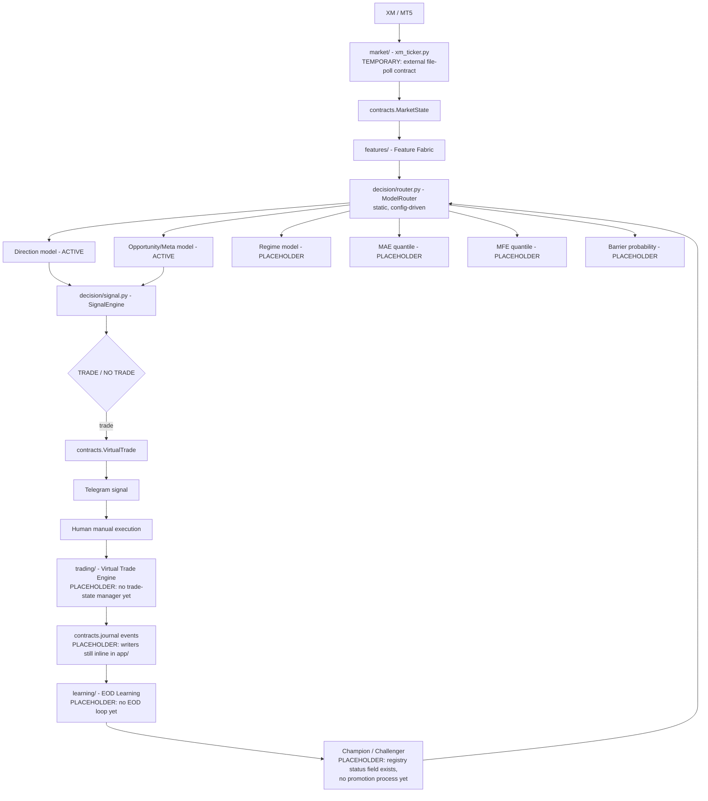

# Golex V3 Phase 1 Foundation Implementation Plan

> **For agentic workers:** REQUIRED SUB-SKILL: Use superpowers:subagent-driven-development (recommended) or superpowers:executing-plans to implement this plan task-by-task. Steps use checkbox (`- [ ]`) syntax for tracking.

**Goal:** Rebuild the repo into the approved V3 skeleton (contracts, config, model registry/router, production/research boundary) without restarting live services or implementing any later-phase intelligence.

**Architecture:** New top-level packages (`contracts/`, `config/`, `features/`, `decision/`, `market/`, `trading/`, `journal/`, `learning/`, `app/`) replace the flat `core/` package; `models/` gets a registry/active/candidates/archive split; every relocated import gets fixed inline, no shims.

**Tech Stack:** Python 3.13, pydantic v2 (2.13.4, present in the runtime venv), PyYAML, CatBoost 1.2.10. No pytest — tests stay plain-assert scripts run directly (`python3 tests/test_x.py`), matching the existing `core/test_smoke.py` convention.

**Spec:** `docs/superpowers/specs/2026-08-18-golex-v3-phase1-foundation-design.md`

## Global Constraints

- `contracts/` is the only place a cross-domain schema is defined. Any module needing `ModelRegistryEntry`, `MarketState`, `VirtualTrade`, journal events, or `FeatureSetSchema` imports it from `contracts/` — never redeclares it.
- `config/` is the single source of truth. No threshold, path, model ID, or feature list gets hardcoded in any Python file this plan touches.
- `xm_ticker.py` is relocated but explicitly NOT wired as integrated live infrastructure this phase — mark it and the external `cron/output/` file-polling contract as temporary legacy architecture.
- Nothing is deleted for being old. Only `catboost_info/` and `__pycache__/` (transient, regenerable) are deleted. Everything else superseded is archived, fully recoverable.
- `models/` registry needs a strict `registry/active/candidates/archive` split — the live engine loads by registry lookup, never by globbing a directory or guessing a filename.
- The router is static and config-driven (`config/models.yaml`), never dynamic — it loads whatever `role -> model_id` mapping research has approved, it does not compare live performance.
- Both `ai-engine.service` and `gold-shadow.service` are stopped before any file move and stay stopped at the end of this plan. No restart.

## Correction discovered during planning (flag in completion report)

`shadow_engine.py` (line 53: `MODEL_DIR_V2 = os.path.join(BASE, "models", "v2")`, line 100: `SignalEngine(model_dir=MODEL_DIR_V2)`) actively loads `models/v2/` as the **paper-traded challenger** for `gold-shadow.service` ("v2 shadow paper-trading Phase3A"). The approved spec's §6/§10 filed `models/v2/` under `archive/` with `status="archived"` — that was written before this was discovered. `models/v2/`'s own `feature_cols.json` also carries materially richer, real metadata (`schema_version: "v2-2026-08-18"`, `trained_at_utc`, `catboost_kw`, `dataset` block, 26 features — excludes `spread`/`tick_volume` that the root 28-feature model includes) confirming it is a distinct, deliberately-trained candidate, not a stray duplicate.

This plan places `models/v2/*` under `models/candidates/` with `status="candidate"` instead of `archive/` — this is applying the spec's own already-approved category *definitions* (candidate = trained, not yet promoted to active) to a fact that wasn't known when the spec categorized it, not a redesign of the categories themselves. Everything else from §10's archive list (old v7 LightGBM artifacts, the four `models/archive/` timestamped snapshots, stale docs/data/logs) is unaffected and archived exactly as specified.

## Second correction discovered during planning (flag in completion report)

The spec's §3 `learning/` bullet lists `calibration.py` and `labeling.py` as research-only ("never imported by `app/`"). Both are directly imported by the live engines: `ai_signal_engine.py`/`shadow_engine.py` import `cusum_filter` from `core.labeling` for real-time event detection, and `shadow_engine.py` imports `PlattCalibrator`/`RollingCalibrationConfig`/`fit_rolling` from `core.calibration` for live probability recalibration. Placing them in `learning/` would make the production/research boundary (§4) false the moment `app/` imports them.

This plan places `labeling.py` in `features/` (event/label detection is feature-adjacent and causal) and `calibration.py` in `decision/` (recalibrating decision probabilities is decision-time logic). `learning/` keeps `data.py`, `train.py`, `cv.py`, `evaluate.py`, `backtest.py`, `retrain_daily.py`, `seed_refresh.py` — all confirmed research/batch-only by the import audit in this plan's investigation. (`backtest.py` was also missing from the spec's `learning/` list — added here; it's `research`-only, confirmed by grep, no live importer.)

---

### Task 1: Safety checkpoint — stop live services, snapshot state

**Files:** none (operational only)

- [ ] **Step 1: Record current service state**

```bash
systemctl --user is-active ai-engine.service gold-shadow.service
```
Expected: both print `active`.

- [ ] **Step 2: Stop both services**

```bash
systemctl --user stop ai-engine.service gold-shadow.service
```

- [ ] **Step 3: Verify stopped**

```bash
systemctl --user is-active ai-engine.service gold-shadow.service
```
Expected: both print `inactive` (or the command exits non-zero with `inactive` on stdout — either is the stopped signal).

- [ ] **Step 4: Snapshot working tree state for the report**

```bash
git status --short > /tmp/golex_phase1_pre_status.txt
git rev-parse HEAD > /tmp/golex_phase1_pre_sha.txt
```

No commit — this task only changes runtime state, not files.

---

### Task 2: Legacy cleanup commit — macro removal

**Files:**
- Modify (already on disk, uncommitted): `core/features.py`, `core/train.py`
- Delete (already deleted on disk, uncommitted): `event_calendar.py`, `fetch_macro_context.py`, `macro/fetch_macro.py`, `macro/macro_live.json`, `xm_macro.py`

- [ ] **Step 1: Re-verify no remaining references**

```bash
grep -rlE 'xm_macro|fetch_macro_context|event_calendar|macro\.fetch_macro' --include='*.py' . | grep -v .archive
```
Expected: no output.

- [ ] **Step 2: Commit the pending deletions/edits**

```bash
git add -A -- core/features.py core/train.py event_calendar.py fetch_macro_context.py macro/ xm_macro.py
git commit -m "$(cat <<'EOF'
Remove dead macro-context modules

Grep-verified no remaining imports anywhere in core/ or research/.
Part of Phase 1 V3 legacy cleanup.

Co-Authored-By: Claude Sonnet 5 <noreply@anthropic.com>
EOF
)"
```

- [ ] **Step 3: Verify clean**

```bash
git status --short
```
Expected: only the pre-existing untracked new files remain (`ai_signal_engine.py`, `core/backtest.py`, etc. — not yet committed, that happens as this plan relocates them).

---

### Task 3: `contracts/model_registry.py`

**Files:**
- Create: `contracts/__init__.py`
- Create: `contracts/model_registry.py`
- Create: `tests/test_contracts.py`

**Interfaces:**
- Produces: `contracts.model_registry.ModelRegistryEntry`, `ModelFamily`, `ModelStatus`, `ModelLineage` — used by Task 9 (registry files), Task 10 (`decision/router.py`).

- [ ] **Step 1: Create the contracts package**

```python
# contracts/__init__.py
```
(empty — submodules are imported explicitly, e.g. `from contracts.model_registry import ModelRegistryEntry`)

- [ ] **Step 2: Write `contracts/model_registry.py`**

```python
"""Canonical model registry contract. The live router and every training
script that registers a model both import ModelRegistryEntry from here --
nobody redeclares this shape."""
from datetime import datetime
from typing import Literal, Optional

from pydantic import BaseModel, Field

ModelFamily = Literal[
    "direction", "opportunity_meta", "regime",
    "mae_quantile", "mfe_quantile", "barrier_probability",
]
ModelStatus = Literal["candidate", "active", "archived", "rejected"]


class ModelLineage(BaseModel):
    data_snapshot: Optional[str] = None
    code_commit: Optional[str] = None
    config_snapshot: Optional[str] = None


class ModelRegistryEntry(BaseModel):
    model_id: str
    family: ModelFamily
    algorithm: str
    artifact_path: str
    feature_schema_version: Optional[str] = None
    feature_cols: list[str] = Field(default_factory=list)
    target_definition: Optional[str] = None
    training_config: dict = Field(default_factory=dict)
    training_period: Optional[str] = None
    validation_period: Optional[str] = None
    created_at: datetime
    status: ModelStatus
    is_champion: bool = False
    metrics: dict = Field(default_factory=dict)
    lineage: ModelLineage = Field(default_factory=ModelLineage)
```

- [ ] **Step 3: Write `tests/test_contracts.py` with the first test**

```python
"""Contract validation smoke tests. Plain-assert, run directly:
python3 tests/test_contracts.py -- matches core/test_smoke.py convention,
no pytest dependency."""
import sys
import os

sys.path.insert(0, os.path.dirname(os.path.dirname(os.path.abspath(__file__))))

from contracts.model_registry import ModelRegistryEntry


def test_model_registry_entry_valid():
    entry = ModelRegistryEntry(
        model_id="direction_catboost_20260818",
        family="direction",
        algorithm="catboost",
        artifact_path="active/primary.cbm",
        created_at="2026-08-18T09:16:20",
        status="active",
        is_champion=True,
    )
    assert entry.model_id == "direction_catboost_20260818"
    assert entry.status == "active"


def test_model_registry_entry_rejects_bad_family():
    try:
        ModelRegistryEntry(
            model_id="x", family="not_a_real_family", algorithm="catboost",
            artifact_path="x.cbm", created_at="2026-08-18T09:16:20", status="active",
        )
        assert False, "expected validation error for bad family"
    except Exception as e:
        assert "family" in str(e).lower() or "literal" in str(e).lower()


if __name__ == "__main__":
    test_model_registry_entry_valid()
    test_model_registry_entry_rejects_bad_family()
    print("contracts/model_registry.py: OK")
```

- [ ] **Step 4: Run it**

```bash
python3 tests/test_contracts.py
```
Expected: `contracts/model_registry.py: OK`

- [ ] **Step 5: Commit**

```bash
git add contracts/__init__.py contracts/model_registry.py tests/test_contracts.py
git commit -m "$(cat <<'EOF'
Add contracts/model_registry.py: canonical ModelRegistryEntry pydantic schema

Co-Authored-By: Claude Sonnet 5 <noreply@anthropic.com>
EOF
)"
```

---

### Task 4: `contracts/market_state.py`

**Files:**
- Create: `contracts/market_state.py`
- Modify: `tests/test_contracts.py`

**Interfaces:**
- Produces: `contracts.market_state.MarketState` — used by Task 12 (`market/` docstring reference) and later phases.

- [ ] **Step 1: Write `contracts/market_state.py`**

```python
"""Canonical live market state contract. Most fields are Optional in
Phase 1 -- the shape exists so later phases populate it from a real feed
instead of inventing a new one. See market/README.md for why this isn't
wired to a live feed yet."""
from datetime import datetime
from typing import Optional

from pydantic import BaseModel, Field


class MarketState(BaseModel):
    timestamp: datetime
    bid: float = Field(gt=0)
    ask: float = Field(gt=0)
    spread: Optional[float] = None
    mid: Optional[float] = None
    tick_state: Optional[dict] = None
    m1_state: Optional[dict] = None
    multi_horizon_state: Optional[dict] = None
    volatility_state: Optional[dict] = None
    activity_state: Optional[dict] = None
    session: Optional[str] = None
    regime: Optional[str] = None
    feature_state_ref: Optional[str] = None
```

- [ ] **Step 2: Append test to `tests/test_contracts.py`**

Add import `from contracts.market_state import MarketState` next to the existing import, and add:

```python
def test_market_state_valid():
    ms = MarketState(timestamp="2026-08-18T12:00:00", bid=2500.10, ask=2500.35)
    assert ms.spread is None
    assert ms.ask > ms.bid


def test_market_state_rejects_nonpositive_bid():
    try:
        MarketState(timestamp="2026-08-18T12:00:00", bid=0, ask=2500.35)
        assert False, "expected validation error for bid <= 0"
    except Exception as e:
        assert "bid" in str(e).lower() or "greater than" in str(e).lower()
```

Update the `__main__` block to call both new functions before the `print`.

- [ ] **Step 3: Run it**

```bash
python3 tests/test_contracts.py
```
Expected: `contracts/model_registry.py: OK` (keep the print line generic — see step 4 rename)

- [ ] **Step 4: Rename the final print to reflect growing scope**

Change the last line of `__main__` to `print("contracts/: OK")`.

- [ ] **Step 5: Commit**

```bash
git add contracts/market_state.py tests/test_contracts.py
git commit -m "$(cat <<'EOF'
Add contracts/market_state.py: MarketState pydantic contract

Co-Authored-By: Claude Sonnet 5 <noreply@anthropic.com>
EOF
)"
```

---

### Task 5: `contracts/feature_schema.py`

**Files:**
- Create: `contracts/feature_schema.py`
- Modify: `tests/test_contracts.py`

**Interfaces:**
- Produces: `contracts.feature_schema.FeatureDescriptor`, `FeatureSetSchema` — used by Task 8 (`features/` schema instance).

- [ ] **Step 1: Write `contracts/feature_schema.py`**

```python
"""Canonical feature schema contract -- prevents the feature-mismatch
problems between training and inference that motivated this rebuild."""
from typing import Optional

from pydantic import BaseModel, Field


class FeatureDescriptor(BaseModel):
    name: str
    family: str
    source: str
    frequency: str
    causal: bool
    required_data: list[str] = Field(default_factory=list)
    update_mechanism: str
    version: str
    dtype: str
    valid_range: Optional[tuple[float, float]] = None
    missing_value_policy: str


class FeatureSetSchema(BaseModel):
    schema_version: str
    features: list[FeatureDescriptor]
```

- [ ] **Step 2: Append test to `tests/test_contracts.py`**

Add `from contracts.feature_schema import FeatureDescriptor, FeatureSetSchema` and:

```python
def test_feature_set_schema_valid():
    fd = FeatureDescriptor(
        name="ewma_vol", family="volatility", source="m1_bars", frequency="per_bar",
        causal=True, required_data=["close"], update_mechanism="incremental",
        version="1", dtype="float64", missing_value_policy="drop_row",
    )
    schema = FeatureSetSchema(schema_version="root-28col-2026-08-18", features=[fd])
    assert schema.features[0].causal is True


def test_feature_descriptor_rejects_missing_required_field():
    try:
        FeatureDescriptor(name="x", family="y", source="z")
        assert False, "expected validation error for missing required fields"
    except Exception:
        pass
```

Add both calls to `__main__`.

- [ ] **Step 3: Run it**

```bash
python3 tests/test_contracts.py
```
Expected: `contracts/: OK`

- [ ] **Step 4: Commit**

```bash
git add contracts/feature_schema.py tests/test_contracts.py
git commit -m "$(cat <<'EOF'
Add contracts/feature_schema.py: FeatureDescriptor/FeatureSetSchema contract

Co-Authored-By: Claude Sonnet 5 <noreply@anthropic.com>
EOF
)"
```

---

### Task 6: `contracts/virtual_trade.py`

**Files:**
- Create: `contracts/virtual_trade.py`
- Modify: `tests/test_contracts.py`

- [ ] **Step 1: Write `contracts/virtual_trade.py`**

```python
"""Canonical virtual trade contract -- the full lifecycle object a signal
becomes once the human executes it. Most forecast/EV fields are Optional
in Phase 1 (not computed until later phases build the models that fill
them)."""
from datetime import datetime
from typing import Optional

from pydantic import BaseModel, Field


class VirtualTrade(BaseModel):
    trade_id: str
    signal_timestamp: datetime
    direction: int  # +1 long, -1 short
    entry: float
    sl: float
    tp: float
    expected_value: Optional[float] = None
    confidence: Optional[float] = None
    model_versions: dict[str, str] = Field(default_factory=dict)
    feature_schema_version: Optional[str] = None
    probability_state: Optional[dict] = None
    mae_forecast: Optional[float] = None
    mfe_forecast: Optional[float] = None
    regime: Optional[str] = None
    execution_metadata: Optional[dict] = None
    management_state: Optional[dict] = None
    resolution: Optional[str] = None
    outcome: Optional[str] = None
    journal_ref: Optional[str] = None
```

- [ ] **Step 2: Append test to `tests/test_contracts.py`**

Add `from contracts.virtual_trade import VirtualTrade` and:

```python
def test_virtual_trade_valid():
    vt = VirtualTrade(
        trade_id="t-1", signal_timestamp="2026-08-18T12:00:00",
        direction=1, entry=2500.0, sl=2495.0, tp=2510.0,
        model_versions={"direction": "direction_catboost_20260818"},
    )
    assert vt.direction == 1
    assert vt.expected_value is None


def test_virtual_trade_rejects_bad_direction_type():
    try:
        VirtualTrade(
            trade_id="t-1", signal_timestamp="2026-08-18T12:00:00",
            direction="up", entry=2500.0, sl=2495.0, tp=2510.0,
        )
        assert False, "expected validation error for non-int direction"
    except Exception:
        pass
```

Add both calls to `__main__`.

- [ ] **Step 3: Run it**

```bash
python3 tests/test_contracts.py
```
Expected: `contracts/: OK`

- [ ] **Step 4: Commit**

```bash
git add contracts/virtual_trade.py tests/test_contracts.py
git commit -m "$(cat <<'EOF'
Add contracts/virtual_trade.py: VirtualTrade lifecycle contract

Co-Authored-By: Claude Sonnet 5 <noreply@anthropic.com>
EOF
)"
```

---

### Task 7: `contracts/journal.py`

**Files:**
- Create: `contracts/journal.py`
- Modify: `tests/test_contracts.py`

- [ ] **Step 1: Write `contracts/journal.py`**

```python
"""Canonical journal event contracts -- one model per lifecycle stage.
payload is an intentionally open dict: exact per-event fields are defined
by the phase that produces the event (e.g. the EOD learning system defines
LearningEvent.payload's shape when that phase is built); the envelope
(schema_version, trade_id, timestamp) is what's fixed now."""
from datetime import datetime
from typing import Optional

from pydantic import BaseModel


class SignalEvent(BaseModel):
    schema_version: str = "v1"
    trade_id: str
    timestamp: datetime
    payload: dict


class MarketStateEvent(BaseModel):
    schema_version: str = "v1"
    trade_id: Optional[str] = None
    timestamp: datetime
    payload: dict


class ManagementEvent(BaseModel):
    schema_version: str = "v1"
    trade_id: str
    timestamp: datetime
    payload: dict


class ExecutionEvent(BaseModel):
    schema_version: str = "v1"
    trade_id: str
    timestamp: datetime
    payload: dict


class ResolutionEvent(BaseModel):
    schema_version: str = "v1"
    trade_id: str
    timestamp: datetime
    payload: dict


class LearningEvent(BaseModel):
    schema_version: str = "v1"
    timestamp: datetime
    payload: dict
```

- [ ] **Step 2: Append test to `tests/test_contracts.py`**

Add `from contracts.journal import SignalEvent, LearningEvent` and:

```python
def test_journal_events_valid():
    sig = SignalEvent(trade_id="t-1", timestamp="2026-08-18T12:00:00", payload={"side": 1})
    learn = LearningEvent(timestamp="2026-08-18T23:59:00", payload={"note": "eod"})
    assert sig.schema_version == "v1"
    assert learn.trade_id is None
```

Add to `__main__`, change final print to `print("contracts/: ALL OK")`.

- [ ] **Step 3: Run it**

```bash
python3 tests/test_contracts.py
```
Expected: `contracts/: ALL OK`

- [ ] **Step 4: Commit**

```bash
git add contracts/journal.py tests/test_contracts.py
git commit -m "$(cat <<'EOF'
Add contracts/journal.py: per-lifecycle-stage journal event contracts

Co-Authored-By: Claude Sonnet 5 <noreply@anthropic.com>
EOF
)"
```

---

### Task 8: `config/` package

**Files:**
- Create: `config/__init__.py`
- Create: `config/schema.py`
- Create: `config/loader.py`
- Create: `config/market.yaml`, `config/features.yaml`, `config/models.yaml`, `config/decision.yaml`, `config/risk.yaml`, `config/telegram.yaml`, `config/journal.yaml`, `config/learning.yaml`, `config/runtime.yaml`
- Create: `tests/test_config.py`

**Interfaces:**
- Produces: `config.loader.load_config() -> config.schema.Config` — used by Task 10 (`decision/router.py`, `decision/signal.py`) and Task 16 (`app/`).

- [ ] **Step 1: Create `config/__init__.py`** (empty)

- [ ] **Step 2: Write `config/schema.py`**

```python
"""Single source of truth for every runtime setting. No Python file
outside this package should hardcode a threshold, path, model ID, or
feature list -- if it needs one, it reads it from here."""
from typing import Literal, Optional

from pydantic import BaseModel, Field


class MarketConfig(BaseModel):
    symbol: str
    feed_mode: Literal["external_file_legacy"] = "external_file_legacy"
    state_dir: str
    tick_state_file: str
    active_signal_file: str
    bars_file: str
    legacy_note: str = (
        "TEMPORARY: market feed is a polling-file contract with an "
        "unmanaged external process (xm_ticker.py is not wired as live "
        "infra in Phase 1). Phase 2 replaces this with an integrated "
        "real-time MT5 market-state pipeline."
    )


class FeaturesConfig(BaseModel):
    schema_version: str


class ModelRoleConfig(BaseModel):
    direction: Optional[str] = None
    opportunity_meta: Optional[str] = None
    regime: Optional[str] = None
    mae_quantile: Optional[str] = None
    mfe_quantile: Optional[str] = None
    barrier_probability: Optional[str] = None


class DecisionConfig(BaseModel):
    meta_prob_threshold: float = Field(ge=0.0, le=1.0)


class RiskConfig(BaseModel):
    pass


class TelegramConfig(BaseModel):
    env_path: str


class JournalConfig(BaseModel):
    schema_version: str
    output_dir: str
    legacy_note: str = (
        "TEMPORARY: journal event files live in an external directory "
        "outside this repo (output_dir). Only the schema is versioned "
        "here in Phase 1."
    )


class LearningConfig(BaseModel):
    acc_regression_tolerance: float


class RuntimeConfig(BaseModel):
    base_dir: str
    outdir: str


class Config(BaseModel):
    market: MarketConfig
    features: FeaturesConfig
    models: ModelRoleConfig
    decision: DecisionConfig
    risk: RiskConfig
    telegram: TelegramConfig
    journal: JournalConfig
    learning: LearningConfig
    runtime: RuntimeConfig
```

- [ ] **Step 3: Write `config/loader.py`**

```python
"""One entry point for every config category. load_config() returns a
fully validated Config; nothing downstream re-parses YAML itself."""
import os

import yaml

from config.schema import (
    Config, MarketConfig, FeaturesConfig, ModelRoleConfig, DecisionConfig,
    RiskConfig, TelegramConfig, JournalConfig, LearningConfig, RuntimeConfig,
)

CONFIG_DIR = os.path.dirname(os.path.abspath(__file__))


def load_config(config_dir: str = CONFIG_DIR) -> Config:
    def _load(name):
        path = os.path.join(config_dir, name)
        with open(path) as f:
            return yaml.safe_load(f) or {}

    return Config(
        market=MarketConfig(**_load("market.yaml")),
        features=FeaturesConfig(**_load("features.yaml")),
        models=ModelRoleConfig(**_load("models.yaml")),
        decision=DecisionConfig(**_load("decision.yaml")),
        risk=RiskConfig(**_load("risk.yaml")),
        telegram=TelegramConfig(**_load("telegram.yaml")),
        journal=JournalConfig(**_load("journal.yaml")),
        learning=LearningConfig(**_load("learning.yaml")),
        runtime=RuntimeConfig(**_load("runtime.yaml")),
    )
```

- [ ] **Step 4: Write the nine YAML files** (real values pulled from the current running code, not invented)

`config/market.yaml`:
```yaml
symbol: XAUUSD
feed_mode: external_file_legacy
state_dir: /home/jith/.hermes/profiles/trading/cron/output
tick_state_file: xm_tick_state.json
active_signal_file: .active_signal_ai.json
bars_file: xm_live_bars.jsonl
```

`config/features.yaml`:
```yaml
schema_version: root-28col-2026-08-18
```

`config/models.yaml`:
```yaml
direction: direction_catboost_20260818
opportunity_meta: opportunity_meta_catboost_20260818
regime: null
mae_quantile: null
mfe_quantile: null
barrier_probability: null
```

`config/decision.yaml`:
```yaml
meta_prob_threshold: 0.6
```

`config/risk.yaml`:
```yaml
{}
```

`config/telegram.yaml`:
```yaml
env_path: /home/jith/.hermes/profiles/signals/.env
```

`config/journal.yaml`:
```yaml
schema_version: v1
output_dir: /home/jith/.hermes/profiles/trading/cron/output
```

`config/learning.yaml`:
```yaml
acc_regression_tolerance: 0.01
```

`config/runtime.yaml`:
```yaml
base_dir: /home/jith/.hermes/profiles/trading/scripts
outdir: /home/jith/.hermes/profiles/trading/cron/output
```

- [ ] **Step 5: Write `tests/test_config.py`**

```python
"""python3 tests/test_config.py"""
import sys
import os

sys.path.insert(0, os.path.dirname(os.path.dirname(os.path.abspath(__file__))))

from config.loader import load_config


def test_load_config_valid():
    cfg = load_config()
    assert cfg.market.symbol == "XAUUSD"
    assert cfg.decision.meta_prob_threshold == 0.6
    assert cfg.models.direction == "direction_catboost_20260818"
    assert cfg.models.regime is None
    assert cfg.learning.acc_regression_tolerance == 0.01


if __name__ == "__main__":
    test_load_config_valid()
    print("config/: OK")
```

- [ ] **Step 6: Run it**

```bash
python3 tests/test_config.py
```
Expected: `config/: OK`

- [ ] **Step 7: Commit**

```bash
git add config/ tests/test_config.py
git commit -m "$(cat <<'EOF'
Add config/ package: pydantic Settings + 9 YAML files, single source of truth

Real values migrated from hardcoded constants in ai_signal_engine.py,
shadow_engine.py, models/feature_cols.json, core/retrain_daily.py.

Co-Authored-By: Claude Sonnet 5 <noreply@anthropic.com>
EOF
)"
```

---

### Task 9: `features/` package (relocate feature + label code)

**Files:**
- Move: `core/features.py` → `features/features.py`
- Move: `core/fracdiff.py` → `features/fracdiff.py`
- Move: `core/hurst.py` → `features/hurst.py`
- Move: `core/kalman.py` → `features/kalman.py`
- Move: `core/volatility.py` → `features/volatility.py`
- Move: `core/labeling.py` → `features/labeling.py`
- Create: `features/__init__.py`
- Create: `tests/test_labeling.py`, `tests/test_volatility.py` (split from `core/test_smoke.py`)

**Interfaces:**
- Produces: `features.features.build_features`, `features.labeling.{cusum_filter, TripleBarrierConfig, triple_barrier_labels}`, `features.volatility.{ewma_vol, garman_klass, rogers_satchell, yang_zhang, bipower_variation}`, `features.kalman.kalman_local_level`, `features.hurst.rolling_hurst`, `features.fracdiff.frac_diff_ffd` — consumed by Task 10 (`decision/`), Task 15 (`learning/`), Task 16 (`app/`), and every `research/*.py` file fixed in Task 17.

- [ ] **Step 1: Move the six files**

```bash
mkdir -p features
git mv core/features.py features/features.py
git mv core/fracdiff.py features/fracdiff.py
git mv core/hurst.py features/hurst.py
git mv core/kalman.py features/kalman.py
git mv core/volatility.py features/volatility.py
git mv core/labeling.py features/labeling.py
touch features/__init__.py
```

- [ ] **Step 2: Fix internal imports inside `features/features.py`**

Modify `features/features.py`:
```python
# old:
from core.volatility import (bipower_variation, ewma_vol, garman_klass,
                              rogers_satchell, yang_zhang)
from core.kalman import kalman_local_level
from core.hurst import rolling_hurst
from core.fracdiff import frac_diff_ffd
# new:
from features.volatility import (bipower_variation, ewma_vol, garman_klass,
                                  rogers_satchell, yang_zhang)
from features.kalman import kalman_local_level
from features.hurst import rolling_hurst
from features.fracdiff import frac_diff_ffd
```
And later in the same file (the lazy import inside a function body):
```python
# old:
from core.data import load_raw_m1, to_m5
# new:
from learning.data import load_raw_m1, to_m5
```
(`core.data` → `learning.data`, see Task 15 — `load_raw_m1`/`to_m5` are batch-loading utilities, not live-path code; this import only executes inside an offline code path in `features.py`, confirmed by reading the surrounding function before editing.)

- [ ] **Step 3: Split `core/test_smoke.py` into `tests/test_labeling.py` and `tests/test_volatility.py`**

Read `core/test_smoke.py` first to copy its actual assertions (do not invent new ones) into two files with corrected imports:

`tests/test_labeling.py` — every `test_*` function that exercises `TripleBarrierConfig`/`cusum_filter`/`triple_barrier_labels`, with the import line changed to:
```python
from features.labeling import TripleBarrierConfig, cusum_filter, triple_barrier_labels
```

`tests/test_volatility.py` — every `test_*` function that exercises `ewma_vol`/`garman_klass`/`rogers_satchell`/`yang_zhang`, with the import line changed to:
```python
from features.volatility import ewma_vol, garman_klass, rogers_satchell, yang_zhang
```

(`PurgedWalkForwardCV`/`purge_and_embargo_mask` tests move to `tests/test_cv.py` in Task 15, once `core/cv.py` has a destination.)

Both new files keep the `sys.path.insert` header line and a `python3 tests/test_x.py` module docstring, matching the original file's convention, and each ends with:
```python
if __name__ == "__main__":
    <call every test_* function defined above>
    print("<filename>: OK")
```

- [ ] **Step 4: Delete the now-fully-split `core/test_smoke.py`**

```bash
git rm core/test_smoke.py
```
(Its CV-related tests are re-added in Task 15 as `tests/test_cv.py` — nothing is lost, this step just removes the source file once every assertion has a new home. If Task 15 hasn't run yet in your session, hold this `git rm` until it has and skip ahead — do not delete `core/test_smoke.py` before its CV assertions have a confirmed new home.)

- [ ] **Step 5: Run the new tests**

```bash
python3 tests/test_labeling.py
python3 tests/test_volatility.py
```
Expected: both print an OK line, no exceptions.

- [ ] **Step 6: Sanity-import the moved package**

```bash
python3 -c "from features.features import build_features; print('features/: import OK')"
```
Expected: `features/: import OK`

- [ ] **Step 7: Commit**

```bash
git add features/ tests/test_labeling.py tests/test_volatility.py
git commit -m "$(cat <<'EOF'
Move core/{features,fracdiff,hurst,kalman,volatility,labeling}.py -> features/

labeling.py placed here (not learning/) because cusum_filter is imported
live by ai_signal_engine.py/shadow_engine.py for real-time event
detection -- see plan's "second correction" note.

Co-Authored-By: Claude Sonnet 5 <noreply@anthropic.com>
EOF
)"
```

---

### Task 10: `decision/` package (signal engine, calibration, router)

**Files:**
- Move: `core/signal.py` → `decision/signal.py`
- Move: `core/calibration.py` → `decision/calibration.py`
- Create: `decision/__init__.py`
- Create: `decision/router.py`
- Create: `tests/test_router.py`

**Interfaces:**
- Consumes: `contracts.model_registry.ModelRegistryEntry` (Task 3), `config.loader.load_config` (Task 8), `features.features.build_features`/`features.labeling.cusum_filter` (Task 9, used by callers not by this file itself).
- Produces: `decision.router.ModelRouter` (methods: `resolve(role: str) -> Optional[ModelRegistryEntry]`, `artifact_path(role: str) -> Optional[str]`), `decision.signal.SignalEngine(router, meta_prob_threshold)` — consumed by Task 16 (`app/`).

- [ ] **Step 1: Move the two files**

```bash
mkdir -p decision
git mv core/signal.py decision/signal.py
git mv core/calibration.py decision/calibration.py
touch decision/__init__.py
```

- [ ] **Step 2: Write `decision/router.py`**

```python
"""Static, config-driven model lookup. This is NOT a champion/challenger
engine -- it never compares live performance or picks a model based on
today's data. Model *selection* is exclusively a research process
(future phase); this class's only job at inference time is "load what
research already approved" via config/models.yaml's role -> model_id map."""
import json
import os
from typing import Optional

from contracts.model_registry import ModelRegistryEntry

_MODELS_DIR = os.path.join(os.path.dirname(os.path.dirname(os.path.abspath(__file__))), "models")
REGISTRY_DIR = os.path.join(_MODELS_DIR, "registry")


class ModelRouter:
    def __init__(self, role_map: dict, registry_dir: str = REGISTRY_DIR, models_dir: str = _MODELS_DIR):
        self.role_map = role_map
        self.registry_dir = registry_dir
        self.models_dir = models_dir

    def resolve(self, role: str) -> Optional[ModelRegistryEntry]:
        model_id = self.role_map.get(role)
        if not model_id:
            return None
        path = os.path.join(self.registry_dir, f"{model_id}.json")
        with open(path) as f:
            return ModelRegistryEntry(**json.load(f))

    def artifact_path(self, role: str) -> Optional[str]:
        entry = self.resolve(role)
        if entry is None:
            return None
        return os.path.join(self.models_dir, entry.artifact_path)
```

- [ ] **Step 3: Refactor `decision/signal.py`'s `SignalEngine` to load via the router**

Modify `decision/signal.py`:
```python
# old __init__:
class SignalEngine:
    def __init__(self, model_dir: str = os.path.join(BASE, "models")):
        with open(os.path.join(model_dir, "feature_cols.json")) as f:
            meta_cfg = json.load(f)
        self.primary_cols = meta_cfg["primary"]
        self.meta_cols = meta_cfg["meta"]
        self.pt_mult = meta_cfg["tb_cfg_trade"]["pt_mult"]
        self.sl_mult = meta_cfg["tb_cfg_trade"]["sl_mult"]
        self.horizon_vol_scale = meta_cfg["horizon_vol_scale"]
        self.max_holding = meta_cfg["max_holding"]
        self.meta_prob_threshold = meta_cfg["meta_prob_threshold"]

        self.primary = CatBoostClassifier()
        self.primary.load_model(os.path.join(model_dir, "primary.cbm"))
        self.meta = CatBoostClassifier()
        self.meta.load_model(os.path.join(model_dir, "meta.cbm"))

# new __init__:
class SignalEngine:
    def __init__(self, router, meta_prob_threshold: float):
        direction_entry = router.resolve("direction")
        meta_entry = router.resolve("opportunity_meta")
        if direction_entry is None or meta_entry is None:
            raise RuntimeError(
                "SignalEngine requires both 'direction' and 'opportunity_meta' "
                "roles configured in config/models.yaml"
            )
        self.primary_cols = direction_entry.feature_cols
        self.meta_cols = meta_entry.feature_cols
        self.pt_mult = meta_entry.training_config["tb_cfg_trade"]["pt_mult"]
        self.sl_mult = meta_entry.training_config["tb_cfg_trade"]["sl_mult"]
        self.horizon_vol_scale = meta_entry.training_config["horizon_vol_scale"]
        self.max_holding = meta_entry.training_config["max_holding"]
        self.meta_prob_threshold = meta_prob_threshold

        self.primary = CatBoostClassifier()
        self.primary.load_model(router.artifact_path("direction"))
        self.meta = CatBoostClassifier()
        self.meta.load_model(router.artifact_path("opportunity_meta"))
```
The `score()` method and `Signal` dataclass are unchanged — only the constructor's model-loading mechanism changes. Remove the now-unused `BASE = os.path.dirname(...)` module-level constant if nothing else in the file references it (check with `grep -n BASE decision/signal.py` before deleting the line).

- [ ] **Step 4: Write `tests/test_router.py`**

This test needs real registry entries to resolve against — it runs after Task 11 (`models/registry/` population) exists, but is written now so Task 11 has something to verify against. If run before Task 11, it is expected to fail on missing registry files; note that in the task order and run it for real verification at the end of Task 11.

```python
"""python3 tests/test_router.py -- requires Task 11's models/registry/*.json
to exist. Run for real verification after Task 11, not after this task."""
import sys
import os

sys.path.insert(0, os.path.dirname(os.path.dirname(os.path.abspath(__file__))))

from decision.router import ModelRouter
from config.loader import load_config


def test_router_resolves_configured_roles():
    cfg = load_config()
    router = ModelRouter(role_map=cfg.models.model_dump())
    direction = router.resolve("direction")
    meta = router.resolve("opportunity_meta")
    assert direction is not None and direction.status == "active"
    assert meta is not None and meta.status == "active"
    assert os.path.exists(router.artifact_path("direction"))
    assert os.path.exists(router.artifact_path("opportunity_meta"))


def test_router_returns_none_for_unconfigured_role():
    cfg = load_config()
    router = ModelRouter(role_map=cfg.models.model_dump())
    assert router.resolve("regime") is None
    assert router.resolve("mae_quantile") is None


if __name__ == "__main__":
    test_router_resolves_configured_roles()
    test_router_returns_none_for_unconfigured_role()
    print("decision/router.py: OK")
```

- [ ] **Step 5: Sanity-import (model-loading behavior verified in Task 11)**

```bash
python3 -c "import ast; ast.parse(open('decision/router.py').read()); ast.parse(open('decision/signal.py').read()); print('decision/: syntax OK')"
```
Expected: `decision/: syntax OK`

- [ ] **Step 6: Commit**

```bash
git add decision/ tests/test_router.py
git commit -m "$(cat <<'EOF'
Move core/{signal,calibration}.py -> decision/, add decision/router.py

SignalEngine now loads models via ModelRouter (config/models.yaml ->
models/registry/) instead of a hardcoded model_dir -- champion/challenger
swaps become a config change, not a file shuffle. calibration.py placed
here (not learning/) because shadow_engine.py uses PlattCalibrator live.

Co-Authored-By: Claude Sonnet 5 <noreply@anthropic.com>
EOF
)"
```

---

### Task 11: `models/` registry restructure

**Files:**
- Create: `models/registry/`, `models/active/`, `models/candidates/`, `models/archive/`
- Move: `models/primary.cbm`, `models/meta.cbm`, `models/feature_cols.json`, `models/train_summary.json` → `models/active/`
- Move: `models/v2/*` → `models/candidates/v2/`
- Move: existing `models/archive/*` (four `20260818_091628_*` snapshot files) → stays under `models/archive/` (already the right place, no move needed, just confirm)
- Move: every old v7 artifact (see list below) → `models/archive/legacy-v7/`
- Create: `models/registry/direction_catboost_20260818.json`
- Create: `models/registry/opportunity_meta_catboost_20260818.json`
- Create: `models/registry/direction_catboost_v2_20260818.json`
- Create: `models/registry/opportunity_meta_catboost_v2_20260818.json`
- Create: `scripts/backfill_legacy_registry.py`
- Create: `tests/test_model_registry.py`

**Interfaces:**
- Consumes: `contracts.model_registry.ModelRegistryEntry` (Task 3).
- Produces: populated `models/registry/*.json` — consumed by Task 10's `tests/test_router.py` (run for real now) and `app/` (Task 16).

- [ ] **Step 1: Create the four subdirectories**

```bash
mkdir -p models/registry models/active models/candidates models/archive
```

- [ ] **Step 2: Move the active pair**

```bash
git mv models/primary.cbm models/active/primary.cbm 2>/dev/null || mv models/primary.cbm models/active/primary.cbm
git mv models/meta.cbm models/active/meta.cbm 2>/dev/null || mv models/meta.cbm models/active/meta.cbm
mv models/feature_cols.json models/active/feature_cols.json
mv models/train_summary.json models/active/train_summary.json
```
(`.cbm`/`.json` under `models/` were untracked (`??` in git status) or gitignored per the spec's §10 note — `git mv` may no-op or error on untracked files; the `|| mv` fallback handles that. Verify after with `git status --short models/`.)

- [ ] **Step 3: Move the v2 candidate**

```bash
mkdir -p models/candidates/v2
mv models/v2/primary.cbm models/v2/meta.cbm models/v2/feature_cols.json \
   models/v2/train_summary.json models/v2/calibration_bootstrap.json \
   models/v2/calibration_global_fallback.json models/candidates/v2/
rmdir models/v2
```

- [ ] **Step 4: Move `models/archive`'s existing timestamped snapshot into the new archive structure**

```bash
mkdir -p models/archive/pre-registry-snapshots
mv models/archive/20260818_091628_* models/archive/pre-registry-snapshots/
```
(the `models/archive/` directory already existed pre-plan with these four files — this just gives it a labeled subfolder so it doesn't visually collide with the new `legacy-v7/` category added next.)

- [ ] **Step 5: Move every old v7 artifact into `models/archive/legacy-v7/`**

```bash
mkdir -p models/archive/legacy-v7
mv models/beast_calibrator.pkl models/calibration.json models/calibration_by_drr*.json \
   models/direction_ensemble.json models/direction_features.json models/direction_metrics.json \
   models/direction_s2026.txt models/direction_s7.txt \
   models/dirmask_spec_*.npy models/drr_spec_*.npy \
   models/ensemble.json models/ensemble_v3_config.json \
   models/feature_analysis_report.md models/feature_drift_stats.json models/feature_map.json \
   models/features.json models/gold_lgb_model.txt models/gold_lgb_model_s*.txt \
   models/matrix_schema.json models/metrics.json \
   models/oof_probs.npy models/oof_spec_*.npy models/oof_targets.npy models/oofy_spec_*.npy \
   models/placement_prior.json models/quant_ensemble.json models/quant_lgb_s*.txt \
   models/real_ai_ensemble.json models/real_ai_s*.txt \
   models/regime_dir_prior.json models/regime_specialists.json \
   models/regime_transition_ensemble.json models/regime_transition_metrics.json \
   models/regime_transition_s*.txt \
   models/spec_*_s*.txt models/signal_rating.json \
   models/archive/ 2>/dev/null
mv models/archive/beast_calibrator.pkl models/archive/calibration.json models/archive/calibration_by_drr*.json \
   models/archive/direction_ensemble.json models/archive/direction_features.json models/archive/direction_metrics.json \
   models/archive/direction_s2026.txt models/archive/direction_s7.txt \
   models/archive/dirmask_spec_*.npy models/archive/drr_spec_*.npy \
   models/archive/ensemble.json models/archive/ensemble_v3_config.json \
   models/archive/feature_analysis_report.md models/archive/feature_drift_stats.json models/archive/feature_map.json \
   models/archive/features.json models/archive/gold_lgb_model.txt models/archive/gold_lgb_model_s*.txt \
   models/archive/matrix_schema.json models/archive/metrics.json \
   models/archive/oof_probs.npy models/archive/oof_spec_*.npy models/archive/oof_targets.npy models/archive/oofy_spec_*.npy \
   models/archive/placement_prior.json models/archive/quant_ensemble.json models/archive/quant_lgb_s*.txt \
   models/archive/real_ai_ensemble.json models/archive/real_ai_s*.txt \
   models/archive/regime_dir_prior.json models/archive/regime_specialists.json \
   models/archive/regime_transition_ensemble.json models/archive/regime_transition_metrics.json \
   models/archive/regime_transition_s*.txt \
   models/archive/spec_*_s*.txt models/archive/signal_rating.json \
   models/archive/legacy-v7/ 2>/dev/null
```
(two-step: first `mv` into `models/archive/` catches anything the shell glob resolved from the original `models/` location, the second re-homes it one level deeper into `legacy-v7/`; run `ls models/` after and confirm only `registry/ active/ candidates/ archive/` remain — sweep any leftover file the glob missed by hand before moving on, don't leave it at the top of `models/`.)

- [ ] **Step 6: Verify `models/` now only has the four category dirs**

```bash
ls models/
```
Expected: `active  archive  candidates  registry`

- [ ] **Step 7: Write the two active registry entries**

`models/registry/direction_catboost_20260818.json` — pull `primary_cols`, `tb_cfg_trade`, `horizon_vol_scale`, `max_holding` from `models/active/feature_cols.json` (read it first to copy exact values, don't retype from memory) and `mean_oof_acc` from `models/active/train_summary.json`:
```json
{
  "model_id": "direction_catboost_20260818",
  "family": "direction",
  "algorithm": "catboost",
  "artifact_path": "active/primary.cbm",
  "feature_schema_version": "root-28col-2026-08-18",
  "feature_cols": ["ret_1","sign_ret_1","ret_5","sign_ret_5","ret_15","sign_ret_15","ret_60","sign_ret_60","ewma_vol","gk_vol_20","rs_vol_20","yz_vol_20","gk_vol_60","rs_vol_60","yz_vol_60","gk_vol_240","rs_vol_240","yz_vol_240","bipower_var_60","jump_component_60","kalman_level_dist","kalman_velocity","kalman_residual_z","hurst_120","hurst_480","fracdiff_log_price","spread","tick_volume"],
  "target_definition": "binary up/down direction on CUSUM events, symmetric triple-barrier (tb_cfg_dir: pt_mult=1.0, sl_mult=1.0, max_holding=45, min_vol=1e-6)",
  "training_config": {
    "tb_cfg_dir": {"pt_mult": 1.0, "sl_mult": 1.0, "max_holding": 45, "min_vol": 1e-6},
    "tb_cfg_trade": {"pt_mult": 1.5, "sl_mult": 1.0, "max_holding": 45, "min_vol": 1e-6},
    "horizon_vol_scale": 0.45,
    "max_holding": 45,
    "cusum_k": 2.5
  },
  "training_period": "2019-12-02 to 2026-08-17 (purged walk-forward, 6 folds)",
  "validation_period": "purged walk-forward OOF, 6 splits, embargo_bars=90",
  "created_at": "2026-08-18T09:16:20+05:30",
  "status": "active",
  "is_champion": true,
  "metrics": {"mean_oof_acc": 0.5115082515354895, "n_bars": 2461612, "n_events": 312758},
  "lineage": {"code_commit": "0da9082d3bb79e726b6f7796dacf960195ae0113", "config_snapshot": "models/active/feature_cols.json"}
}
```

`models/registry/opportunity_meta_catboost_20260818.json` (same run, meta stage):
```json
{
  "model_id": "opportunity_meta_catboost_20260818",
  "family": "opportunity_meta",
  "algorithm": "catboost",
  "artifact_path": "active/meta.cbm",
  "feature_schema_version": "root-28col-2026-08-18",
  "feature_cols": ["ret_1","sign_ret_1","ret_5","sign_ret_5","ret_15","sign_ret_15","ret_60","sign_ret_60","ewma_vol","gk_vol_20","rs_vol_20","yz_vol_20","gk_vol_60","rs_vol_60","yz_vol_60","gk_vol_240","rs_vol_240","yz_vol_240","bipower_var_60","jump_component_60","kalman_level_dist","kalman_velocity","kalman_residual_z","hurst_120","hurst_480","fracdiff_log_price","spread","tick_volume","assumed_side"],
  "target_definition": "precision filter on primary's OOF predictions: did the trade-side barrier (tb_cfg_trade) pay off before the adverse side",
  "training_config": {
    "tb_cfg_trade": {"pt_mult": 1.5, "sl_mult": 1.0, "max_holding": 45, "min_vol": 1e-6},
    "horizon_vol_scale": 0.45,
    "max_holding": 45,
    "cusum_k": 2.5
  },
  "training_period": "2019-12-02 to 2026-08-17",
  "validation_period": "purged walk-forward OOF, 6 splits, embargo_bars=90",
  "created_at": "2026-08-18T09:16:28+05:30",
  "status": "active",
  "is_champion": true,
  "metrics": {"meta_win_rate_baseline": 0.48868154734876157, "n_meta_train": 253259},
  "lineage": {"code_commit": "0da9082d3bb79e726b6f7796dacf960195ae0113", "config_snapshot": "models/active/feature_cols.json"}
}
```
(Before writing these two files, run `python3 -c "import json; print(json.load(open('models/active/feature_cols.json')))"` and `cat models/active/train_summary.json` to copy the real numbers rather than trusting this plan's transcription — the values above were read from those files during planning but re-verify at execution time.)

- [ ] **Step 8: Write the two candidate registry entries**

`models/registry/direction_catboost_v2_20260818.json` (values from `models/candidates/v2/feature_cols.json`, which is richer — has `schema_version`, `trained_at_utc`, `catboost_kw`, `dataset` — read it first):
```json
{
  "model_id": "direction_catboost_v2_20260818",
  "family": "direction",
  "algorithm": "catboost",
  "artifact_path": "candidates/v2/primary.cbm",
  "feature_schema_version": "v2-2026-08-18",
  "feature_cols": ["ret_1","sign_ret_1","ret_5","sign_ret_5","ret_15","sign_ret_15","ret_60","sign_ret_60","ewma_vol","gk_vol_20","rs_vol_20","yz_vol_20","gk_vol_60","rs_vol_60","yz_vol_60","gk_vol_240","rs_vol_240","yz_vol_240","bipower_var_60","jump_component_60","kalman_level_dist","kalman_velocity","kalman_residual_z","hurst_120","hurst_480","fracdiff_log_price"],
  "target_definition": "binary up/down direction on CUSUM events, same symmetric triple-barrier as the active model, excludes spread/tick_volume features",
  "training_config": {
    "tb_cfg_dir": {"pt_mult": 1.0, "sl_mult": 1.0, "max_holding": 45, "min_vol": 1e-6},
    "tb_cfg_trade": {"pt_mult": 1.5, "sl_mult": 1.0, "max_holding": 45, "min_vol": 1e-6},
    "horizon_vol_scale": 0.45,
    "max_holding": 45,
    "cusum_k": 2.5,
    "catboost_kw": {"depth": 4, "iterations": 2000, "learning_rate": 0.02, "l2_leaf_reg": 15, "loss_function": "Logloss", "random_seed": 42, "early_stopping_rounds": 100},
    "excluded_features": ["spread", "tick_volume"],
    "n_splits": 6,
    "embargo_bars": 90,
    "val_fraction": 0.15
  },
  "training_period": "2019-12-02 to 2026-08-17 16:26",
  "validation_period": "purged walk-forward OOF, 6 splits, embargo_bars=90",
  "created_at": "2026-08-18T05:02:07Z",
  "status": "candidate",
  "is_champion": false,
  "metrics": {"n_bars": 2461612, "note": "paper-traded live by gold-shadow.service (stopped in Phase 1, not restarted) -- no promotion decision has been made"},
  "lineage": {"data_snapshot": "gold_seed.csv as of 2026-08-17 16:26", "config_snapshot": "models/candidates/v2/feature_cols.json"}
}
```

`models/registry/opportunity_meta_catboost_v2_20260818.json` (same run, meta stage — mirror the active meta entry's shape with `artifact_path: "candidates/v2/meta.cbm"`, `feature_schema_version: "v2-2026-08-18"`, `meta` feature list from `models/candidates/v2/feature_cols.json` — 26 cols + `assumed_side` = 27, `status: "candidate"`, `is_champion: false`, and read `models/candidates/v2/train_summary.json` for its real `metrics`).

- [ ] **Step 9: Write `scripts/backfill_legacy_registry.py`**

```python
"""One-time backfill: register every archived legacy-v7 model artifact
with whatever metadata is honestly derivable from its filename and
sibling files -- no fabricated training_config. Run once:
python3 scripts/backfill_legacy_registry.py
Idempotent: re-running overwrites the same registry files with the same
content (derived purely from what's on disk), it does not duplicate."""
import glob
import json
import os
import re
from datetime import datetime, timezone

BASE = os.path.dirname(os.path.dirname(os.path.abspath(__file__)))
LEGACY_DIR = os.path.join(BASE, "models", "archive", "legacy-v7")
REGISTRY_DIR = os.path.join(BASE, "models", "registry")

FAMILY_GUESS = {
    "gold_lgb_model": "direction",
    "direction_s": "direction",
    "quant_lgb_s": "opportunity_meta",
    "real_ai_s": "opportunity_meta",
    "regime_transition_s": "regime",
    "spec_": "regime",
}


def guess_family(stem: str) -> str:
    for prefix, family in FAMILY_GUESS.items():
        if stem.startswith(prefix):
            return family
    return "regime"  # legacy regime-specialist files that don't match above


def main():
    os.makedirs(REGISTRY_DIR, exist_ok=True)
    written = 0
    for path in sorted(glob.glob(os.path.join(LEGACY_DIR, "*.txt"))):
        stem = os.path.splitext(os.path.basename(path))[0]
        model_id = f"legacy_v7_{stem}"
        mtime = datetime.fromtimestamp(os.path.getmtime(path), tz=timezone.utc)
        entry = {
            "model_id": model_id,
            "family": guess_family(stem),
            "algorithm": "lightgbm",
            "artifact_path": f"archive/legacy-v7/{os.path.basename(path)}",
            "feature_schema_version": None,
            "feature_cols": [],
            "target_definition": None,
            "training_config": {},
            "training_period": None,
            "validation_period": None,
            "created_at": mtime.isoformat(),
            "status": "archived",
            "is_champion": False,
            "metrics": {},
            "lineage": {},
        }
        out_path = os.path.join(REGISTRY_DIR, f"{model_id}.json")
        with open(out_path, "w") as f:
            json.dump(entry, f, indent=2)
        written += 1
    print(f"backfilled {written} legacy-v7 registry entries into {REGISTRY_DIR}")


if __name__ == "__main__":
    main()
```
This intentionally leaves `feature_cols`, `training_config`, `target_definition` empty/None for legacy files rather than fabricating v7-era CatBoost/LightGBM hyperparameters nobody recorded — `contracts.model_registry.ModelRegistryEntry` accepts that (all those fields are `Optional`/default-empty). `family` is a best-effort guess from the filename prefix, not asserted as ground truth.

- [ ] **Step 10: Run the backfill**

```bash
python3 scripts/backfill_legacy_registry.py
```
Expected: `backfilled N legacy-v7 registry entries into .../models/registry` with N > 0.

- [ ] **Step 11: Write `tests/test_model_registry.py`**

```python
"""python3 tests/test_model_registry.py"""
import glob
import json
import os
import sys

sys.path.insert(0, os.path.dirname(os.path.dirname(os.path.abspath(__file__))))

from contracts.model_registry import ModelRegistryEntry

BASE = os.path.dirname(os.path.dirname(os.path.abspath(__file__)))
REGISTRY_DIR = os.path.join(BASE, "models", "registry")
MODELS_DIR = os.path.join(BASE, "models")


def test_every_registry_entry_parses():
    paths = glob.glob(os.path.join(REGISTRY_DIR, "*.json"))
    assert len(paths) > 0, "expected at least one registry entry"
    for path in paths:
        with open(path) as f:
            ModelRegistryEntry(**json.load(f))


def test_active_artifacts_exist_on_disk():
    for path in glob.glob(os.path.join(REGISTRY_DIR, "*.json")):
        with open(path) as f:
            entry = ModelRegistryEntry(**json.load(f))
        if entry.status == "active":
            full = os.path.join(MODELS_DIR, entry.artifact_path)
            assert os.path.exists(full), f"active entry {entry.model_id} points at missing {full}"


def test_exactly_two_active_champions():
    champions = []
    for path in glob.glob(os.path.join(REGISTRY_DIR, "*.json")):
        with open(path) as f:
            entry = ModelRegistryEntry(**json.load(f))
        if entry.is_champion:
            champions.append(entry.model_id)
    assert sorted(champions) == ["direction_catboost_20260818", "opportunity_meta_catboost_20260818"]


if __name__ == "__main__":
    test_every_registry_entry_parses()
    test_active_artifacts_exist_on_disk()
    test_exactly_two_active_champions()
    print("models/registry: OK")
```

- [ ] **Step 12: Run it**

```bash
python3 tests/test_model_registry.py
```
Expected: `models/registry: OK`

- [ ] **Step 13: Now run Task 10's router test for real**

```bash
python3 tests/test_router.py
```
Expected: `decision/router.py: OK`

- [ ] **Step 14: Commit**

```bash
git add models/ scripts/backfill_legacy_registry.py tests/test_model_registry.py
git commit -m "$(cat <<'EOF'
Restructure models/ into registry/active/candidates/archive

models/v2 -> candidates/ (it's gold-shadow.service's paper-traded
challenger, not a discarded duplicate -- see plan's "first correction"
note), old v7 LightGBM artifacts -> archive/legacy-v7/ with a best-effort
registry backfill (no fabricated training_config for undocumented
legacy runs).

Co-Authored-By: Claude Sonnet 5 <noreply@anthropic.com>
EOF
)"
```

---

### Task 12: `market/` package

**Files:**
- Move: `xm_ticker.py` → `market/xm_ticker.py`
- Create: `market/__init__.py`
- Create: `market/README.md`

- [ ] **Step 1: Move the file**

```bash
mkdir -p market
git mv xm_ticker.py market/xm_ticker.py
touch market/__init__.py
```

- [ ] **Step 2: Check for hardcoded paths inside that need no change (feed connector talks to external state dir already covered by `config/market.yaml`)**

```bash
grep -n 'BASE\s*=\|OUTDIR\s*=' market/xm_ticker.py
```
Read the surrounding lines; this file's own internal path constants are not touched in Phase 1 (it's not being wired live) — just confirm nothing else in the repo still imports `xm_ticker` from its old root location:
```bash
grep -rln 'import xm_ticker\|from xm_ticker' --include='*.py' . | grep -v .archive
```
Expected: no output (nothing imports it as a Python module today — `watchdog.py` only launches it as a subprocess by filename string, fixed in Task 13).

- [ ] **Step 3: Write `market/README.md`**

```markdown
# market/

Holds the MT5 feed connector (`xm_ticker.py`, relocated from repo root in
Phase 1). **This is not integrated live infrastructure yet.**

Today's actual live contract is: `xm_ticker.py` runs as an unmanaged
external process, writing state files (`xm_tick_state.json`,
`.active_signal_ai.json`, `xm_live_bars.jsonl`) to an external directory
(`/home/jith/.hermes/profiles/trading/cron/output/`, see
`config/market.yaml`'s `state_dir`) that `app/` polls. This repo doesn't
manage or version that process's lifecycle.

This is a known-bad interim state, called out explicitly rather than
quietly relied on. Phase 2 replaces it with a real `MarketState`
(`contracts/market_state.py`)-producing pipeline that `app/` owns
directly.
```

- [ ] **Step 4: Commit**

```bash
git add market/
git commit -m "$(cat <<'EOF'
Move xm_ticker.py -> market/, mark external cron/output contract as
temporary legacy architecture (Phase 2 replaces it)

Co-Authored-By: Claude Sonnet 5 <noreply@anthropic.com>
EOF
)"
```

---

### Task 13: `trading/` package (process supervision)

**Files:**
- Move: `watchdog.py` → `trading/watchdog.py`
- Move: `disk-monitor.py` → `trading/disk_monitor.py`
- Move: `space_guard.py` → `trading/space_guard.py`
- Create: `trading/__init__.py`
- Modify: `trading/watchdog.py`

**Interfaces:**
- Consumes: nothing new this task (`VirtualTrade` contract is defined in `contracts/virtual_trade.py`, Task 6 — `trading/` doesn't have a trade-state manager to wire it into yet, that's later-phase work; this task only relocates existing process-supervision scripts).

- [ ] **Step 1: Move the three files**

```bash
mkdir -p trading
git mv watchdog.py trading/watchdog.py
git mv disk-monitor.py trading/disk_monitor.py
git mv space_guard.py trading/space_guard.py
touch trading/__init__.py
```

- [ ] **Step 2: Fix `trading/watchdog.py`'s launch command and process-name check for the relocated live entrypoint**

First inspect the exact lines (they reference `ai_signal_engine.py` by filename, which becomes `app/engine.py` in Task 16 — this edit is written now and verified once Task 16 exists):
```bash
grep -n 'ai_signal_engine' trading/watchdog.py
```
Then modify each hit:
```python
# old (launch command, ~line 132):
f"cd {BASE} && exec /home/jith/.hermes/hermes-agent/venv/bin/python3 -u ai_signal_engine.py"],
# new:
f"cd {BASE} && exec /home/jith/.hermes/hermes-agent/venv/bin/python3 -u -m app.engine"],
```
```python
# old (process check, ~line 218):
if not is_alive("ai_signal_engine.py"):
# new:
if not is_alive("app.engine") and not is_alive("app/engine.py"):
```
(check both forms since `python3 -m app.engine` and a direct `python3 app/engine.py` invocation show up differently in `ps` output — read `is_alive()`'s implementation first to confirm it does a substring match on the command line, and adjust the check to whatever that function actually matches on rather than assuming.)

- [ ] **Step 3: Sanity-check the file still parses**

```bash
python3 -c "import ast; ast.parse(open('trading/watchdog.py').read()); print('trading/watchdog.py: syntax OK')"
```
Expected: `trading/watchdog.py: syntax OK`

- [ ] **Step 4: Commit**

```bash
git add trading/
git commit -m "$(cat <<'EOF'
Move watchdog.py/disk-monitor.py/space_guard.py -> trading/, update
watchdog's launch command + liveness check for the relocated app.engine
entrypoint (services stay stopped -- this just keeps the script correct
for when they're restarted in a later phase)

Co-Authored-By: Claude Sonnet 5 <noreply@anthropic.com>
EOF
)"
```

---

### Task 14: `journal/` package (contract re-export only)

**Files:**
- Create: `journal/__init__.py`
- Create: `journal/README.md`

- [ ] **Step 1: Create the package**

```bash
mkdir -p journal
```

`journal/__init__.py`:
```python
"""Journal contract re-export -- see contracts/journal.py for the actual
schemas. No journal-writing code lives here yet in Phase 1; the engines'
existing inline journal-writing (trade_journal_ai.jsonl, live_outcomes.jsonl
in the external cron/output dir) is not refactored to use these contracts
in this phase -- that's a later-phase change, tracked as deliberately
unresolved in the Phase 1 completion report."""
from contracts.journal import (
    SignalEvent, MarketStateEvent, ManagementEvent,
    ExecutionEvent, ResolutionEvent, LearningEvent,
)

__all__ = [
    "SignalEvent", "MarketStateEvent", "ManagementEvent",
    "ExecutionEvent", "ResolutionEvent", "LearningEvent",
]
```

- [ ] **Step 2: Write `journal/README.md`**

```markdown
# journal/

Journal event contracts (`contracts/journal.py`, re-exported here for
convenience) are defined in Phase 1. The actual journal files
(`trade_journal_ai.jsonl`, `live_outcomes.jsonl`) still live in the
external `cron/output/` directory (see `config/journal.yaml`'s
`output_dir`) and are still written inline by `app/engine.py`/
`app/shadow.py` using their existing ad hoc dict shapes, not these
pydantic contracts yet.

Wiring the live engines to actually construct `SignalEvent`/
`ResolutionEvent`/etc. instances and moving the output location into this
repo's control is explicitly deferred past Phase 1 (the original spec's
Step 9 defines the schema; adopting it in the write path is separate
work).
```

- [ ] **Step 3: Import check**

```bash
python3 -c "from journal import SignalEvent; print('journal/: import OK')"
```
Expected: `journal/: import OK`

- [ ] **Step 4: Commit**

```bash
git add journal/
git commit -m "$(cat <<'EOF'
Add journal/ package: re-exports contracts/journal.py

Schema only -- actual journal files stay in the external cron/output dir
and the live engines' inline writers are not refactored onto these
contracts in Phase 1 (documented as deliberately deferred).

Co-Authored-By: Claude Sonnet 5 <noreply@anthropic.com>
EOF
)"
```

---

### Task 15: `learning/` package (research/batch-only training code)

**Files:**
- Move: `core/data.py` → `learning/data.py`
- Move: `core/train.py` → `learning/train.py`
- Move: `core/cv.py` → `learning/cv.py`
- Move: `core/evaluate.py` → `learning/evaluate.py`
- Move: `core/backtest.py` → `learning/backtest.py`
- Move: `core/retrain_daily.py` → `learning/retrain_daily.py`
- Move: `core/seed_refresh.py` → `learning/seed_refresh.py`
- Create: `learning/__init__.py`
- Create: `tests/test_cv.py` (the remaining split from `core/test_smoke.py`)
- Delete: `core/` (now empty except `__pycache__`)

**Interfaces:**
- Consumes: `features.data.load_raw_m1`/`to_m5` — wait, `data.py` itself defines `load_raw_m1`, it doesn't consume it; consumes `features.features.build_features`, `features.labeling.{TripleBarrierConfig, cusum_filter, triple_barrier_labels}`, `features.volatility.*`, `features.fracdiff.*` (Task 9), `contracts.model_registry.ModelRegistryEntry` is NOT consumed here (registering a freshly trained model into the registry is a future-phase change to `train.py`/`retrain_daily.py` — out of scope this task, noted below).
- Produces: `learning.data.load_raw_m1`, `learning.train.{assemble_dataset, label_events, train_primary_oof, build_meta_labels, TB_CFG_DIR, TB_CFG_TRADE, HORIZON_VOL_SCALE, CUSUM_K, N_SPLITS, EMBARGO_BARS, CATBOOST_KW, VAL_FRACTION}` — consumed by `learning/backtest.py`, `learning/evaluate.py`, and every `research/*.py` fixed in Task 17.

- [ ] **Step 1: Move the seven files**

```bash
mkdir -p learning
git mv core/data.py learning/data.py
git mv core/train.py learning/train.py
git mv core/cv.py learning/cv.py
git mv core/evaluate.py learning/evaluate.py
git mv core/backtest.py learning/backtest.py
git mv core/retrain_daily.py learning/retrain_daily.py
git mv core/seed_refresh.py learning/seed_refresh.py
touch learning/__init__.py
```

- [ ] **Step 2: Fix internal imports in `learning/train.py`**

```python
# old:
from core.data import load_raw_m1
from core.features import build_features
from core.labeling import TripleBarrierConfig, cusum_filter, triple_barrier_labels
from core.cv import PurgedWalkForwardCV
# new:
from learning.data import load_raw_m1
from features.features import build_features
from features.labeling import TripleBarrierConfig, cusum_filter, triple_barrier_labels
from learning.cv import PurgedWalkForwardCV
```

- [ ] **Step 3: Fix internal imports in `learning/evaluate.py`**

```python
# old:
from core.train import (assemble_dataset, label_events, train_primary_oof, ...)
from core.cv import PurgedWalkForwardCV
# new:
from learning.train import (assemble_dataset, label_events, train_primary_oof, ...)
from learning.cv import PurgedWalkForwardCV
```
(read the file first to copy the exact remaining names in that `assemble_dataset, ...` tuple rather than guessing — the `...` above is a placeholder for "whatever the rest of that import line already says," not for you to leave literally in the code.)

- [ ] **Step 4: Fix internal imports in `learning/backtest.py`**

```python
# old:
from core.train import assemble_dataset, label_events, train_primary_oof, build_meta_labels, TB_CFG_TRADE
from core.evaluate import oof_meta_predictions, THRESHOLDS
# new:
from learning.train import assemble_dataset, label_events, train_primary_oof, build_meta_labels, TB_CFG_TRADE
from learning.evaluate import oof_meta_predictions, THRESHOLDS
```

- [ ] **Step 5: Fix internal imports in `learning/retrain_daily.py`**

```python
# old:
from core import seed_refresh, train
# new:
from learning import seed_refresh, train
```
Also replace its hardcoded `ACC_REGRESSION_TOLERANCE = 0.01` module constant with a config read (Global Constraint: no hardcoded thresholds):
```python
# old:
ACC_REGRESSION_TOLERANCE = 0.01  # allow up to 1pp OOF accuracy drop before refusing to promote
# new:
from config.loader import load_config
ACC_REGRESSION_TOLERANCE = load_config().learning.acc_regression_tolerance
```

- [ ] **Step 6: `learning/seed_refresh.py` and `learning/data.py` and `learning/cv.py`** — check each for a `core.` import

```bash
grep -n 'from core\.\|import core\b' learning/seed_refresh.py learning/data.py learning/cv.py
```
Fix any hit found using the same `core.X` → `learning.X`/`features.X` mapping as above (expected: `seed_refresh.py` likely has none or references `learning.data`; `data.py`/`cv.py` are typically leaf modules with no internal `core.` imports — confirm rather than assume).

- [ ] **Step 7: Write `tests/test_cv.py`** (final split from `core/test_smoke.py`, read the original file to copy its `PurgedWalkForwardCV`/`purge_and_embargo_mask` assertions exactly)

```python
"""python3 tests/test_cv.py"""
import sys
import os

sys.path.insert(0, os.path.dirname(os.path.dirname(os.path.abspath(__file__))))

from learning.cv import PurgedWalkForwardCV, purge_and_embargo_mask

# <copy the original core/test_smoke.py's CV-related test_* function bodies here verbatim,
#  only the import line changes>

if __name__ == "__main__":
    # <call every test_* function defined above>
    print("learning/cv.py: OK")
```

- [ ] **Step 8: Now safe to delete `core/test_smoke.py`** (deferred from Task 9 step 4)

```bash
git rm core/test_smoke.py
rmdir core/__pycache__ 2>/dev/null
rmdir core 2>/dev/null
```

- [ ] **Step 9: Run everything**

```bash
python3 tests/test_cv.py
python3 -c "from learning.train import assemble_dataset; from learning.backtest import greedy_sequential; from learning.retrain_daily import main; print('learning/: import OK')"
```
Expected: `learning/cv.py: OK` then `learning/: import OK`

- [ ] **Step 10: Commit**

```bash
git add learning/ tests/test_cv.py
git status --short core/ 2>/dev/null  # confirm core/ is gone, nothing to add there
git commit -m "$(cat <<'EOF'
Move core/{data,train,cv,evaluate,backtest,retrain_daily,seed_refresh}.py
-> learning/, retire core/ package entirely

retrain_daily.py's ACC_REGRESSION_TOLERANCE now reads config/learning.yaml
instead of a hardcoded module constant.

Co-Authored-By: Claude Sonnet 5 <noreply@anthropic.com>
EOF
)"
```

---

### Task 16: `app/` package (live entrypoints, relocated)

**Files:**
- Move: `ai_signal_engine.py` → `app/engine.py`
- Move: `shadow_engine.py` → `app/shadow.py`
- Create: `app/__init__.py`

**Scope note:** the spec describes `app/` as a "thin orchestrator." A full rewrite of these 368/293-line engines into a composed `market → decision → trading → journal` pipeline is explicitly out of scope for Phase 1 (§13: no advanced trade management, and `market/` isn't wired to a real feed yet per Task 12). This task relocates them **behavior-preserving**: same logic, imports fixed to the new package paths, model loading switched to the router (matching Task 10's `SignalEngine` signature change). Composing them into a genuinely thin orchestrator is later-phase work — flagged in the completion report as deliberately unresolved.

**Interfaces:**
- Consumes: `decision.signal.SignalEngine(router, meta_prob_threshold)` (Task 10), `decision.router.ModelRouter` (Task 10), `features.features.build_features`, `features.labeling.cusum_filter` (Task 9), `decision.calibration.{PlattCalibrator, RollingCalibrationConfig, fit_rolling}` (Task 10), `config.loader.load_config` (Task 8).

- [ ] **Step 1: Move the two files**

```bash
mkdir -p app
git mv ai_signal_engine.py app/engine.py
git mv shadow_engine.py app/shadow.py
touch app/__init__.py
```

- [ ] **Step 2: Fix `app/engine.py`'s imports and `SignalEngine` construction**

```python
# old:
from core.signal import SignalEngine
from core.features import build_features
from core.labeling import cusum_filter
...
BASE = "/home/jith/.hermes/profiles/trading/scripts"
OUTDIR = "/home/jith/.hermes/profiles/trading/cron/output"
SEED = f"{BASE}/gold_seed.csv"
BARS_LIVE = f"{OUTDIR}/xm_live_bars.jsonl"
ACTIVE = f"{OUTDIR}/.active_signal_ai.json"
STATE = f"{OUTDIR}/xm_tick_state.json"
JOURNAL = f"{OUTDIR}/trade_journal_ai.jsonl"
OUTCOMES = f"{OUTDIR}/live_outcomes.jsonl"
TG_ENV = "/home/jith/.hermes/profiles/signals/.env"
TG_FAIL_LOG = f"{OUTDIR}/.tg_delivery_failures.jsonl"
...
        self.signal_engine = SignalEngine()

# new:
from decision.signal import SignalEngine
from decision.router import ModelRouter
from features.features import build_features
from features.labeling import cusum_filter
from config.loader import load_config

_cfg = load_config()
BASE = _cfg.runtime.base_dir
OUTDIR = _cfg.runtime.outdir
SEED = f"{BASE}/data/gold_seed.csv"
BARS_LIVE = f"{OUTDIR}/{_cfg.market.bars_file}"
ACTIVE = f"{OUTDIR}/{_cfg.market.active_signal_file}"
STATE = f"{OUTDIR}/{_cfg.market.tick_state_file}"
JOURNAL = f"{OUTDIR}/trade_journal_ai.jsonl"
OUTCOMES = f"{OUTDIR}/live_outcomes.jsonl"
TG_ENV = _cfg.telegram.env_path
TG_FAIL_LOG = f"{OUTDIR}/.tg_delivery_failures.jsonl"
...
        self.signal_engine = SignalEngine(
            router=ModelRouter(role_map=_cfg.models.model_dump()),
            meta_prob_threshold=_cfg.decision.meta_prob_threshold,
        )
```
(read the actual full constant block in `app/engine.py` first — the block above shows the ones already known from Task 1's grep; JOURNAL/OUTCOMES/TG_FAIL_LOG aren't in `config/journal.yaml` as separate filenames yet, leave those two as f-strings off `OUTDIR` rather than inventing new config keys not in the approved spec's §8 list.)

- [ ] **Step 3: Fix `app/shadow.py`'s imports**

```python
# old:
from core.signal import SignalEngine
from core.features import build_features
from core.labeling import cusum_filter
from core.calibration import PlattCalibrator, RollingCalibrationConfig, fit_rolling
...
        self.v2_engine = SignalEngine(model_dir=MODEL_DIR_V2)

# new:
from decision.signal import SignalEngine
from decision.router import ModelRouter
from features.features import build_features
from features.labeling import cusum_filter
from decision.calibration import PlattCalibrator, RollingCalibrationConfig, fit_rolling
from config.loader import load_config

_cfg = load_config()
...
        v2_router = ModelRouter(role_map={
            "direction": "direction_catboost_v2_20260818",
            "opportunity_meta": "opportunity_meta_catboost_v2_20260818",
        })
        self.v2_engine = SignalEngine(router=v2_router, meta_prob_threshold=_cfg.decision.meta_prob_threshold)
```
Also fix the `MODEL_DIR_V2`-based reads that no longer apply directly (`self.v2_cfg = json.load(...)`, `self.cusum_k = self.v2_cfg["cusum_k"]`, `self.threshold = self.v2_cfg["meta_prob_threshold"]`, `self.model_version = self.v2_cfg["schema_version"]`, and the `calibration_bootstrap.json`/`calibration_global_fallback.json` paths under `boot`/`glob`):
```python
# old:
MODEL_DIR_V2 = os.path.join(BASE, "models", "v2")
...
        with open(os.path.join(MODEL_DIR_V2, "feature_cols.json")) as f:
            self.v2_cfg = json.load(f)
        self.cusum_k = self.v2_cfg["cusum_k"]
        self.threshold = self.v2_cfg["meta_prob_threshold"]
        self.model_version = self.v2_cfg["schema_version"]
...
        boot = os.path.join(MODEL_DIR_V2, "calibration_bootstrap.json")
        glob_ = os.path.join(MODEL_DIR_V2, "calibration_global_fallback.json")

# new:
MODEL_DIR_V2 = os.path.join(_cfg.runtime.base_dir, "models", "candidates", "v2")
...
        with open(os.path.join(MODEL_DIR_V2, "feature_cols.json")) as f:
            self.v2_cfg = json.load(f)
        self.cusum_k = self.v2_cfg["cusum_k"]
        self.threshold = _cfg.decision.meta_prob_threshold
        self.model_version = self.v2_cfg["schema_version"]
...
        boot = os.path.join(MODEL_DIR_V2, "calibration_bootstrap.json")
        glob_ = os.path.join(MODEL_DIR_V2, "calibration_global_fallback.json")
```
(`self.threshold` now reads the same single `config/decision.yaml` value as the champion engine — Global Constraint #2's single-source-of-truth requirement — rather than a second copy baked into the candidate's own `feature_cols.json`; both currently happen to be `0.6` so this is not a behavior change, just removing a duplicate source of truth. Read the actual variable name used after `glob` in the real file before editing — `glob` shadows the stdlib module name, confirm whether the original code already renamed it or not and preserve whatever the rest of the function body expects.)

- [ ] **Step 4: Fix `research/parity_check.py`'s dynamic import**

```python
# old:
ai_engine = importlib.import_module("ai_signal_engine")
# new:
ai_engine = importlib.import_module("app.engine")
```

- [ ] **Step 5: Syntax + import check both engines**

```bash
python3 -c "import ast; ast.parse(open('app/engine.py').read()); ast.parse(open('app/shadow.py').read()); print('app/: syntax OK')"
python3 -c "import app.engine; print('app.engine: import OK')"
python3 -c "import app.shadow; print('app.shadow: import OK')"
```
Expected: all three print their OK line. (These imports execute `load_config()` and construct `SignalEngine`/`ModelRouter` at module scope inside class `__init__` methods only if instantiated — if `app/engine.py`'s top level does anything beyond class/function definitions on import, e.g. instantiates the engine class immediately, that instantiation runs here too; if it fails because a live-only resource is unavailable with services stopped, note the exact error in the completion report rather than forcing it to pass — read the file's bottom (`if __name__ == "__main__":` guard) first to know whether import alone is side-effect-free.)

- [ ] **Step 6: Commit**

```bash
git add app/ research/parity_check.py
git commit -m "$(cat <<'EOF'
Move ai_signal_engine.py/shadow_engine.py -> app/{engine,shadow}.py

Behavior-preserving relocation: imports fixed to new package paths,
model loading switched to ModelRouter/config (matching decision/signal.py's
new constructor). Not rewritten into a composed thin-orchestrator pipeline
-- market/ isn't wired to a real feed yet (Phase 2), so app/ still owns
its own live loop directly. Flagged as deliberately deferred scope.

Co-Authored-By: Claude Sonnet 5 <noreply@anthropic.com>
EOF
)"
```

---

### Task 17: Fix `research/*.py` imports

**Files (modify import lines only, no logic changes):**
`research/dynamic_sltp_research.py`, `research/audit_edge.py`, `research/v3_pipeline_checks.py`, `research/build_v3_dataset.py`, `research/v3_family_ablation.py`, `research/v3_quantile_models.py`, `research/train_v2_validate.py`, `research/build_mae_mfe_dataset.py`, `research/features_v3.py`, `research/v3_model_comparison.py`, `research/entry_quality.py`

**Mapping** (apply consistently — `core.X` → its Task 9/10/15 destination):
- `core.data` → `learning.data`
- `core.features` → `features.features`
- `core.labeling` → `features.labeling`
- `core.cv` → `learning.cv`
- `core.train` → `learning.train`
- `core.backtest` → `learning.backtest`
- `core.calibration` → `decision.calibration`
- `core.hurst` → `features.hurst`

- [ ] **Step 1: Apply the mapping file by file**

For each file listed above, run its exact `core.` import lines (already captured by this plan's investigation grep) through the mapping and edit in place. Example for `research/audit_edge.py`:
```python
# old:
from core.data import load_raw_m1
from core.features import build_features
from core.labeling import TripleBarrierConfig, cusum_filter, triple_barrier_labels
from core.cv import PurgedWalkForwardCV
from core.train import (TB_CFG_DIR, TB_CFG_TRADE, HORIZON_VOL_SCALE, CUSUM_K, ...)
from core.backtest import greedy_sequential
# new:
from learning.data import load_raw_m1
from features.features import build_features
from features.labeling import TripleBarrierConfig, cusum_filter, triple_barrier_labels
from learning.cv import PurgedWalkForwardCV
from learning.train import (TB_CFG_DIR, TB_CFG_TRADE, HORIZON_VOL_SCALE, CUSUM_K, ...)
from learning.backtest import greedy_sequential
```
Repeat the same mechanical substitution for the other ten files, reading each one's actual current import block first (already enumerated in this plan's investigation) rather than guessing at names not previously grepped.

- [ ] **Step 2: Fix the two lazy/inline imports found during investigation**

`research/build_v3_dataset.py` line 43 (inside a function body): `from core.data import load_raw_m1` → `from learning.data import load_raw_m1`
`research/features_v3.py` line 522 (inside a function body): `from core.train import CUSUM_K` → `from learning.train import CUSUM_K`
`research/features_v3.py` line 596 (inside a function body): `from core.hurst import rolling_hurst` → `from features.hurst import rolling_hurst`

- [ ] **Step 3: Verify no `core.` references remain anywhere outside `.archive/`**

```bash
grep -rlE 'from core\.|import core\b' --include='*.py' . | grep -v .archive
```
Expected: no output.

- [ ] **Step 4: Syntax-check every fixed file**

```bash
for f in research/dynamic_sltp_research.py research/audit_edge.py research/v3_pipeline_checks.py \
         research/build_v3_dataset.py research/v3_family_ablation.py research/v3_quantile_models.py \
         research/train_v2_validate.py research/build_mae_mfe_dataset.py research/features_v3.py \
         research/v3_model_comparison.py research/entry_quality.py research/parity_check.py; do
  python3 -c "import ast; ast.parse(open('$f').read())" && echo "$f: syntax OK" || echo "$f: FAILED"
done
```
Expected: every line ends `: syntax OK`. Record any `FAILED` line verbatim for the completion report rather than trying to force a fix beyond the mechanical import mapping (a `FAILED` here means the file had a pre-existing issue this plan didn't cause — note it, don't silently patch unrelated code).

- [ ] **Step 5: Commit**

```bash
git add research/
git commit -m "$(cat <<'EOF'
Fix research/*.py imports for the core/ -> features/decision/learning split

Mechanical import-path substitution only, no logic changes.

Co-Authored-By: Claude Sonnet 5 <noreply@anthropic.com>
EOF
)"
```

---

### Task 18: Archive sweep — docs, dead data, logs, misc

**Files:**
- Move to `.archive/legacy-docs-2026-08-18/`: `ARCHITECTURE.md`, `COMPLETE_PLAN.md`, `JANE_STREET_PLAN.md`, `MILLIONAIRE_PLAN.md`, `RESEARCH_PROOF.md`, `AI_SYSTEM_SUMMARY.md`, `FEATURE_ANALYSIS.md`, `audit_answer_for_user.md`, `audit_msg_to_user.md`, `audit_real_state_2026-08-12.md`
- Move to `.archive/legacy-data-2026-08-18/`: every dead root CSV/NPY/log/json listed in spec §2/§10 (`dukascopy_m1_features.csv`, `xauusd_rally.csv`, `gap_m1_*.csv`, `gold_m1_2021.csv`, `gold_m1_history.csv`, `gold_recent.csv`, `gold_seed_full6yr.csv`, `gold_seed_merged_full6yr.csv`, `gold_seed_multi.csv`, `gold_seed.csv.bak_1238`, `backtest_*.csv`, `_feat_signals.npy`, `quant_features_116.npy`, `prices_tail.npy`, `train_data_t.npy`, `train_data_y.npy`, `*.log` at root, `.matrix_schema*.json`, `features.json`, `features.py.fixed`, `train_data_meta.json`, `quant_features_meta.json`)
- Move: `gold_seed.csv` → `data/gold_seed.csv`
- Delete: `catboost_info/`, every `__pycache__/` directory
- Modify: `.gitignore` (add `catboost_info/`)

- [ ] **Step 1: Re-verify the dead-data list has zero references (repeat spec §2's grep, code has moved since then)**

```bash
grep -rlE 'dukascopy_m1_features\.csv|xauusd_rally\.csv|gap_m1_|gold_m1_2021\.csv|gold_m1_history\.csv|gold_recent\.csv|gold_seed_full6yr\.csv|gold_seed_merged_full6yr\.csv|gold_seed_multi\.csv|backtest_.*\.csv|_feat_signals\.npy|quant_features_116\.npy|prices_tail\.npy|train_data_[ty]\.npy' \
  --include='*.py' features/ decision/ learning/ app/ market/ trading/ journal/ research/ scripts/ config/ contracts/ 2>/dev/null
```
Expected: no output. If anything shows up, stop and investigate before moving — do not archive a file something still reads.

- [ ] **Step 2: Move `gold_seed.csv` into `data/`**

```bash
mkdir -p data
mv gold_seed.csv data/gold_seed.csv
```

- [ ] **Step 3: Fix every reference to the old root path**

```bash
grep -rln "gold_seed\.csv" --include='*.py' . | grep -v .archive
```
For each hit, change the path construction to point at `data/gold_seed.csv` (e.g. `learning/data.py`, `learning/seed_refresh.py`, `research/audit_edge.py`, `research/ev_surface.py`, and `app/engine.py`'s `SEED` constant already fixed in Task 16 step 2 — re-grep after this step to confirm zero remaining references to the old bare `gold_seed.csv` root path, only `data/gold_seed.csv`).

- [ ] **Step 4: Archive the docs**

```bash
mkdir -p .archive/legacy-docs-2026-08-18
mv ARCHITECTURE.md COMPLETE_PLAN.md JANE_STREET_PLAN.md MILLIONAIRE_PLAN.md \
   RESEARCH_PROOF.md AI_SYSTEM_SUMMARY.md FEATURE_ANALYSIS.md \
   audit_answer_for_user.md audit_msg_to_user.md audit_real_state_2026-08-12.md \
   .archive/legacy-docs-2026-08-18/
```

- [ ] **Step 5: Archive the dead data files**

```bash
mkdir -p .archive/legacy-data-2026-08-18
mv dukascopy_m1_features.csv xauusd_rally.csv gap_m1_*.csv gold_m1_2021.csv \
   gold_m1_history.csv gold_recent.csv gold_seed_full6yr.csv gold_seed_merged_full6yr.csv \
   gold_seed_multi.csv gold_seed.csv.bak_1238 backtest_sellonly.csv backtest_trades.csv \
   backtest_v4.csv _feat_signals.npy quant_features_116.npy prices_tail.npy \
   train_data_t.npy train_data_y.npy .matrix_schema.json .matrix_schema_m5.json \
   features.json features.py.fixed train_data_meta.json quant_features_meta.json \
   *.log \
   .archive/legacy-data-2026-08-18/ 2>/dev/null
```
(the `*.log` glob catches `engine.log`, `eod_learning.log`, `eod_rally_rebuild.log`, `merge_time_v3.log`, `retrain_v87.log`, `retrain_v87b.log`, `v7_training.log`, `v7p3*.log`, `transition_v88.log`, `mt5.log`, `ticker.fixed.log`, `xfwm4.log`, `xvfb.log`, `dukascopy_fetch_errors.log` — confirm with `ls *.log 2>/dev/null` before running that this doesn't also silently sweep up `logs/engine.log`/`logs/ticker.log`, which are a subdirectory, not a root-level glob match, so they're unaffected; leave `logs/` alone, it's not in this plan's archive list and its contents are recent operational logs, not superseded artifacts.)

- [ ] **Step 6: Delete transient artifacts**

```bash
rm -rf catboost_info/
find . -path ./.archive -prune -o -name __pycache__ -type d -print -exec rm -rf {} +
```

- [ ] **Step 7: Update `.gitignore`**

Add a line (check it isn't already there first):
```
catboost_info/
```

- [ ] **Step 8: Verify root is clean**

```bash
ls -la | grep -vE '^\.$|^\.\.$|^total|^\.git$|^\.claude$|^\.gitignore$|^\.matrix_schema|^\.archive$'
```
Review the remaining list by eye — expect only the new V3 package directories (`app/ config/ contracts/ data/ decision/ docs/ features/ journal/ learning/ market/ models/ research/ scripts/ services/ tests/ trading/`), `rotator_keys.json` (left untouched per spec), and any file this plan hasn't yet addressed (flag anything unexpected in the completion report rather than silently moving it).

- [ ] **Step 9: Commit**

```bash
git add -A
git status --short | head -50
git commit -m "$(cat <<'EOF'
Archive sweep: stale docs, dead root data/log files -> .archive/;
gold_seed.csv -> data/; delete catboost_info/ + __pycache__ (transient,
regenerable, not evidence)

Nothing evidentiary deleted -- everything superseded is under .archive/
with its original filename preserved.

Co-Authored-By: Claude Sonnet 5 <noreply@anthropic.com>
EOF
)"
```

---

### Task 19: `services/` package (systemd units + shell wrappers)

**Files:**
- Move: `self-heal.sh`, `system-health.sh`, `camofox-watchdog.sh`, `model_staleness_watch.sh`, `cua-driver-wrapper.sh`, `cua-mcp-wrapper.sh`, `tradingview-mcp-wrapper.sh`, `start-cua.sh`, `config-backup.sh` → `services/`
- Create: `services/README.md` documenting the two systemd units this repo cares about and their current (stopped) state

- [ ] **Step 1: Move the shell scripts**

```bash
mkdir -p services
git mv self-heal.sh system-health.sh camofox-watchdog.sh model_staleness_watch.sh \
       cua-driver-wrapper.sh cua-mcp-wrapper.sh tradingview-mcp-wrapper.sh \
       start-cua.sh config-backup.sh services/
```

- [ ] **Step 2: Check each moved script for a hardcoded reference to a path this plan changed**

```bash
grep -n 'ai_signal_engine\|shadow_engine\|/models/primary\|/models/meta\|core\.' services/*.sh
```
Fix any hit the same way Task 13 fixed `watchdog.py` (update to `app.engine`/`app/engine.py` and the new `models/active/` paths); if none found, no edit needed — record which in the completion report.

- [ ] **Step 3: Write `services/README.md`**

```markdown
# services/

Shell wrappers and process-supervision scripts. The two systemd user
units this repo's live surface depends on:

- `ai-engine.service` -> runs `app/engine.py` (was root `ai_signal_engine.py`)
- `gold-shadow.service` -> runs `app/shadow.py` (was root `shadow_engine.py`)

**Both are stopped as of Phase 1 (2026-08-18) and were not restarted by
this plan.** The actual `systemctl --user` unit definitions live outside
this repo (`systemd-run --user --unit=...`, per each script's own launch
command) -- this directory holds the scripts those units invoke, not the
unit files themselves. Restarting them against the new `app/` paths is a
deliberate later-phase decision, not a Phase 1 deliverable.
```

- [ ] **Step 4: Commit**

```bash
git add services/
git commit -m "$(cat <<'EOF'
Move ops shell scripts -> services/, document the two live systemd units
and their current stopped state

Co-Authored-By: Claude Sonnet 5 <noreply@anthropic.com>
EOF
)"
```

---

### Task 20: `scripts/` package (one-off utilities)

**Files:**
- Move: `download_2026_ab.py`, `download_duka_2021.py`, `download_duka_rally.py`, `download_gold_mt5.py`, `download_missing_gaps.py`, `fetch_dukascopy_m1.py` → `scripts/`

- [ ] **Step 1: Move the files**

```bash
mkdir -p scripts
git mv download_2026_ab.py download_duka_2021.py download_duka_rally.py \
       download_gold_mt5.py download_missing_gaps.py fetch_dukascopy_m1.py \
       scripts/
```
(`scripts/backfill_legacy_registry.py` already exists here from Task 11.)

- [ ] **Step 2: Check for cross-references**

```bash
grep -rln 'download_2026_ab\|download_duka_2021\|download_duka_rally\|download_gold_mt5\|download_missing_gaps\|fetch_dukascopy_m1' --include='*.py' --include='*.sh' . | grep -v .archive | grep -v scripts/
```
Expected: no output (these are standalone one-off scripts, not imported elsewhere — confirm rather than assume).

- [ ] **Step 3: Syntax-check**

```bash
for f in scripts/*.py; do python3 -c "import ast; ast.parse(open('$f').read())" && echo "$f: OK"; done
```
Expected: every file prints `: OK`.

- [ ] **Step 4: Commit**

```bash
git add scripts/
git commit -m "$(cat <<'EOF'
Move one-off download/fetch utilities -> scripts/

Co-Authored-By: Claude Sonnet 5 <noreply@anthropic.com>
EOF
)"
```

---

### Task 21: `tests/test_boundary.py` — production/research import-graph check

**Files:**
- Create: `tests/test_boundary.py`

**Interfaces:**
- Consumes: the final import graph of `app/`, `learning/`, `research/` (all prior tasks must be complete).

- [ ] **Step 1: Write the test**

```python
"""python3 tests/test_boundary.py -- app/ must never transitively import
learning/ or research/. This is the automated enforcement of the
production/research boundary (spec §4)."""
import ast
import os
import sys

sys.path.insert(0, os.path.dirname(os.path.dirname(os.path.abspath(__file__))))

BASE = os.path.dirname(os.path.dirname(os.path.abspath(__file__)))
FORBIDDEN_ROOTS = {"learning", "research"}


def _module_imports(path):
    with open(path) as f:
        tree = ast.parse(f.read(), filename=path)
    names = []
    for node in ast.walk(tree):
        if isinstance(node, ast.Import):
            names.extend(alias.name for alias in node.names)
        elif isinstance(node, ast.ImportFrom) and node.module:
            names.append(node.module)
    return names


def _walk_py_files(pkg_dir):
    for root, _, files in os.walk(pkg_dir):
        if "__pycache__" in root:
            continue
        for f in files:
            if f.endswith(".py"):
                yield os.path.join(root, f)


def test_app_never_imports_learning_or_research():
    violations = []
    for path in _walk_py_files(os.path.join(BASE, "app")):
        for name in _module_imports(path):
            top = name.split(".")[0]
            if top in FORBIDDEN_ROOTS:
                violations.append((path, name))
    assert not violations, f"app/ imports research-only code: {violations}"


if __name__ == "__main__":
    test_app_never_imports_learning_or_research()
    print("tests/test_boundary.py: OK")
```

- [ ] **Step 2: Run it**

```bash
python3 tests/test_boundary.py
```
Expected: `tests/test_boundary.py: OK`. If it fails, the violation list tells you exactly which `app/` file imports which forbidden module — fix that import (it means Task 16 missed something), don't weaken this test to pass.

- [ ] **Step 3: Commit**

```bash
git add tests/test_boundary.py
git commit -m "$(cat <<'EOF'
Add tests/test_boundary.py: automated app/ -> learning/research import check

Co-Authored-By: Claude Sonnet 5 <noreply@anthropic.com>
EOF
)"
```

---

### Task 22: `docs/ARCHITECTURE.md` (V3, with Mermaid)

**Files:**
- Create: `docs/ARCHITECTURE.md`

- [ ] **Step 1: Write the document**

Cover, in order: purpose (one paragraph, matches spec §1), system boundaries (the `app/` vs `learning/`+`research/` split, spec §4), data flow (the full target pipeline from the original user spec: Market State → Feature Fabric → Specialist Model Layer → Decision Engine → Trade Construction → Telegram → Virtual Trade → Journal → Learning → Champion/Challenger), component responsibilities (one line per top-level package from spec §3), model responsibilities (the six router roles from spec §7, marked real vs placeholder), research/live separation (spec §4), versioning (model registry `status`/`is_champion` fields, spec §6), journal lineage (spec §5's journal contract + spec §10's data lineage intent), future learning architecture (spec §13's out-of-scope list, framed as "what Phase 2+ builds"), and a Mermaid diagram.

Mermaid diagram (embed literally, adjust only if a component name in this plan ended up different from the spec's):


- [ ] **Step 2: Self-check the doc doesn't overclaim**

Grep the draft for any sentence describing a component as working that this plan's completion report will list as a placeholder — if found, soften the wording (e.g. "PLACEHOLDER" / "not yet wired" markers, matching the diagram's own labels).

- [ ] **Step 3: Commit**

```bash
git add docs/ARCHITECTURE.md
git commit -m "$(cat <<'EOF'
Add docs/ARCHITECTURE.md: V3 target architecture with Mermaid diagram,
Phase 1 real-vs-placeholder status marked explicitly

Co-Authored-By: Claude Sonnet 5 <noreply@anthropic.com>
EOF
)"
```

---

### Task 23: Final verification sweep + completion report

**Files:** none (verification only)

- [ ] **Step 1: Run every test file**

```bash
for f in tests/test_contracts.py tests/test_config.py tests/test_labeling.py \
         tests/test_volatility.py tests/test_cv.py tests/test_model_registry.py \
         tests/test_router.py tests/test_boundary.py; do
  echo "=== $f ==="
  python3 "$f" || echo "FAILED: $f"
done
```
Record every line of output verbatim for the completion report.

- [ ] **Step 2: Import-check every new top-level package**

```bash
python3 -c "
import contracts.model_registry, contracts.market_state, contracts.feature_schema, contracts.virtual_trade, contracts.journal
import config.loader
import features.features, features.labeling
import decision.signal, decision.router, decision.calibration
import learning.train, learning.backtest, learning.evaluate, learning.retrain_daily, learning.seed_refresh
import journal
import app.engine, app.shadow
print('ALL PACKAGES: import OK')
"
```
Record the exact output, including any traceback, verbatim.

- [ ] **Step 3: Registry + config + boundary re-check (idempotency confirmation)**

```bash
python3 tests/test_model_registry.py && python3 tests/test_config.py && python3 tests/test_boundary.py
```

- [ ] **Step 4: Confirm services still stopped**

```bash
systemctl --user is-active ai-engine.service gold-shadow.service
```
Expected: both `inactive`.

- [ ] **Step 5: Full git log of everything this plan committed**

```bash
git log --oneline 0da9082..HEAD
git diff --stat 0da9082..HEAD
```
(`0da9082` is the pre-Task-1 commit — the design spec commit — recorded at the top of this session; substitute the actual pre-Task-1 SHA if it differs from what's in `/tmp/golex_phase1_pre_sha.txt` from Task 1 step 4.)

- [ ] **Step 6: Final tree**

```bash
find . -maxdepth 2 -not -path '*/.git*' -not -path '*/__pycache__*' -not -path '*/.archive/*' | sort
```

- [ ] **Step 7: Compose and deliver the completion report to the user**

Using the real output captured in Steps 1-6 (not a summary written from memory), report:
- Files moved (per task, from the `git mv`/`mv` commands actually run)
- Files archived (the two `.archive/legacy-*-2026-08-18/` manifests — `ls` them)
- Files deleted (`catboost_info/`, `__pycache__/` instances — count them)
- Final tree (Step 6's output)
- Tests executed and their pass/fail status (Step 1's output, verbatim)
- Import checks (Step 2's output, verbatim)
- Registry validation (Step 3's `test_model_registry.py` output)
- Configuration validation (Step 3's `test_config.py` output)
- Boundary test (Step 3's `test_boundary.py` output)
- Anything that failed (any `FAILED` line from Step 1, any traceback from Step 2)
- Anything deliberately left unresolved: `app/` relocated behavior-preserving rather than rewritten as a genuinely thin orchestrator (Task 16's scope note); journal contracts not wired into the engines' actual write path (Task 14's README); `market/` not integrated as live infra (Task 12's README); legacy-v7 registry entries have empty `feature_cols`/`training_config` (Task 11 step 9's honesty-over-fabrication choice); the two corrections made mid-plan (models/v2 → candidates not archive; labeling.py/calibration.py → features/decision not learning) — plus the two live services remain stopped, not restarted.

No commit for this task — it's a report, not a code change.

---

## Self-Review Notes (for the plan author, before handing off)

- **Spec coverage:** every spec section (§3 structure, §5 contracts, §6 registry, §7 router, §8 config, §9 tests, §10 archive policy, §11 services, §12 docs) has a task. §4 (boundary) gets both a structural task (16) and an automated test (21).
- **Placeholder scan:** no task step says "add appropriate handling" or "similar to Task N" without inline content; every code block is complete or explicitly says "read the file first, copy real values" where the true content only exists on disk (registry entries, test_smoke.py splits) rather than being inventable at plan-writing time.
- **Type consistency:** `SignalEngine.__init__(self, router, meta_prob_threshold)` (Task 10) is used identically in Task 16's `app/engine.py` and `app/shadow.py` edits. `ModelRouter(role_map, registry_dir, models_dir)` (Task 10) is constructed identically in Task 16 and `tests/test_router.py` (Task 10/11).
- **Two mid-plan corrections to the approved spec are called out explicitly** (top of this document) rather than silently applied — both are factual corrections using the spec's own already-approved category definitions, not architectural redesign.
