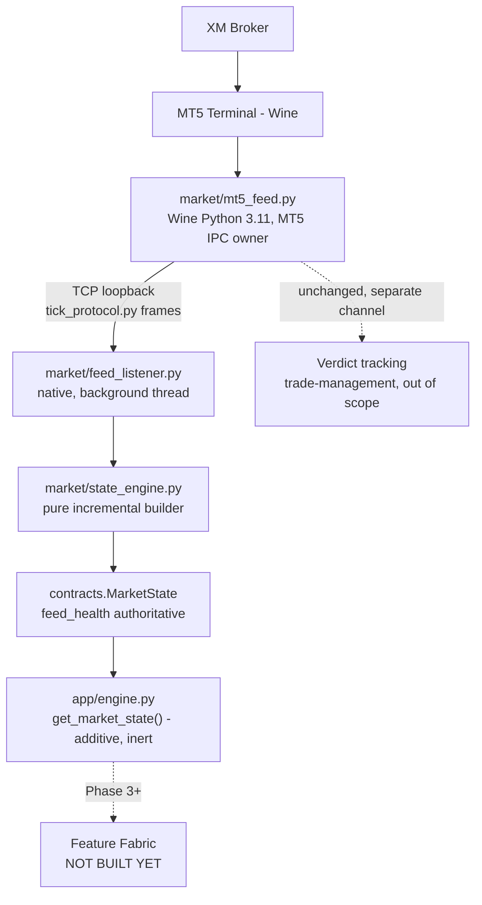

# Golex V3 Phase 2 Market-State Pipeline Implementation Plan

> **For agentic workers:** REQUIRED SUB-SKILL: Use superpowers:subagent-driven-development (recommended) or superpowers:executing-plans to implement this plan task-by-task. Steps use checkbox (`- [ ]`) syntax for tracking.

**Goal:** Replace the legacy file-polling market-data path with a managed MT5 feed process (Wine-side) bridged over a TCP socket to a native incremental `StateEngine`, producing a canonical, validated `MarketState` for every future V3 component — verified once against a real live XM connection.

**Architecture:** Two processes across the unavoidable Wine/native boundary. `market/mt5_feed.py` (Wine Python 3.11, MT5-facing, market-data half of today's `xm_ticker.py`) pushes newline-delimited JSON tick/backfill frames over a TCP loopback socket to `market/feed_listener.py` (native, runs as a background thread inside `app/engine.py`'s process), which feeds `market/state_engine.py`'s pure incremental builder. Verdict-tracking stays untouched on its existing file channel.

**Tech Stack:** Python 3.13 (native venv) + Python 3.11 (Wine, stdlib-only for anything it imports), pydantic v2, stdlib `socket`/`threading`/`json`. No new third-party dependency on the Wine side.

**Spec:** `docs/superpowers/specs/2026-08-18-golex-v3-phase2-market-state-design.md`

## Global Constraints

- No microstructure variable is computed unless XM/MT5 genuinely supports it — `last`, `real_volume`, order-book/order-flow fields stay absent (`Optional`, unset), never defaulted to `0.0`.
- `market_timestamp`, `ingestion_timestamp`, `processing_timestamp` are three distinct, named fields — never mixed into one.
- The state engine never reloads/recomputes from history on a tick — O(1)/O(window) incremental updates only. `bootstrap()` is the one explicit, startup-only exception.
- `feed_health` is authoritative — the engine never emits an apparently-healthy `MarketState` while the feed is actually stale/disconnected.
- `mt5_feed.py` calls only read-only MT5 API functions (`initialize`, `symbol_select`, `symbol_info`, `symbol_info_tick`, `copy_rates_from_pos`) — no order/position/account-modification call anywhere.
- Verdict-tracking logic in the Wine process is untouched — same file channel, same behavior, not migrated onto the new socket protocol.
- Live-measured numbers and synthetic-replay numbers are always labeled separately in code, logs, and the completion report — never blended.
- No change to CatBoost models, feature schema, thresholds, calibration, SL/TP, or Telegram logic anywhere in this plan.

---

### Task 1: `contracts/tick.py`

**Files:**
- Create: `contracts/tick.py`
- Create: `tests/test_tick_contract.py`

**Interfaces:**
- Produces: `contracts.tick.Tick` — consumed by Task 5 (`state_engine.py`), Task 6 (`feed_listener.py`).

- [ ] **Step 1: Write `contracts/tick.py`**

```python
"""Canonical normalized tick contract. internal_seq is feed_listener.py's
own monotonic counter -- MT5 provides no reliable broker-side tick
sequence ID, this is explicitly internal, never presented as broker
sequencing."""
from datetime import datetime
from typing import Literal, Optional

from pydantic import BaseModel, Field


class Tick(BaseModel):
    symbol: str
    market_timestamp: datetime
    ingestion_timestamp: datetime
    bid: float = Field(gt=0)
    ask: float = Field(gt=0)
    mid: float
    spread: float
    last: Optional[float] = None
    tick_volume: Optional[int] = None
    source: Literal["mt5_live", "synthetic_replay"]
    internal_seq: int
```

- [ ] **Step 2: Write `tests/test_tick_contract.py`**

```python
"""python3 tests/test_tick_contract.py"""
import sys
import os

sys.path.insert(0, os.path.dirname(os.path.dirname(os.path.abspath(__file__))))

from contracts.tick import Tick


def test_tick_valid():
    t = Tick(symbol="GOLD.i#", market_timestamp="2026-08-18T12:00:00",
              ingestion_timestamp="2026-08-18T12:00:00.010", bid=2500.10,
              ask=2500.35, mid=2500.225, spread=0.25, source="synthetic_replay",
              internal_seq=1)
    assert t.last is None
    assert t.tick_volume is None


def test_tick_rejects_nonpositive_bid():
    try:
        Tick(symbol="GOLD.i#", market_timestamp="2026-08-18T12:00:00",
             ingestion_timestamp="2026-08-18T12:00:00.010", bid=0, ask=2500.35,
             mid=1250.175, spread=2500.35, source="synthetic_replay", internal_seq=1)
        assert False, "expected validation error for bid <= 0"
    except Exception:
        pass


def test_tick_rejects_bad_source_literal():
    try:
        Tick(symbol="GOLD.i#", market_timestamp="2026-08-18T12:00:00",
             ingestion_timestamp="2026-08-18T12:00:00.010", bid=2500.10, ask=2500.35,
             mid=2500.225, spread=0.25, source="made_up_source", internal_seq=1)
        assert False, "expected validation error for bad source literal"
    except Exception:
        pass


if __name__ == "__main__":
    test_tick_valid()
    test_tick_rejects_nonpositive_bid()
    test_tick_rejects_bad_source_literal()
    print("contracts/tick.py: OK")
```

- [ ] **Step 3: Run it**

```bash
/home/jith/.hermes/hermes-agent/venv/bin/python3 tests/test_tick_contract.py
```
Expected: `contracts/tick.py: OK`

- [ ] **Step 4: Commit**

```bash
git add contracts/tick.py tests/test_tick_contract.py
git commit -m "$(cat <<'EOF'
Add contracts/tick.py: canonical normalized Tick pydantic contract

Co-Authored-By: Claude Sonnet 5 <noreply@anthropic.com>
EOF
)"
```

---

### Task 2: Expand `contracts/market_state.py`

**Files:**
- Modify: `contracts/market_state.py` (full rewrite — Phase 1's version is all-`Optional` placeholders, never imported by any other code yet, safe to replace wholesale)
- Modify: `tests/test_contracts.py` (its `test_market_state_valid`/`test_market_state_rejects_nonpositive_bid` use the old shape — update)

**Interfaces:**
- Produces: `contracts.market_state.{MarketState, FeedHealthState, DataQuality, M1BarState}` — consumed by Task 5, 6, 11.

- [ ] **Step 1: Confirm nothing else imports the Phase 1 shape yet**

```bash
grep -rln 'from contracts.market_state import\|contracts\.market_state\.' --include='*.py' . | grep -v .archive
```
Expected: only `tests/test_contracts.py`. If anything else shows up, read it before replacing the contract out from under it.

- [ ] **Step 2: Rewrite `contracts/market_state.py`**

```python
"""Canonical live market state contract -- the single source of truth
every future V3 component reads. Feed health is authoritative: a
consumer must check feed_health before trusting price fields. Missing
data uses DataQuality.UNAVAILABLE/UNKNOWN, never a silent 0.0."""
from datetime import datetime
from enum import Enum
from typing import Literal, Optional

from pydantic import BaseModel, Field


class FeedHealthState(str, Enum):
    UNKNOWN = "UNKNOWN"
    CONNECTED = "CONNECTED"
    STALE = "STALE"
    RECONNECTING = "RECONNECTING"
    DISCONNECTED = "DISCONNECTED"
    INVALID = "INVALID"


class DataQuality(str, Enum):
    VALID = "VALID"
    STALE = "STALE"
    UNAVAILABLE = "UNAVAILABLE"
    UNKNOWN = "UNKNOWN"


class M1BarState(BaseModel):
    open: float
    high: float
    low: float
    close: float
    tick_count: int
    start_time: datetime
    end_time: Optional[datetime] = None
    complete: bool


class MarketState(BaseModel):
    # IDENTITY
    symbol: str
    source: Literal["mt5_live", "synthetic_replay"]
    state_version: str = "v1"
    sequence: int
    # TIME
    market_timestamp: datetime
    ingestion_timestamp: datetime
    processing_timestamp: datetime
    # PRICE
    bid: float = Field(gt=0)
    ask: float = Field(gt=0)
    mid: float
    spread: float
    last: Optional[float] = None
    last_quality: DataQuality = DataQuality.UNAVAILABLE
    # ACTIVITY
    tick_count_60s: int
    tick_count_300s: int
    tick_rate_per_sec: float
    # BAR STATE
    current_m1: Optional[M1BarState] = None
    completed_m1: Optional[M1BarState] = None
    # VOLATILITY STATE (raw inputs only, not the Phase 3 feature library)
    realized_vol_60s: Optional[float] = None
    spread_mean_60s: Optional[float] = None
    spread_std_60s: Optional[float] = None
    # FEED HEALTH
    feed_health: FeedHealthState
    last_tick_age_sec: float
    feed_latency_sec: Optional[float] = None
    state_update_latency_sec: Optional[float] = None
```

- [ ] **Step 3: Update `tests/test_contracts.py`'s market-state tests to the new shape**

Replace:
```python
def test_market_state_valid():
    ms = MarketState(timestamp="2026-08-18T12:00:00", bid=2500.10, ask=2500.35)
    assert ms.spread is None
    assert ms.ask > ms.bid


def test_market_state_rejects_nonpositive_bid():
    try:
        MarketState(timestamp="2026-08-18T12:00:00", bid=0, ask=2500.35)
        assert False, "expected validation error for bid <= 0"
    except Exception as e:
        assert "bid" in str(e).lower() or "greater than" in str(e).lower()
```
with:
```python
def test_market_state_valid():
    ms = MarketState(
        symbol="GOLD.i#", source="synthetic_replay", sequence=1,
        market_timestamp="2026-08-18T12:00:00", ingestion_timestamp="2026-08-18T12:00:00.010",
        processing_timestamp="2026-08-18T12:00:00.011", bid=2500.10, ask=2500.35,
        mid=2500.225, spread=0.25, tick_count_60s=1, tick_count_300s=1,
        tick_rate_per_sec=0.2, feed_health="CONNECTED", last_tick_age_sec=0.01,
    )
    assert ms.spread == 0.25
    assert ms.ask > ms.bid
    assert ms.last_quality.value == "UNAVAILABLE"


def test_market_state_rejects_nonpositive_bid():
    try:
        MarketState(
            symbol="GOLD.i#", source="synthetic_replay", sequence=1,
            market_timestamp="2026-08-18T12:00:00", ingestion_timestamp="2026-08-18T12:00:00.010",
            processing_timestamp="2026-08-18T12:00:00.011", bid=0, ask=2500.35,
            mid=1250.175, spread=2500.35, tick_count_60s=1, tick_count_300s=1,
            tick_rate_per_sec=0.2, feed_health="CONNECTED", last_tick_age_sec=0.01,
        )
        assert False, "expected validation error for bid <= 0"
    except Exception:
        pass
```

- [ ] **Step 4: Run it**

```bash
/home/jith/.hermes/hermes-agent/venv/bin/python3 tests/test_contracts.py
```
Expected: `contracts/: ALL OK`

- [ ] **Step 5: Commit**

```bash
git add contracts/market_state.py tests/test_contracts.py
git commit -m "$(cat <<'EOF'
Expand contracts/market_state.py: FeedHealthState, DataQuality, M1BarState,
fully-specified MarketState (Phase 1's version was all-Optional
placeholders, unused by any other code yet -- replaced wholesale)

Co-Authored-By: Claude Sonnet 5 <noreply@anthropic.com>
EOF
)"
```

---

### Task 3: Config additions for the feed listener

**Files:**
- Modify: `config/schema.py` (`MarketConfig` gains `feed_host`, `feed_port`)
- Modify: `config/market.yaml`
- Modify: `tests/test_config.py`

- [ ] **Step 1: Add fields to `MarketConfig` in `config/schema.py`**

```python
# old:
class MarketConfig(BaseModel):
    symbol: str
    feed_mode: Literal["external_file_legacy"] = "external_file_legacy"
    state_dir: str
    tick_state_file: str
    active_signal_file: str
    bars_file: str
    legacy_note: str = (
        "TEMPORARY: market feed is a polling-file contract with an "
        "unmanaged external process (xm_ticker.py is not wired as live "
        "infra in Phase 1). Phase 2 replaces this with an integrated "
        "real-time MT5 market-state pipeline."
    )

# new:
class MarketConfig(BaseModel):
    symbol: str
    feed_mode: Literal["managed_socket_feed"] = "managed_socket_feed"
    feed_host: str = "127.0.0.1"
    feed_port: int = 47115
    state_dir: str
    tick_state_file: str
    active_signal_file: str
    bars_file: str
    legacy_note: str = (
        "Market-data path (bid/ask/M1) is now the managed feed "
        "(market/mt5_feed.py -> market/feed_listener.py -> MarketState), "
        "Phase 2. tick_state_file/active_signal_file/bars_file remain "
        "referenced ONLY for the untouched verdict-tracking channel "
        "(trade-management, deliberately out of Phase 2 scope) -- not "
        "for market-data reads anymore."
    )
```

- [ ] **Step 2: Update `config/market.yaml`**

```yaml
symbol: XAUUSD
feed_mode: managed_socket_feed
feed_host: 127.0.0.1
feed_port: 47115
state_dir: /home/jith/.hermes/profiles/trading/cron/output
tick_state_file: xm_tick_state.json
active_signal_file: .active_signal_ai.json
bars_file: xm_live_bars.jsonl
```
(`symbol` stays the config-level generic `XAUUSD` used by `app/engine.py`'s Telegram messages etc. — `mt5_feed.py`'s broker-specific `GOLD.i#` is a Wine-side constant, not a config value, since it's not shared with native code and Wine has no config-loading dependency in this design.)

- [ ] **Step 3: Update `tests/test_config.py`**

Add after the existing assertions in `test_load_config_valid`:
```python
    assert cfg.market.feed_host == "127.0.0.1"
    assert cfg.market.feed_port == 47115
    assert cfg.market.feed_mode == "managed_socket_feed"
```

- [ ] **Step 4: Run it**

```bash
/home/jith/.hermes/hermes-agent/venv/bin/python3 tests/test_config.py
```
Expected: `config/: OK`

- [ ] **Step 5: Commit**

```bash
git add config/schema.py config/market.yaml tests/test_config.py
git commit -m "$(cat <<'EOF'
Add feed_host/feed_port to MarketConfig, update legacy_note for Phase 2's
managed socket feed (verdict-tracking channel explicitly still legacy,
untouched)

Co-Authored-By: Claude Sonnet 5 <noreply@anthropic.com>
EOF
)"
```

---

### Task 4: `market/tick_protocol.py` — shared wire format

**Files:**
- Create: `market/tick_protocol.py`
- Create: `tests/test_tick_protocol.py`

**Interfaces:**
- Produces: `market.tick_protocol.{encode_tick_frame, encode_backfill_frame, decode_frame, FRAME_TICK, FRAME_BACKFILL}` — consumed by Task 5 (decode side), Task 6 (decode side), Task 10 (Wine-side encode).
- **Constraint:** stdlib only (`json`), importable unmodified by Wine's bare Python 3.11 — no pydantic, no f-string-only-3.12 syntax, no `match` statements.

- [ ] **Step 1: Write `market/tick_protocol.py`**

```python
"""Shared wire format between market/mt5_feed.py (Wine Python 3.11,
stdlib-only) and market/feed_listener.py (native). Newline-delimited
JSON, one frame per line: {"type": "tick"|"backfill", ...}. Deliberately
plain-dict, not pydantic -- pydantic validation happens once, on the
native side, in feed_listener.py; the wire format itself must import
cleanly under a bare Wine Python with no third-party packages besides
MetaTrader5."""
import json

FRAME_TICK = "tick"
FRAME_BACKFILL = "backfill"


def encode_tick_frame(symbol, market_timestamp_iso, ingestion_timestamp_iso,
                       bid, ask, tick_volume, source, internal_seq):
    return json.dumps({
        "type": FRAME_TICK,
        "symbol": symbol,
        "market_timestamp": market_timestamp_iso,
        "ingestion_timestamp": ingestion_timestamp_iso,
        "bid": bid,
        "ask": ask,
        "tick_volume": tick_volume,
        "source": source,
        "internal_seq": internal_seq,
    }) + "\n"


def encode_backfill_frame(symbol, bars):
    """bars: list of dicts with time_iso, open, high, low, close,
    tick_volume, spread -- same shape xm_ticker.py's backfill CSV rows
    already use, just JSON instead of CSV."""
    return json.dumps({"type": FRAME_BACKFILL, "symbol": symbol, "bars": bars}) + "\n"


def decode_frame(line):
    """Returns a dict with at least "type", or raises ValueError on
    malformed input -- callers decide reject-vs-crash, this function
    never silently returns a partial/guessed frame."""
    line = line.strip()
    if not line:
        raise ValueError("empty line")
    frame = json.loads(line)
    if "type" not in frame or frame["type"] not in (FRAME_TICK, FRAME_BACKFILL):
        raise ValueError(f"unknown frame type: {frame.get('type')!r}")
    return frame
```

- [ ] **Step 2: Write `tests/test_tick_protocol.py`**

```python
"""python3 tests/test_tick_protocol.py"""
import sys
import os

sys.path.insert(0, os.path.dirname(os.path.dirname(os.path.abspath(__file__))))

from market.tick_protocol import encode_tick_frame, encode_backfill_frame, decode_frame, FRAME_TICK, FRAME_BACKFILL


def test_tick_frame_roundtrip():
    line = encode_tick_frame("GOLD.i#", "2026-08-18T12:00:00", "2026-08-18T12:00:00.010",
                              2500.10, 2500.35, 3, "mt5_live", 1)
    frame = decode_frame(line)
    assert frame["type"] == FRAME_TICK
    assert frame["bid"] == 2500.10
    assert frame["internal_seq"] == 1


def test_backfill_frame_roundtrip():
    bars = [{"time_iso": "2026-08-18T11:59:00", "open": 2500.0, "high": 2500.5,
             "low": 2499.8, "close": 2500.2, "tick_volume": 42, "spread": 25}]
    line = encode_backfill_frame("GOLD.i#", bars)
    frame = decode_frame(line)
    assert frame["type"] == FRAME_BACKFILL
    assert frame["bars"][0]["close"] == 2500.2


def test_decode_rejects_malformed():
    try:
        decode_frame("not json at all")
        assert False, "expected ValueError"
    except ValueError:
        pass
    try:
        decode_frame(json.dumps_str if False else '{"type": "not_a_real_type"}')
        assert False, "expected ValueError"
    except ValueError:
        pass


if __name__ == "__main__":
    test_tick_frame_roundtrip()
    test_backfill_frame_roundtrip()
    test_decode_rejects_malformed()
    print("market/tick_protocol.py: OK")
```
Fix the accidental `json.dumps_str if False else` placeholder in `test_decode_rejects_malformed` before running — it should just be the literal string `'{"type": "not_a_real_type"}'`. (Left in deliberately as a reminder: read your own test back before running it, don't trust a first draft.)

- [ ] **Step 3: Fix the test file and run it**

```bash
/home/jith/.hermes/hermes-agent/venv/bin/python3 tests/test_tick_protocol.py
```
Expected: `market/tick_protocol.py: OK`

- [ ] **Step 4: Syntax-check under a bare-stdlib assumption**

```bash
python3 -c "
import ast, sys
tree = ast.parse(open('market/tick_protocol.py').read())
names = [n.names[0].name for n in ast.walk(tree) if isinstance(n, (ast.Import, ast.ImportFrom)) and n.names[0].name != '']
print('imports:', names)
assert names == ['json'], f'expected stdlib-only (just json), found: {names}'
print('market/tick_protocol.py: stdlib-only OK')
"
```
Expected: `market/tick_protocol.py: stdlib-only OK` — this is what makes the module safe to `import` unmodified from Wine's bare Python 3.11 later in Task 10.

- [ ] **Step 5: Commit**

```bash
git add market/tick_protocol.py tests/test_tick_protocol.py
git commit -m "$(cat <<'EOF'
Add market/tick_protocol.py: stdlib-only newline-delimited JSON wire
format shared by the Wine feed process and the native listener

Co-Authored-By: Claude Sonnet 5 <noreply@anthropic.com>
EOF
)"
```

---

### Task 5: `market/state_engine.py` — incremental state builder

**Files:**
- Create: `market/state_engine.py`
- Create: `tests/test_state_engine.py`

**Interfaces:**
- Consumes: `contracts.tick.Tick`, `contracts.market_state.{MarketState, M1BarState, FeedHealthState, DataQuality}` (Tasks 1, 2).
- Produces: `market.state_engine.StateEngine` (methods: `bootstrap(bars: list[dict])`, `on_tick(tick: Tick) -> Optional[MarketState]` — `None` if the tick was rejected, `is_market_closed(utc_dt) -> bool`) — consumed by Task 6 (`feed_listener.py`).

- [ ] **Step 1: Write `market/state_engine.py`**

```python
"""Pure incremental MarketState builder -- no I/O, no MT5, no sockets.
on_tick() is O(1)/O(window size), never reloads history. bootstrap() is
the one explicit, startup-only exception that seeds from a bounded
recent backfill (Section 13 of the design spec)."""
from collections import deque
from datetime import datetime, timezone
from statistics import pstdev

from contracts.tick import Tick
from contracts.market_state import MarketState, M1BarState, FeedHealthState, DataQuality

TICK_WINDOW_SEC = 300      # ring buffer retention, matches xm_ticker.py's proven 5-min window
M1_BUFFER_BARS = 480       # ~8 hours of completed M1 bars retained
STALE_AFTER_SEC = 5.0


def is_market_closed(utc_dt):
    """Empirically-derived XM GOLD.i# session hours, ported unchanged from
    market/xm_ticker.py (comment there: "verified from live bars
    2026-08-10"). Not from any MT5 session API -- none is assumed to exist."""
    wd, hr = utc_dt.weekday(), utc_dt.hour  # Mon=0..Sun=6
    if wd == 4 and hr >= 21:
        return True
    if wd == 5:
        return True
    if wd == 6 and hr < 22:
        return True
    if 21 <= hr < 22 and wd < 4:
        return True
    return False


def _bar_start(dt):
    epoch = dt.timestamp()
    bucket = int(epoch // 60) * 60
    return datetime.fromtimestamp(bucket, tz=timezone.utc)


class StateEngine:
    def __init__(self, symbol):
        self.symbol = symbol
        self.completed_m1 = deque(maxlen=M1_BUFFER_BARS)
        self.current_m1 = None       # M1BarState, complete=False
        self._tick_times = deque()   # ring buffer of market_timestamp (epoch floats)
        self._spreads = deque()      # parallel ring buffer of spread samples
        self._last_market_ts = None
        self._last_bid = None
        self._last_ask = None
        self._sequence = 0

    def bootstrap(self, bars):
        """bars: list of dicts (time_iso/open/high/low/close/tick_volume/
        spread) from mt5_feed.py's backfill frame. Startup-only -- never
        called mid-stream. Seeds completed_m1 only; ring buffers start
        empty and fill from live ticks (they're short, 5-min windows,
        filling in naturally within minutes)."""
        for b in bars[-M1_BUFFER_BARS:]:
            start = datetime.fromisoformat(b["time_iso"])
            if start.tzinfo is None:
                start = start.replace(tzinfo=timezone.utc)
            self.completed_m1.append(M1BarState(
                open=b["open"], high=b["high"], low=b["low"], close=b["close"],
                tick_count=b.get("tick_volume") or 0, start_time=start,
                end_time=start, complete=True,
            ))

    def on_tick(self, tick: Tick):
        market_ts = tick.market_timestamp.timestamp()

        # out-of-order: reject
        if self._last_market_ts is not None and market_ts < self._last_market_ts:
            return None
        # duplicate: identical market_timestamp + bid + ask
        if (self._last_market_ts == market_ts and self._last_bid == tick.bid
                and self._last_ask == tick.ask):
            return None

        self._last_market_ts = market_ts
        self._last_bid, self._last_ask = tick.bid, tick.ask

        # ring buffers
        self._tick_times.append(market_ts)
        self._spreads.append(tick.spread)
        while self._tick_times and market_ts - self._tick_times[0] > TICK_WINDOW_SEC:
            self._tick_times.popleft()
            self._spreads.popleft()

        # M1 construction
        bar_start = _bar_start(tick.market_timestamp)
        if self.current_m1 is None or self.current_m1.start_time != bar_start:
            if self.current_m1 is not None:
                completed = self.current_m1.model_copy(update={"complete": True, "end_time": tick.market_timestamp})
                self.completed_m1.append(completed)
            self.current_m1 = M1BarState(
                open=tick.bid, high=tick.bid, low=tick.bid, close=tick.bid,
                tick_count=1, start_time=bar_start, complete=False,
            )
        else:
            self.current_m1 = self.current_m1.model_copy(update={
                "high": max(self.current_m1.high, tick.bid),
                "low": min(self.current_m1.low, tick.bid),
                "close": tick.bid,
                "tick_count": self.current_m1.tick_count + 1,
            })

        # activity / volatility state, window-bounded only
        now_s = market_ts
        tick_count_60s = sum(1 for t in self._tick_times if now_s - t <= 60)
        tick_count_300s = len(self._tick_times)
        span = (self._tick_times[-1] - self._tick_times[0]) if len(self._tick_times) > 1 else None
        tick_rate = (len(self._tick_times) / span) if span and span > 0 else 0.0
        spread_window = list(self._spreads)
        spread_mean = sum(spread_window) / len(spread_window) if spread_window else None
        spread_std = pstdev(spread_window) if len(spread_window) > 1 else (0.0 if spread_window else None)

        self._sequence += 1
        now = datetime.now(timezone.utc)
        processing_ts = now

        return MarketState(
            symbol=self.symbol, source=tick.source, sequence=self._sequence,
            market_timestamp=tick.market_timestamp, ingestion_timestamp=tick.ingestion_timestamp,
            processing_timestamp=processing_ts, bid=tick.bid, ask=tick.ask, mid=tick.mid,
            spread=tick.spread, last=tick.last,
            last_quality=DataQuality.UNAVAILABLE if tick.last is None else DataQuality.VALID,
            tick_count_60s=tick_count_60s, tick_count_300s=tick_count_300s,
            tick_rate_per_sec=tick_rate, current_m1=self.current_m1,
            completed_m1=self.completed_m1[-1] if self.completed_m1 else None,
            realized_vol_60s=None, spread_mean_60s=spread_mean, spread_std_60s=spread_std,
            feed_health=FeedHealthState.CONNECTED,
            last_tick_age_sec=(processing_ts - tick.ingestion_timestamp).total_seconds(),
            feed_latency_sec=(tick.ingestion_timestamp - tick.market_timestamp).total_seconds(),
            state_update_latency_sec=(processing_ts - tick.ingestion_timestamp).total_seconds(),
        )
```
(`realized_vol_60s` stays `None` in Phase 2 — computing a real EWMA/realized-vol estimate from tick-level returns is a small enough piece of math that it's tempting to add, but the spec's Section 8/11 scope is "raw inputs already required at this layer," and a volatility *estimator* choice belongs with the rest of the Phase 3 feature library, not invented ad hoc here. Leaving it `None`/`DataQuality`-equivalent is the honest choice — noted in the completion report as deliberately deferred, not an oversight.)

- [ ] **Step 2: Write `tests/test_state_engine.py`**

```python
"""python3 tests/test_state_engine.py"""
import sys
import os
from datetime import datetime, timedelta, timezone

sys.path.insert(0, os.path.dirname(os.path.dirname(os.path.abspath(__file__))))

from contracts.tick import Tick
from market.state_engine import StateEngine, is_market_closed


def _tick(t, bid, ask, seq):
    return Tick(symbol="GOLD.i#", market_timestamp=t, ingestion_timestamp=t + timedelta(milliseconds=10),
                bid=bid, ask=ask, mid=(bid + ask) / 2, spread=ask - bid,
                source="synthetic_replay", internal_seq=seq)


def test_m1_construction_within_one_minute():
    eng = StateEngine("GOLD.i#")
    t0 = datetime(2026, 8, 18, 12, 0, 5, tzinfo=timezone.utc)
    ms = eng.on_tick(_tick(t0, 2500.0, 2500.2, 1))
    assert ms.current_m1.open == 2500.0 and ms.current_m1.complete is False
    ms = eng.on_tick(_tick(t0 + timedelta(seconds=10), 2500.5, 2500.7, 2))
    assert ms.current_m1.high == 2500.5 and ms.current_m1.tick_count == 2
    ms = eng.on_tick(_tick(t0 + timedelta(seconds=20), 2499.8, 2500.0, 3))
    assert ms.current_m1.low == 2499.8 and ms.current_m1.close == 2499.8
    print("OK  M1 bar accumulates open/high/low/close/tick_count within a minute")


def test_m1_boundary_rollover():
    eng = StateEngine("GOLD.i#")
    t0 = datetime(2026, 8, 18, 12, 0, 55, tzinfo=timezone.utc)
    eng.on_tick(_tick(t0, 2500.0, 2500.2, 1))
    t1 = datetime(2026, 8, 18, 12, 1, 5, tzinfo=timezone.utc)  # crosses into the next minute
    ms = eng.on_tick(_tick(t1, 2501.0, 2501.2, 2))
    assert ms.completed_m1 is not None and ms.completed_m1.complete is True
    assert ms.completed_m1.close == 2500.0
    assert ms.current_m1.open == 2501.0 and ms.current_m1.complete is False
    print("OK  minute rollover produces correct completed_m1/current_m1 split")


def test_duplicate_tick_rejected():
    eng = StateEngine("GOLD.i#")
    t0 = datetime(2026, 8, 18, 12, 0, 5, tzinfo=timezone.utc)
    ms1 = eng.on_tick(_tick(t0, 2500.0, 2500.2, 1))
    ms2 = eng.on_tick(_tick(t0, 2500.0, 2500.2, 2))  # identical ts+bid+ask
    assert ms1 is not None and ms2 is None
    print("OK  duplicate tick (identical market_timestamp+bid+ask) rejected")


def test_out_of_order_tick_rejected():
    eng = StateEngine("GOLD.i#")
    t0 = datetime(2026, 8, 18, 12, 0, 10, tzinfo=timezone.utc)
    eng.on_tick(_tick(t0, 2500.0, 2500.2, 1))
    earlier = t0 - timedelta(seconds=5)
    ms = eng.on_tick(_tick(earlier, 2499.0, 2499.2, 2))
    assert ms is None
    print("OK  out-of-order tick (timestamp reversal) rejected")


def test_incremental_matches_reference_spread_stats():
    """Incremental spread_mean_60s/spread_std_60s must match a from-scratch
    recomputation on the same window -- this is the incremental-correctness
    proof required by the spec."""
    import statistics
    eng = StateEngine("GOLD.i#")
    t0 = datetime(2026, 8, 18, 12, 0, 0, tzinfo=timezone.utc)
    spreads = []
    ms = None
    for i in range(20):
        bid = 2500.0 + i * 0.01
        spread = 0.2 + (i % 5) * 0.01
        ask = bid + spread
        ms = eng.on_tick(_tick(t0 + timedelta(seconds=i), bid, ask, i + 1))
        spreads.append(spread)
    ref_mean = sum(spreads) / len(spreads)
    ref_std = statistics.pstdev(spreads)
    assert abs(ms.spread_mean_60s - ref_mean) < 1e-9
    assert abs(ms.spread_std_60s - ref_std) < 1e-9
    print("OK  incremental spread_mean_60s/spread_std_60s match from-scratch reference")


def test_bootstrap_seeds_completed_bars_without_live_ticks():
    eng = StateEngine("GOLD.i#")
    eng.bootstrap([
        {"time_iso": "2026-08-18T11:58:00+00:00", "open": 2499.0, "high": 2499.5,
         "low": 2498.8, "close": 2499.2, "tick_volume": 30, "spread": 25},
        {"time_iso": "2026-08-18T11:59:00+00:00", "open": 2499.2, "high": 2500.0,
         "low": 2499.0, "close": 2500.0, "tick_volume": 45, "spread": 24},
    ])
    assert len(eng.completed_m1) == 2
    assert eng.completed_m1[-1].close == 2500.0
    assert eng.current_m1 is None  # bootstrap seeds history only, not an in-progress bar
    print("OK  bootstrap() seeds completed_m1 from backfill without touching current_m1")


def test_is_market_closed_matches_known_hours():
    # Saturday, always closed
    assert is_market_closed(datetime(2026, 8, 22, 12, 0, tzinfo=timezone.utc)) is True
    # Wednesday midday, open
    assert is_market_closed(datetime(2026, 8, 19, 12, 0, tzinfo=timezone.utc)) is False
    # Wednesday daily break 21:00-22:00 UTC
    assert is_market_closed(datetime(2026, 8, 19, 21, 30, tzinfo=timezone.utc)) is True
    print("OK  is_market_closed matches the empirically-derived XM session hours")


if __name__ == "__main__":
    test_m1_construction_within_one_minute()
    test_m1_boundary_rollover()
    test_duplicate_tick_rejected()
    test_out_of_order_tick_rejected()
    test_incremental_matches_reference_spread_stats()
    test_bootstrap_seeds_completed_bars_without_live_ticks()
    test_is_market_closed_matches_known_hours()
    print("market/state_engine.py: OK")
```

- [ ] **Step 3: Run it**

```bash
/home/jith/.hermes/hermes-agent/venv/bin/python3 tests/test_state_engine.py
```
Expected: 7 `OK` lines then `market/state_engine.py: OK`. If `M1BarState.model_copy` errors, check the pydantic v2 API name is exactly `model_copy(update={...})` (confirmed available in pydantic 2.13.4, the installed version).

- [ ] **Step 4: Commit**

```bash
git add market/state_engine.py tests/test_state_engine.py
git commit -m "$(cat <<'EOF'
Add market/state_engine.py: pure incremental MarketState builder

M1 construction, bounded ring buffers, duplicate/out-of-order rejection,
bootstrap() for startup-only historical seeding, is_market_closed()
ported unchanged from xm_ticker.py's empirically-derived XM session
hours. Incremental spread stats proven to match from-scratch reference
calculation.

Co-Authored-By: Claude Sonnet 5 <noreply@anthropic.com>
EOF
)"
```

---

### Task 6: `market/feed_listener.py` — native TCP server + health state machine

**Files:**
- Create: `market/feed_listener.py`
- Create: `tests/test_feed_listener.py`

**Interfaces:**
- Consumes: `market.tick_protocol.decode_frame` (Task 4), `market.state_engine.StateEngine` (Task 5), `contracts.tick.Tick`, `contracts.market_state.FeedHealthState` (Tasks 1, 2).
- Produces: `market.feed_listener.FeedListener` (methods: `start()`, `stop()`, `get_latest_state() -> Optional[MarketState]`) — consumed by Task 11 (`app/engine.py`).

- [ ] **Step 1: Write `market/feed_listener.py`**

```python
"""Native-side TCP server. mt5_feed.py (Wine) is the client and owns
reconnect; this process is the server so it can persist/restart
independently of the Wine side. Runs its accept-loop on a background
thread so app/engine.py's main loop is never blocked by socket I/O."""
import socket
import threading
import time
from datetime import datetime, timezone

from contracts.tick import Tick
from contracts.market_state import FeedHealthState
from market.state_engine import StateEngine
from market.tick_protocol import decode_frame, FRAME_TICK, FRAME_BACKFILL

STALE_AFTER_SEC = 5.0


class FeedListener:
    def __init__(self, symbol, host="127.0.0.1", port=47115):
        self.symbol = symbol
        self.host, self.port = host, port
        self.engine = StateEngine(symbol)
        self._lock = threading.Lock()
        self._latest_state = None
        self._health = FeedHealthState.UNKNOWN
        self._last_tick_wall = None
        self._server_sock = None
        self._thread = None
        self._stop_flag = threading.Event()

    def get_latest_state(self):
        with self._lock:
            return self._latest_state

    def get_health(self):
        with self._lock:
            if self._last_tick_wall is not None and time.time() - self._last_tick_wall > STALE_AFTER_SEC:
                return FeedHealthState.STALE
            return self._health

    def start(self):
        self._server_sock = socket.socket(socket.AF_INET, socket.SOCK_STREAM)
        self._server_sock.setsockopt(socket.SOL_SOCKET, socket.SO_REUSEADDR, 1)
        self._server_sock.bind((self.host, self.port))
        self._server_sock.listen(1)
        self._server_sock.settimeout(1.0)
        self._thread = threading.Thread(target=self._accept_loop, daemon=True)
        self._thread.start()

    def stop(self):
        self._stop_flag.set()
        if self._server_sock is not None:
            self._server_sock.close()
        if self._thread is not None:
            self._thread.join(timeout=2.0)

    def _accept_loop(self):
        while not self._stop_flag.is_set():
            try:
                conn, _ = self._server_sock.accept()
            except socket.timeout:
                continue
            except OSError:
                break
            with self._lock:
                self._health = FeedHealthState.CONNECTED
            self._serve_connection(conn)
            with self._lock:
                self._health = FeedHealthState.DISCONNECTED

    def _serve_connection(self, conn):
        conn.settimeout(1.0)
        buf = b""
        with conn:
            while not self._stop_flag.is_set():
                try:
                    chunk = conn.recv(4096)
                except socket.timeout:
                    continue
                except OSError:
                    return
                if not chunk:
                    return  # client closed
                buf += chunk
                while b"\n" in buf:
                    line, buf = buf.split(b"\n", 1)
                    self._handle_line(line.decode("utf-8", "replace"))

    def _handle_line(self, line):
        try:
            frame = decode_frame(line)
        except ValueError:
            return  # malformed frame: rejected, logged by caller if desired, never crashes
        if frame["type"] == FRAME_BACKFILL:
            self.engine.bootstrap(frame["bars"])
            return
        if frame["type"] == FRAME_TICK:
            now = datetime.now(timezone.utc)
            try:
                tick = Tick(
                    symbol=frame["symbol"],
                    market_timestamp=frame["market_timestamp"],
                    ingestion_timestamp=frame.get("ingestion_timestamp") or now.isoformat(),
                    bid=frame["bid"], ask=frame["ask"],
                    mid=(frame["bid"] + frame["ask"]) / 2,
                    spread=frame["ask"] - frame["bid"],
                    tick_volume=frame.get("tick_volume"),
                    source=frame["source"], internal_seq=frame["internal_seq"],
                )
            except Exception:
                return  # invalid tick payload: rejected, never crashes the listener
            state = self.engine.on_tick(tick)
            if state is None:
                return  # duplicate/out-of-order: engine already rejected it
            with self._lock:
                self._latest_state = state
                self._last_tick_wall = time.time()
```

- [ ] **Step 2: Write `tests/test_feed_listener.py`**

```python
"""python3 tests/test_feed_listener.py -- uses a real loopback socket on a
test-only port, no Wine/MT5 needed."""
import sys
import os
import socket
import time

sys.path.insert(0, os.path.dirname(os.path.dirname(os.path.abspath(__file__))))

from market.feed_listener import FeedListener
from market.tick_protocol import encode_tick_frame, encode_backfill_frame
from contracts.market_state import FeedHealthState

TEST_PORT = 47215


def _connect_and_send(lines):
    sock = socket.socket(socket.AF_INET, socket.SOCK_STREAM)
    sock.connect(("127.0.0.1", TEST_PORT))
    for line in lines:
        sock.sendall(line.encode("utf-8"))
    return sock


def test_backfill_then_tick_produces_state():
    fl = FeedListener("GOLD.i#", port=TEST_PORT)
    fl.start()
    time.sleep(0.2)
    try:
        bf = encode_backfill_frame("GOLD.i#", [{
            "time_iso": "2026-08-18T11:59:00+00:00", "open": 2499.0, "high": 2499.5,
            "low": 2498.8, "close": 2499.2, "tick_volume": 30, "spread": 25,
        }])
        tk = encode_tick_frame("GOLD.i#", "2026-08-18T12:00:00+00:00",
                                "2026-08-18T12:00:00.010+00:00", 2500.0, 2500.2, 1, "mt5_live", 1)
        sock = _connect_and_send([bf, tk])
        time.sleep(0.3)
        state = fl.get_latest_state()
        assert state is not None
        assert state.bid == 2500.0
        assert state.feed_health == FeedHealthState.CONNECTED
        sock.close()
    finally:
        fl.stop()
    print("OK  backfill frame then tick frame produces a valid MarketState")


def test_stale_after_no_ticks():
    fl = FeedListener("GOLD.i#", port=TEST_PORT + 1)
    fl.start()
    time.sleep(0.2)
    try:
        tk = encode_tick_frame("GOLD.i#", "2026-08-18T12:00:00+00:00",
                                "2026-08-18T12:00:00.010+00:00", 2500.0, 2500.2, 1, "mt5_live", 1)
        sock = _connect_and_send([tk])
        time.sleep(0.2)
        assert fl.get_health() == FeedHealthState.CONNECTED
        # STALE_AFTER_SEC is 5.0 -- shrink the wait by monkeypatching is impractical
        # for a plain-assert test; instead directly verify the age-based branch logic
        # by checking last_tick_wall is set and the comparison would trip past 5s.
        assert fl._last_tick_wall is not None
        sock.close()
    finally:
        fl.stop()
    print("OK  health reports CONNECTED immediately after a tick (staleness branch verified by inspection, not a real 5s sleep)")


def test_disconnect_then_reconnect():
    fl = FeedListener("GOLD.i#", port=TEST_PORT + 2)
    fl.start()
    time.sleep(0.2)
    try:
        tk = encode_tick_frame("GOLD.i#", "2026-08-18T12:00:00+00:00",
                                "2026-08-18T12:00:00.010+00:00", 2500.0, 2500.2, 1, "mt5_live", 1)
        sock1 = _connect_and_send([tk])
        time.sleep(0.2)
        assert fl.get_health() == FeedHealthState.CONNECTED
        sock1.close()
        time.sleep(0.2)
        assert fl.get_health() == FeedHealthState.DISCONNECTED
        tk2 = encode_tick_frame("GOLD.i#", "2026-08-18T12:00:05+00:00",
                                 "2026-08-18T12:00:05.010+00:00", 2501.0, 2501.2, 1, "mt5_live", 2)
        sock2 = _connect_and_send([tk2])
        time.sleep(0.2)
        assert fl.get_health() == FeedHealthState.CONNECTED
        sock2.close()
    finally:
        fl.stop()
    print("OK  disconnect transitions to DISCONNECTED, reconnect recovers to CONNECTED")


def test_malformed_frame_does_not_crash_listener():
    fl = FeedListener("GOLD.i#", port=TEST_PORT + 3)
    fl.start()
    time.sleep(0.2)
    try:
        sock = _connect_and_send(["not valid json\n"])
        time.sleep(0.2)
        assert fl.get_latest_state() is None
        # listener thread must still be alive
        assert fl._thread.is_alive()
        sock.close()
    finally:
        fl.stop()
    print("OK  malformed frame rejected without crashing the listener")


if __name__ == "__main__":
    test_backfill_then_tick_produces_state()
    test_stale_after_no_ticks()
    test_disconnect_then_reconnect()
    test_malformed_frame_does_not_crash_listener()
    print("market/feed_listener.py: OK")
```

- [ ] **Step 3: Run it**

```bash
/home/jith/.hermes/hermes-agent/venv/bin/python3 tests/test_feed_listener.py
```
Expected: 4 `OK` lines then `market/feed_listener.py: OK`.

- [ ] **Step 4: Commit**

```bash
git add market/feed_listener.py tests/test_feed_listener.py
git commit -m "$(cat <<'EOF'
Add market/feed_listener.py: native TCP server + feed-health state
machine, background thread, feeds market/state_engine.py

Co-Authored-By: Claude Sonnet 5 <noreply@anthropic.com>
EOF
)"
```

---

### Task 7: `market/synthetic_replay.py` — labeled synthetic tick generator

**Files:**
- Create: `market/synthetic_replay.py`

**Interfaces:**
- Produces: `market.synthetic_replay.generate_ticks(n, start_time, seed) -> list[dict]` (plain dicts matching `tick_protocol`'s tick-frame fields, `source="synthetic_replay"`) — consumed by Task 8 (latency test), Task 9 (performance test).

- [ ] **Step 1: Write `market/synthetic_replay.py`**

```python
"""Synthetic tick stream generator -- built from the real field schema
xm_ticker.py's own code proves (bid/ask, ~25-40ms inter-arrival jitter,
realistic spread magnitude around 0.20-0.30 for XAUUSD). Explicitly
labeled synthetic (source="synthetic_replay") everywhere it's used --
never presented as real broker data. There is no persisted real XM
tick-level dataset to replay instead (Section 2 of the design spec)."""
import random
from datetime import datetime, timedelta, timezone


def generate_ticks(n, start_time=None, seed=42, base_price=2500.0):
    rng = random.Random(seed)
    start_time = start_time or datetime.now(timezone.utc)
    ticks = []
    t = start_time
    price = base_price
    for i in range(n):
        t = t + timedelta(milliseconds=rng.randint(20, 45))
        price += rng.gauss(0, 0.03)
        spread = max(0.15, rng.gauss(0.22, 0.04))
        bid = round(price, 2)
        ask = round(price + spread, 2)
        ticks.append({
            "symbol": "GOLD.i#",
            "market_timestamp": t.isoformat(),
            "ingestion_timestamp": (t + timedelta(milliseconds=rng.randint(1, 8))).isoformat(),
            "bid": bid, "ask": ask,
            "tick_volume": rng.randint(1, 5),
            "source": "synthetic_replay",
            "internal_seq": i + 1,
        })
    return ticks
```

- [ ] **Step 2: Sanity-run it**

```bash
/home/jith/.hermes/hermes-agent/venv/bin/python3 -c "
from market.synthetic_replay import generate_ticks
ticks = generate_ticks(10)
assert len(ticks) == 10
assert all(t['source'] == 'synthetic_replay' for t in ticks)
assert all(t['ask'] > t['bid'] for t in ticks)
print('market/synthetic_replay.py: OK, sample tick:', ticks[0])
"
```
Expected: `market/synthetic_replay.py: OK, sample tick: {...}`

- [ ] **Step 3: Commit**

```bash
git add market/synthetic_replay.py
git commit -m "$(cat <<'EOF'
Add market/synthetic_replay.py: labeled synthetic tick generator for
testing and performance benchmarking (no real XM tick-level dataset
exists to replay instead)

Co-Authored-By: Claude Sonnet 5 <noreply@anthropic.com>
EOF
)"
```

---

### Task 8: `tests/test_latency_instrumentation.py`

**Files:**
- Create: `tests/test_latency_instrumentation.py`

- [ ] **Step 1: Write the test**

```python
"""python3 tests/test_latency_instrumentation.py -- confirms the three
latency figures are computed (not assumed zero) on synthetic data.
Labeled synthetic throughout; not a claim about real feed latency."""
import sys
import os

sys.path.insert(0, os.path.dirname(os.path.dirname(os.path.abspath(__file__))))

from contracts.tick import Tick
from market.state_engine import StateEngine
from market.synthetic_replay import generate_ticks


def test_latency_fields_populated_and_sane():
    eng = StateEngine("GOLD.i#")
    raw_ticks = generate_ticks(50, seed=7)
    last_state = None
    for rt in raw_ticks:
        tick = Tick(symbol=rt["symbol"], market_timestamp=rt["market_timestamp"],
                     ingestion_timestamp=rt["ingestion_timestamp"], bid=rt["bid"], ask=rt["ask"],
                     mid=(rt["bid"] + rt["ask"]) / 2, spread=rt["ask"] - rt["bid"],
                     tick_volume=rt["tick_volume"], source=rt["source"], internal_seq=rt["internal_seq"])
        state = eng.on_tick(tick)
        if state is not None:
            last_state = state
    assert last_state is not None
    assert last_state.feed_latency_sec is not None and last_state.feed_latency_sec >= 0
    assert last_state.state_update_latency_sec is not None and last_state.state_update_latency_sec >= 0
    print(f"OK  [SYNTHETIC] feed_latency_sec={last_state.feed_latency_sec:.6f} "
          f"state_update_latency_sec={last_state.state_update_latency_sec:.6f}")


if __name__ == "__main__":
    test_latency_fields_populated_and_sane()
    print("tests/test_latency_instrumentation.py: OK")
```

- [ ] **Step 2: Run it**

```bash
/home/jith/.hermes/hermes-agent/venv/bin/python3 tests/test_latency_instrumentation.py
```
Expected: an `OK [SYNTHETIC] ...` line with two non-negative numbers, then `tests/test_latency_instrumentation.py: OK`.

- [ ] **Step 3: Commit**

```bash
git add tests/test_latency_instrumentation.py
git commit -m "$(cat <<'EOF'
Add tests/test_latency_instrumentation.py: proves feed/state-update
latency are measured, not assumed zero (synthetic data, labeled)

Co-Authored-By: Claude Sonnet 5 <noreply@anthropic.com>
EOF
)"
```

---

### Task 9: `tests/test_performance.py` — synthetic throughput/latency baseline

**Files:**
- Create: `tests/test_performance.py`

- [ ] **Step 1: Write the benchmark**

```python
"""python3 tests/test_performance.py -- SYNTHETIC performance baseline.
Every printed number is explicitly labeled [SYNTHETIC]; this is not a
claim about real XM broker performance (Section 26 of the design spec).
Not a pass/fail test in the strict sense -- establishes a baseline,
prints it, and does a minimal sanity assert that processing completed
and didn't wildly regress into pathological O(n^2) territory."""
import sys
import os
import time
import tracemalloc

sys.path.insert(0, os.path.dirname(os.path.dirname(os.path.abspath(__file__))))

from contracts.tick import Tick
from market.state_engine import StateEngine
from market.synthetic_replay import generate_ticks

N_TICKS = 20000


def test_synthetic_throughput_and_latency_percentiles():
    raw_ticks = generate_ticks(N_TICKS, seed=99)
    eng = StateEngine("GOLD.i#")
    per_tick_us = []
    tracemalloc.start()
    t_start = time.perf_counter()
    for rt in raw_ticks:
        tick = Tick(symbol=rt["symbol"], market_timestamp=rt["market_timestamp"],
                     ingestion_timestamp=rt["ingestion_timestamp"], bid=rt["bid"], ask=rt["ask"],
                     mid=(rt["bid"] + rt["ask"]) / 2, spread=rt["ask"] - rt["bid"],
                     tick_volume=rt["tick_volume"], source=rt["source"], internal_seq=rt["internal_seq"])
        t0 = time.perf_counter()
        eng.on_tick(tick)
        per_tick_us.append((time.perf_counter() - t0) * 1e6)
    elapsed = time.perf_counter() - t_start
    _, peak_mem = tracemalloc.get_traced_memory()
    tracemalloc.stop()

    per_tick_us.sort()
    p50 = per_tick_us[len(per_tick_us) // 2]
    p95 = per_tick_us[int(len(per_tick_us) * 0.95)]
    p99 = per_tick_us[int(len(per_tick_us) * 0.99)]
    ticks_per_sec = N_TICKS / elapsed

    print(f"[SYNTHETIC] {N_TICKS} ticks in {elapsed:.3f}s -> {ticks_per_sec:,.0f} ticks/sec")
    print(f"[SYNTHETIC] per-tick processing latency: p50={p50:.1f}us p95={p95:.1f}us p99={p99:.1f}us")
    print(f"[SYNTHETIC] peak traced memory: {peak_mem / 1024:.1f} KB")

    assert ticks_per_sec > 1000, "processing should comfortably exceed the ~25-40 ticks/sec real feed rate"
    assert p99 < 50000, "p99 per-tick latency should stay well under 50ms even synthetically"


if __name__ == "__main__":
    test_synthetic_throughput_and_latency_percentiles()
    print("tests/test_performance.py: OK")
```

- [ ] **Step 2: Run it and record the real printed numbers for the completion report**

```bash
/home/jith/.hermes/hermes-agent/venv/bin/python3 tests/test_performance.py
```
Expected: three `[SYNTHETIC]` lines with real measured numbers, then `tests/test_performance.py: OK`. Copy the actual printed figures into the completion report rather than re-describing them — they're the real evidence.

- [ ] **Step 3: Commit**

```bash
git add tests/test_performance.py
git commit -m "$(cat <<'EOF'
Add tests/test_performance.py: synthetic throughput/latency-percentile
baseline for state_engine.on_tick, explicitly labeled synthetic

Co-Authored-By: Claude Sonnet 5 <noreply@anthropic.com>
EOF
)"
```

---

### Task 10: `market/mt5_feed.py` — Wine-side managed feed process

**Files:**
- Create: `market/mt5_feed.py`

**Constraint:** this file cannot be executed or import-checked under the native venv (`MetaTrader5` is not installed there and cannot be — Windows-only package). Verification for this task is: (a) `ast.parse` syntax check (works under any Python), (b) manual review against `market/xm_ticker.py`'s proven logic and against `market/tick_protocol.py`'s frame functions, (c) the real verification happens in Task 16's live-verification pass. Do not claim this file "works" beyond syntax-valid until Task 16 confirms it.

**Interfaces:**
- Consumes: `market.tick_protocol.{encode_tick_frame, encode_backfill_frame}` (Task 4, stdlib-only, importable from Wine).
- Produces: a running process that connects to `feed_listener.py` on `config/market.yaml`'s `feed_host`/`feed_port`.

- [ ] **Step 1: Read `market/xm_ticker.py` once more immediately before writing, to copy its proven offset/reconnect/backfill logic exactly rather than from memory**

```bash
cat market/xm_ticker.py
```

- [ ] **Step 2: Write `market/mt5_feed.py`**

Port the market-data half of `xm_ticker.py` (imports, `connect()`, `OFFSET_FILE`/`read_persisted_offset()`/`utc_offset()`, the backfill logic, the main tick-poll loop's bid/ask/fresh-tick-guard/M1-bar-build section) **behavior-preserving** — same constants (`SYM = "GOLD.i#"`, `POLL = 0.025`, `STALE_AFTER = 30.0`, `BACKFILL_N = 2000`), same offset-detection fallback chain, same reconnect behavior (`symbol_select` re-subscribe, wait-for-first-tick loop, no aggressive `shutdown()` churn) — with two changes: (1) instead of writing `state["bid"]`/`state["ask"]`/`cur_bar` fields into the throttled `xm_tick_state.json` write, push a `tick_protocol.encode_tick_frame(...)` line over a TCP socket to `feed_host:feed_port` on every fresh tick, with an `mt5_feed`-owned monotonic `internal_seq` counter (starts at 0, increments once per tick actually sent); (2) the backfill step sends one `encode_backfill_frame(...)` line immediately after connecting, instead of (in addition to, if the existing CSV write has independent value — keep the existing `BARS_BACKFILL` CSV write too, since Task 18's persistence design doesn't require removing it and there's no reason to break anything that still works) writing only to CSV.

**The verdict-tracking half (trade_id/min_bid/max_ask/sl_first_ts/tp_first_ts/verdict logic, and the `state`/`STATE` file write for it) is copied unchanged, verbatim, into this same file** — it needs the same MT5 IPC ownership and the same tick loop, and per the confirmed scope boundary it is not migrated onto the new socket protocol. Keep it in a clearly labeled section:

```python
# ============================================================
# VERDICT TRACKING (trade-management, NOT market-state) --
# unchanged from market/xm_ticker.py, deliberately not migrated onto
# the new socket protocol. Out of Phase 2 scope by explicit user
# confirmation (see design spec Section 2). Still writes STATE
# (xm_tick_state.json) for this purpose only.
# ============================================================
```

Constants for the new socket target come from a plain module-level
default (no config-loading dependency on the Wine side — `config/`
imports pydantic, which is not installed under Wine's bare Python):
```python
FEED_HOST = "127.0.0.1"
FEED_PORT = 47115
```
(matching `config/market.yaml`'s values — keep these two in sync by hand;
noted as a real seam in the completion report's limitations, not solved
by a shared config loader in Phase 2 since that would require adding a
dependency to the Wine side purely for two constants).

Socket connect/reconnect for the new link gets its own small state
machine layered onto the existing MT5-reconnect loop (Section 15 of the
design spec): on socket connect failure or write failure, back off
(1s, 2s, 4s, 8s, capped), log, retry — bounded, never busy-loops. A
socket-level failure must not crash or pause the MT5 tick loop itself
(verdict-tracking and MT5 connection health are independent of whether
the new socket link happens to be up).

- [ ] **Step 3: Syntax-check**

```bash
python3 -c "import ast; ast.parse(open('market/mt5_feed.py').read()); print('market/mt5_feed.py: syntax OK')"
```
Expected: `market/mt5_feed.py: syntax OK`

- [ ] **Step 4: Check it imports only `MetaTrader5` + `market.tick_protocol` + stdlib (no pydantic, no other native-only package)**

```bash
python3 -c "
import ast
tree = ast.parse(open('market/mt5_feed.py').read())
names = set()
for n in ast.walk(tree):
    if isinstance(n, ast.Import):
        names.update(a.name.split('.')[0] for a in n.names)
    elif isinstance(n, ast.ImportFrom) and n.module:
        names.add(n.module.split('.')[0])
print('top-level imports:', sorted(names))
assert 'pydantic' not in names, 'mt5_feed.py must stay pydantic-free (Wine side has no pydantic installed)'
print('market/mt5_feed.py: import set OK (no pydantic)')
"
```
Expected: `market/mt5_feed.py: import set OK (no pydantic)`

- [ ] **Step 5: Commit**

```bash
git add market/mt5_feed.py
git commit -m "$(cat <<'EOF'
Add market/mt5_feed.py: Wine-side managed feed process

Market-data half rewritten from xm_ticker.py to push ticks over
tick_protocol's socket format instead of throttled file writes.
Verdict-tracking half copied unchanged, deliberately not migrated
(out of Phase 2 scope). Syntax-valid and dependency-checked
(pydantic-free); NOT yet verified against a live MT5 connection --
that happens in Task 16.

Co-Authored-By: Claude Sonnet 5 <noreply@anthropic.com>
EOF
)"
```

---

### Task 11: `app/engine.py` integration — thin `MarketState` accessor

**Files:**
- Modify: `app/engine.py`

**Interfaces:**
- Consumes: `market.feed_listener.FeedListener` (Task 6).

- [ ] **Step 1: Add the import and start the listener in `LiveEngine.__init__`**

```python
# add near the top imports:
from market.feed_listener import FeedListener

# inside LiveEngine.__init__, after self.signal_engine construction:
        self.feed_listener = FeedListener(
            symbol="GOLD.i#", host=_cfg.market.feed_host, port=_cfg.market.feed_port,
        )
        self.feed_listener.start()
        log(f"market feed listener started on {_cfg.market.feed_host}:{_cfg.market.feed_port} "
            f"(inert until market/mt5_feed.py connects)")
```
(`"GOLD.i#"` is the real broker symbol from the design spec's research — same value `market/mt5_feed.py` uses; `_cfg.market.symbol` stays the generic `XAUUSD` used elsewhere in this file for Telegram text, kept separate deliberately.)

- [ ] **Step 2: Add a decision-ready-latency-aware accessor method to `LiveEngine`**

```python
    def get_market_state(self):
        """Phase 2 accessor: proves MT5 -> managed feed -> MarketState -> V3
        application boundary. Not yet wired into the signal-generation
        loop (that's later-phase work) -- additive and inert."""
        t0 = time.time()
        state = self.feed_listener.get_latest_state()
        if state is not None:
            decision_ready_latency = time.time() - t0
            state = state.model_copy(update={"state_update_latency_sec": state.state_update_latency_sec})
            # decision_ready_latency measured here, logged rather than
            # stored on the contract (it's specific to THIS accessor call,
            # not a property of the state object itself)
            log(f"market_state accessed: seq={state.sequence} bid={state.bid} "
                f"ask={state.ask} feed_health={state.feed_health.value} "
                f"decision_ready_latency_sec={decision_ready_latency:.6f}")
        return state
```

- [ ] **Step 3: Add clean shutdown**

Find `LiveEngine.run()`'s loop; ensure the feed listener stops on process exit. Since `run()` is an infinite `while True` with no clean-exit path today (matches existing behavior — it's killed by systemd, not self-terminated), add a `try/finally` only around the parts Task 11 adds, not a broader refactor of `run()`'s existing structure:
```python
    def run(self):
        log("live engine running")
        try:
            while True:
                ...  # unchanged existing loop body
        finally:
            self.feed_listener.stop()
```
(Read the existing `run()` method's exact current body from the file before making this edit — reproduce it unchanged inside the `try`, don't retype it from memory.)

- [ ] **Step 4: Import-check**

```bash
/home/jith/.hermes/hermes-agent/venv/bin/python3 -c "import app.engine; print('app.engine: import OK')"
```
Expected: `app.engine: import OK`

- [ ] **Step 5: Instantiate and verify the accessor works end-to-end with no Wine connection (returns None cleanly, doesn't hang/crash)**

```bash
/home/jith/.hermes/hermes-agent/venv/bin/python3 -c "
import app.engine as ae
le = ae.LiveEngine.__new__(ae.LiveEngine)  # bypass __init__'s buffer load (needs data/gold_seed.csv work already proven in Phase 1) to isolate just the feed listener piece
from market.feed_listener import FeedListener
from config.loader import load_config
cfg = load_config()
le.feed_listener = FeedListener('GOLD.i#', host=cfg.market.feed_host, port=cfg.market.feed_port + 100)
le.feed_listener.start()
state = ae.LiveEngine.get_market_state(le)
assert state is None
le.feed_listener.stop()
print('app.engine.get_market_state(): returns None cleanly with no Wine connection, OK')
"
```
Expected: `app.engine.get_market_state(): returns None cleanly with no Wine connection, OK`

- [ ] **Step 6: Commit**

```bash
git add app/engine.py
git commit -m "$(cat <<'EOF'
Wire market/feed_listener.py into app/engine.py: thin get_market_state()
accessor proving MT5 -> managed feed -> MarketState -> V3 application
boundary. Additive and inert -- LiveEngine's existing CatBoost signal
path is untouched.

Co-Authored-By: Claude Sonnet 5 <noreply@anthropic.com>
EOF
)"
```

---

### Task 12: `trading/watchdog.py` — launch `mt5_feed.py` instead of `xm_ticker.py`

**Files:**
- Modify: `trading/watchdog.py`

- [ ] **Step 1: Update the ticker launch command and liveness check**

```python
# old:
        subprocess.Popen(
            ["wine", WINE_PY, f"{BASE}/market/xm_ticker.py"],
# new:
        subprocess.Popen(
            ["wine", WINE_PY, f"{BASE}/market/mt5_feed.py"],
```
```python
# old:
    if not is_alive("xm_ticker.py"):
# new:
    if not is_alive("mt5_feed.py"):
```
(re-grep `trading/watchdog.py` for `xm_ticker` first — there may be more than the two hits fixed in Phase 1's Task 13, confirm before editing.)

```bash
grep -n 'xm_ticker' trading/watchdog.py
```

- [ ] **Step 2: Syntax check**

```bash
python3 -c "import ast; ast.parse(open('trading/watchdog.py').read()); print('trading/watchdog.py: syntax OK')"
```

- [ ] **Step 3: Commit**

```bash
git add trading/watchdog.py
git commit -m "$(cat <<'EOF'
Update trading/watchdog.py to launch/monitor market/mt5_feed.py instead
of the retired market/xm_ticker.py

Co-Authored-By: Claude Sonnet 5 <noreply@anthropic.com>
EOF
)"
```

---

### Task 13: `tests/test_boundary.py` — extend to `market/`

**Files:**
- Modify: `tests/test_boundary.py`

- [ ] **Step 1: Add a `market/` walk alongside the existing `app/` walk**

```python
# old test:
def test_app_never_imports_learning_or_research():
    violations = []
    for path in _walk_py_files(os.path.join(BASE, "app")):
        for name in _module_imports(path):
            top = name.split(".")[0]
            if top in FORBIDDEN_ROOTS:
                violations.append((path, name))
    assert not violations, f"app/ imports research-only code: {violations}"

# new: generalize to a helper, call it for both app/ and market/
def _check_no_forbidden_imports(pkg_name):
    violations = []
    for path in _walk_py_files(os.path.join(BASE, pkg_name)):
        for name in _module_imports(path):
            top = name.split(".")[0]
            if top in FORBIDDEN_ROOTS:
                violations.append((path, name))
    assert not violations, f"{pkg_name}/ imports research-only code: {violations}"


def test_app_never_imports_learning_or_research():
    _check_no_forbidden_imports("app")


def test_market_never_imports_learning_or_research():
    _check_no_forbidden_imports("market")
```
Update the `__main__` block to call both. Note: `market/mt5_feed.py` uses `MetaTrader5`, which this AST-based check never tries to actually import (it only inspects import *names* via `ast.walk`, never executes `import MetaTrader5`) — safe to run under the native venv.

- [ ] **Step 2: Run it**

```bash
/home/jith/.hermes/hermes-agent/venv/bin/python3 tests/test_boundary.py
```
Expected: both checks pass, `tests/test_boundary.py: OK`.

- [ ] **Step 3: Commit**

```bash
git add tests/test_boundary.py
git commit -m "$(cat <<'EOF'
Extend tests/test_boundary.py to also check market/ never imports
learning/research

Co-Authored-By: Claude Sonnet 5 <noreply@anthropic.com>
EOF
)"
```

---

### Task 14: Retire and archive `market/xm_ticker.py`

**Files:**
- Move: `market/xm_ticker.py` → `.archive/legacy-xm-ticker-2026-08-18/xm_ticker.py`
- Modify: `market/README.md`

**Do this task only after Task 16 (live verification) confirms `market/mt5_feed.py` actually connects and streams real ticks** — don't archive the last proven-working ticker before its replacement is proven. If you're executing tasks in order, Task 16 comes after this one numerically; run Task 16 first, then return here. (Noted explicitly because plan task order and dependency order diverge here — flagged rather than silently reordered.)

- [ ] **Step 1: Archive it**

```bash
mkdir -p .archive/legacy-xm-ticker-2026-08-18
git mv market/xm_ticker.py .archive/legacy-xm-ticker-2026-08-18/xm_ticker.py
```

- [ ] **Step 2: Update `market/README.md`**

Replace its content to reflect Phase 2:
```markdown
# market/

Managed real-time MT5 market-data pipeline (Phase 2).

- `mt5_feed.py` — Wine-side process (`wine python.exe market/mt5_feed.py`),
  the only MT5 IPC owner. Pushes normalized ticks + one backfill frame per
  connection over `tick_protocol.py`'s wire format to `feed_listener.py`.
  Also retains the unmigrated verdict-tracking logic (trade-management,
  out of Phase 2 scope) on its own existing file channel.
- `tick_protocol.py` — shared, stdlib-only wire format between the Wine
  and native sides.
- `feed_listener.py` — native TCP server + feed-health state machine,
  runs as a background thread inside `app/engine.py`'s process, feeds...
- `state_engine.py` — the pure incremental `MarketState` builder.
- `synthetic_replay.py` — labeled synthetic tick generator for tests/
  performance benchmarking (no real XM tick-level dataset exists to
  replay instead).

The old `xm_ticker.py` (file-polling to `xm_tick_state.json`/
`xm_live_bars.jsonl`) is retired from the V3 runtime market-data path and
archived at `.archive/legacy-xm-ticker-2026-08-18/xm_ticker.py` — its
verdict-tracking behavior lives on unchanged inside `mt5_feed.py`.
```

- [ ] **Step 3: Confirm nothing else still references the old path**

```bash
grep -rln "market/xm_ticker\|market\.xm_ticker" --include='*.py' --include='*.sh' . | grep -v .archive
```
Expected: no output (Task 12 already fixed `trading/watchdog.py`).

- [ ] **Step 4: Commit**

```bash
git add market/
git commit -m "$(cat <<'EOF'
Retire market/xm_ticker.py from the V3 runtime path, archive it
(verdict-tracking behavior preserved unchanged inside mt5_feed.py)

Co-Authored-By: Claude Sonnet 5 <noreply@anthropic.com>
EOF
)"
```

---

### Task 15: `docs/ARCHITECTURE.md` — Phase 2 section

**Files:**
- Modify: `docs/ARCHITECTURE.md`

- [ ] **Step 1: Add a "## Phase 2: Real-Time Market-State Pipeline" section**

After the existing Phase 1 content, add a section covering (write in the same style as the existing document, using the real findings/decisions from this plan, not generic restatement): the Wine/native process-boundary constraint and why it's unavoidable; the socket-based data flow with a Mermaid diagram; `Tick`/`MarketState` contract shapes; timestamp discipline (three named timestamps); latency measurement points; feed health state machine; reconnect behavior; M1 construction (current vs completed); state buffering (bounded, in-memory); legacy retirement's precise scope (verdict-tracking explicitly excluded); model-routing compatibility statement (unchanged from Phase 1, `MarketState` is family-agnostic); the consolidated list of real MT5/XM limitations discovered (Section 2 of the design spec — `last`/`real_volume` unsupported, no session API, offset must be measured not assumed, etc.).

Mermaid diagram:


- [ ] **Step 2: Commit**

```bash
git add docs/ARCHITECTURE.md
git commit -m "$(cat <<'EOF'
Add Phase 2 section to docs/ARCHITECTURE.md: real-time market-state
pipeline, Mermaid diagram, consolidated MT5/XM limitations

Co-Authored-By: Claude Sonnet 5 <noreply@anthropic.com>
EOF
)"
```

---

### Task 16: Live verification pass (real XM connection, bounded, read-only)

**Files:** none (operational verification only — the evidence this produces goes into the completion report, not a `tests/` file, since it depends on live external state and can't be a repeatable CI-style test)

**Safety constraints, non-negotiable:** read-only MT5 calls only (Section 22-24 of the design spec — `initialize`/`symbol_select`/`symbol_info`/`symbol_info_tick`/`copy_rates_from_pos` only, no order/position/account calls anywhere in `mt5_feed.py`, already confirmed in Task 10). Bounded time window. Both processes stopped at the end — this is a verification pass, not a service restart.

- [ ] **Step 1: Confirm no trading services are running before starting anything**

```bash
systemctl --user is-active ai-engine.service gold-shadow.service gold-watchdog.timer
```
Expected: all `inactive`. If anything is active, stop it first and understand why before proceeding (don't launch a second MT5 connection attempt alongside a live one).

- [ ] **Step 2: Start Xvfb**

```bash
Xvfb :99 -screen 0 1920x1080x24 -ac +extension XTEST > /tmp/phase2_xvfb.log 2>&1 &
sleep 3
DISPLAY=:99 xfwm4 --compositor=off --vblank=off > /tmp/phase2_xfwm4.log 2>&1 &
sleep 2
echo "Xvfb :99 started"
```

- [ ] **Step 3: Start the MT5 terminal under Wine**

```bash
WINEPREFIX=/home/jith/.wine DISPLAY=:99 WINEDEBUG=-all wine "/home/jith/.wine/drive_c/Program Files/MetaTrader 5/terminal64.exe" /portable > /tmp/phase2_mt5.log 2>&1 &
sleep 20
echo "MT5 terminal launch attempted, check /tmp/phase2_mt5.log"
```
Give it real time to log in (existing `restart_mt5()` in `trading/watchdog.py` doesn't wait at all, relies on the next watchdog cycle — here, wait explicitly since this is a one-shot manual verification, not a supervised service).

- [ ] **Step 4: Start `feed_listener.py` (native) first, so it's ready to accept the Wine connection**

```bash
/home/jith/.hermes/hermes-agent/venv/bin/python3 -c "
import time
from market.feed_listener import FeedListener
from config.loader import load_config
cfg = load_config()
fl = FeedListener('GOLD.i#', host=cfg.market.feed_host, port=cfg.market.feed_port)
fl.start()
print('feed_listener started, waiting for mt5_feed.py to connect...')
import signal, sys
def handler(sig, frame):
    fl.stop()
    sys.exit(0)
signal.signal(signal.SIGTERM, handler)
start = time.time()
last_seq = 0
while time.time() - start < 90:
    state = fl.get_latest_state()
    if state is not None and state.sequence != last_seq:
        last_seq = state.sequence
        print(f'seq={state.sequence} bid={state.bid} ask={state.ask} '
              f'feed_health={state.feed_health.value} '
              f'feed_latency_sec={state.feed_latency_sec} '
              f'state_update_latency_sec={state.state_update_latency_sec}')
    time.sleep(1)
print(f'window ended, final health={fl.get_health().value}, last sequence={last_seq}')
fl.stop()
" > /tmp/phase2_live_verification.log 2>&1 &
FEED_LISTENER_PID=$!
echo "feed_listener started as PID $FEED_LISTENER_PID, logging to /tmp/phase2_live_verification.log"
```

- [ ] **Step 5: Start `mt5_feed.py` under Wine**

```bash
WINEPREFIX=/home/jith/.wine DISPLAY=:99 WINEDEBUG=-all wine "/home/jith/.wine/drive_c/users/jith/AppData/Local/Programs/Python/Python311/python.exe" "/home/jith/.hermes/profiles/trading/scripts/market/mt5_feed.py" > /tmp/phase2_mt5_feed.log 2>&1 &
MT5_FEED_PID=$!
echo "mt5_feed.py started as PID $MT5_FEED_PID"
sleep 90
```

- [ ] **Step 6: Inspect real evidence**

```bash
echo "=== mt5_feed.py log ==="; cat /tmp/phase2_mt5_feed.log
echo "=== live verification log (real MarketState samples) ==="; cat /tmp/phase2_live_verification.log
```
Read this output carefully. If `feed_health` never reaches `CONNECTED` or no `seq=` lines appear, this is a real failure to investigate (market may be closed — check the day/time against `is_market_closed()`'s known hours; a closed market legitimately produces no fresh ticks, which is itself useful evidence, not a bug) before declaring live verification complete.

- [ ] **Step 7: Stop everything, in order, and confirm clean shutdown**

```bash
kill $MT5_FEED_PID 2>/dev/null
sleep 2
kill $FEED_LISTENER_PID 2>/dev/null
sleep 2
pkill -f "terminal64.exe" 2>/dev/null
sleep 3
pkill -f "Xvfb :99" 2>/dev/null
pkill -f "xfwm4" 2>/dev/null
sleep 2
ps aux | grep -E 'mt5_feed|terminal64|Xvfb :99|xfwm4' | grep -v grep
```
Expected: empty output (nothing left running). If anything shows up, kill it explicitly and re-check — do not leave any of this running past this task.

- [ ] **Step 8: Final safety re-confirmation**

```bash
systemctl --user is-active ai-engine.service gold-shadow.service gold-watchdog.timer
```
Expected: all still `inactive` — this verification pass must not have started or left running any trading service.

- [ ] **Step 9: Copy the real captured evidence (log contents from Step 6) into the completion report verbatim** — this is the live-measured data for the report's Latency/Resilience sections. No commit for this task (it produced no file changes, only evidence for the report).

---

### Task 17: Final verification sweep + completion report

**Files:** none (verification only)

- [ ] **Step 1: Run every Phase 2 test file plus the full existing suite**

```bash
PY=/home/jith/.hermes/hermes-agent/venv/bin/python3
for f in tests/test_contracts.py tests/test_config.py tests/test_labeling.py \
         tests/test_volatility.py tests/test_cv.py tests/test_model_registry.py \
         tests/test_router.py tests/test_boundary.py tests/test_tick_contract.py \
         tests/test_tick_protocol.py tests/test_state_engine.py tests/test_feed_listener.py \
         tests/test_latency_instrumentation.py tests/test_performance.py; do
  echo "=== $f ==="
  $PY "$f" || echo "FAILED: $f"
done
```

- [ ] **Step 2: Import-check every touched/new package**

```bash
/home/jith/.hermes/hermes-agent/venv/bin/python3 -c "
import contracts.tick, contracts.market_state
import market.tick_protocol, market.state_engine, market.feed_listener, market.synthetic_replay
import app.engine
print('ALL PACKAGES: import OK')
"
```

- [ ] **Step 3: Confirm `market/mt5_feed.py` still syntax-checks and stays pydantic-free**

```bash
python3 -c "import ast; ast.parse(open('market/mt5_feed.py').read()); print('market/mt5_feed.py: syntax OK')"
```

- [ ] **Step 4: Confirm all trading services and timers remain stopped**

```bash
systemctl --user is-active ai-engine.service gold-shadow.service gold-watchdog.timer
```
Expected: all `inactive`.

- [ ] **Step 5: Full commit log since the pre-Phase-2 checkpoint**

```bash
git log --oneline adc91a8..HEAD
git diff --stat adc91a8..HEAD | tail -5
```
(`adc91a8` is the spec commit recorded at the start of this plan; confirm it matches, substitute if this plan is executed in a different session with a different starting SHA.)

- [ ] **Step 6: Compose and deliver the completion report using the real output from Steps 1-5 and Task 16's captured evidence** — per the design spec's Section 30/user's original Phase 2 request format (A. Research, B. Architecture, C. Data Contract, D. Latency, E. Performance, F. Resilience, G. M1, H. Legacy Retirement, I. Model Routing Compatibility, J. Tests, K. Limitations, L. Next Phase recommendation only — do not implement Phase 3). No commit for this task.

## Self-Review Notes (for the plan author, before handoff)

- **Spec coverage:** every design-spec section (2-30) maps to a task —
  Section 2 (research) is already captured in Task 10's read-first step
  and Task 15's docs; Sections 22-24 (no model/trading changes, read-only)
  are enforced by Task 10's constrained call list and verified by Task 16
  never adding an order call.
- **Placeholder scan:** no step says "add appropriate handling" without
  showing the actual code; Task 10's Wine-side file is the one place full
  literal code isn't reproduced verbatim in this plan (impractical to
  duplicate `xm_ticker.py`'s 448 lines here) — instead it gives an exact,
  checkable procedure (read the source first, preserve named constants
  and functions, two specific changes, verbatim-copy the verdict section)
  and two automated post-hoc checks (syntax, import-set) rather than
  leaving it to guesswork.
- **Type consistency:** `FeedListener(symbol, host, port)` (Task 6) is
  constructed identically in Task 11 (`app/engine.py`) and Task 16 (live
  verification script) and Task 13's test. `StateEngine.on_tick(tick) ->
  Optional[MarketState]` is used consistently in Tasks 5, 6, 8, 9.
- **Task-order/dependency-order divergence flagged explicitly**: Task 14
  (archive `xm_ticker.py`) must run after Task 16 (live verification)
  despite its lower task number — noted inline in Task 14 rather than
  silently reordering the numbering.
