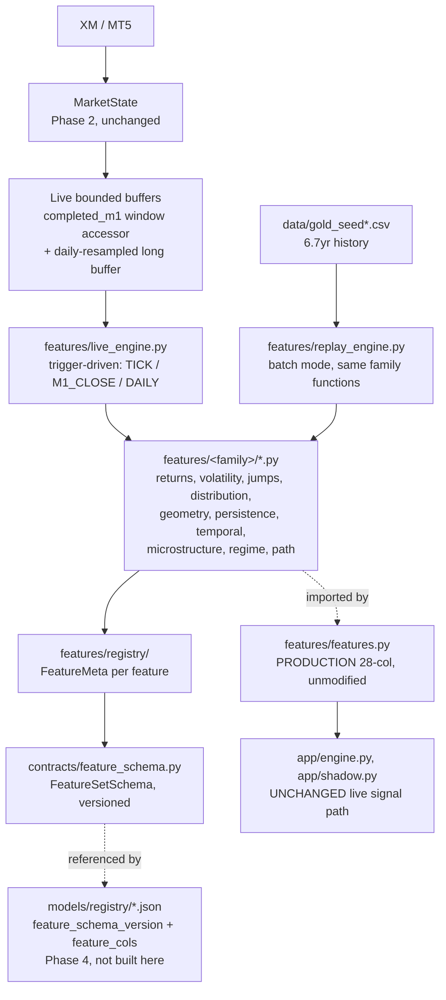

# GOLEX V3 — Phase 3: Quantitative Feature Fabric — Design

Status: APPROVED (user, 2026-08-19). Scope: build the comprehensive, causal,
versioned, live-compatible quantitative feature fabric on top of the
Phase-2-verified `MarketState` pipeline. No new models, no dynamic SL/TP,
no EV gate, no virtual trade management, no EOD learning, no
champion/challenger. Production signal path (`app/engine.py`'s CatBoost
call, `app/shadow.py`) is untouched.

## 1. Purpose

Phase 1 built the repo skeleton and contracts. Phase 2 built a real-time,
low-latency, causally-correct `MarketState`. Phase 3 builds the
**quantitative language** on top of `MarketState`: a broad, research-grade,
non-redundant, data-honest feature universe, formally registered with
metadata, versioned, and reproducible identically in both live inference
and historical replay — so Phase 4 can pick per-specialist-model feature
slices from a proven, common vocabulary instead of each model reinventing
its own ad hoc feature list.

More features is not the goal. A mathematically defensible, causal,
live-compatible, reproducible universe is the goal. Survival of any given
feature into any given specialist model's schema is a **Phase 4** decision.

## 2. Starting position — real prior work, verified before designing

Before proposing anything new, the existing repo state was audited
(read-only) because building blind risked duplicating already-correct,
already-validated work:

- **`features/features.py`** (99 lines) — the CURRENT PRODUCTION 28-column
  feature set (`config/features.yaml: schema_version: root-28col-2026-08-18`,
  matching `models/registry/direction_catboost_20260818.json`'s
  `feature_cols`). Imported live by `app/engine.py` and `app/shadow.py`.
  Causal by construction (rolling/shift only). Covers: multi-horizon
  returns + sign, EWMA vol, Garman-Klass/Rogers-Satchell/Yang-Zhang vol at
  3 windows, bipower variation + jump component, Kalman local-level
  (level/velocity/residual), rolling Hurst (2 windows), fractional
  differencing (FFD, d=0.4), plus passthrough `spread`/`tick_volume`.
- **`features/hurst.py`, `fracdiff.py`, `kalman.py`, `volatility.py`,
  `labeling.py`** — the supporting math for the above, plus triple-barrier
  labeling + CUSUM event sampling (de Prado). `kalman_local_level` is a
  hand-rolled, **already step-recursive** numba filter — trivially
  convertible to a true O(1) incremental class without touching its math.
- **`research/features_v3.py`** (688 lines, RESEARCH ONLY, not wired into
  any live or training path) — 92 candidate features across 10 families
  (`research/v3_family_ablation.py`'s `FAMILIES` dict):
  `A_return_dynamics`, `B_volatility`, `C_jump_change`,
  `D_distribution_info` (incl. Shannon/permutation/sample entropy),
  `E_market_geometry`, `F_mean_reversion`, `G_time_session`,
  `H_microstructure` (honestly scoped: tick_volume + spread only — no
  fabricated order flow, confirmed by grep, zero `real_volume`
  references anywhere in the file), `I_regime_state`,
  `J_first_passage` (retrospective, empirical, **verified causal by
  direct code read** of `_first_passage_stats`: every inner loop index is
  strictly `< i`, no lookahead — this matters because the family name
  ("hist_p_reach...") could easily have hidden a label-leak bug and did
  not).
- **Real OOF evidence already exists** in `research/output/`:
  `v3_importance_mi.json` (CatBoost importance + mutual information),
  `v3_family_ablation_*.csv` (family-level accuracy deltas),
  `v3_feature_selection.py`'s rule-based survivor selection (importance
  ≥0.3 stable, OR top-15 MI, minus >0.95-correlated redundant pairs) →
  `v3_feature_survivors.json`: **17 of 92 survive**. `v3_final_comparison.json`:
  base-26 vs base+17-survivors gives **delta_primary_acc = -0.0000156,
  delta_meta_acc = -0.0000929** — i.e., statistically zero. This is real
  evidence for exactly the principle this phase is built around: more
  features did not help *this* model/config. It does not mean those 17 (or
  any other subset) are useless for a *different* future specialist model
  with a different target (MAE, MFE, regime, barrier probability) — see
  §9.
- **A real gap found**: `research/features_v3.py`'s own docstring claims
  causality is "verified by `research/v3_causality_check.py`'s truncation
  test" — that file does not exist in the repo. The causality claim is
  currently backed only by code-construction argument, not an executable
  test. Phase 3 must build this test for real (§8).
- **Historical CSV facts** (`data/gold_seed_merged_full6yr.csv`,
  `data/gold_seed.csv`, columns `time,open,high,low,close,tick_volume,
  spread,real_volume`): `real_volume` is 0 for the large majority of rows
  sampled across the full date range — matches Phase 2's live finding that
  `real_volume` is `UNSUPPORTED_BY_DATA` for `GOLD.i#`. `tick_volume` is
  real/nonzero in early history (2019-2022 sample rows) and 0 in later
  sample rows (2023, 2025) — genuine partial historical coverage, exact
  cutoff to be measured in Task 1. `spread` is already proven
  (`SUMMARY.md` finding #9) constant for 98.9% of training history with
  zero CatBoost importance — a dead historical feature, but **Phase 2's
  live feed provides a genuinely dynamic real-time spread** that has no
  historical analogue at all (§7).
- **`decision/router.py`** is already feature-schema-agnostic (role →
  registry entry lookup, no hardcoded feature list) — no changes needed
  there for Phase 3 to plug in.
- **`contracts/feature_schema.py`** already has a `FeatureDescriptor`/
  `FeatureSetSchema` stub from Phase 1 — extended, not replaced (§4).

## 3. Architecture



Two entry points into the same family math (§6): `live_engine.py` (bounded,
trigger-driven, MarketState-fed) and `replay_engine.py` (batch, historical
CSV-fed, for future Phase 4 dataset building). Both call the *same*
functions in `features/<family>/*.py` — this is the core design choice
that makes live/replay numerical equivalence close to true by construction
instead of a second implementation to maintain and drift-check forever.

## 4. Code movement — features/ becomes the single owner of feature math

`research/features_v3.py`'s 92 candidate functions **move** into
`features/<family>/*.py` (function bodies preserved — a behavior-preserving
move, same pattern Phase 2 used for `mt5_feed.py`, not a rewrite).
`research/` scripts that reference them (`build_v3_dataset.py`,
`v3_pipeline_checks.py`, `v3_family_ablation.py`, `v3_feature_selection.py`,
etc.) get their imports updated to `from features.<family> import ...`
instead of `from research.features_v3 import ...`. This corrects the
dependency direction to match how `features/features.py` already works
(`research/audit_edge.py` already imports `features.features`, never the
reverse) and closes a real gap: **`tests/test_boundary.py` currently only
forbids `app/` and `market/` from importing `learning/`/`research/` — it
does not check `features/`.** This phase adds
`test_features_never_imports_learning_or_research()`, using the same
AST-based `_check_no_forbidden_imports()` helper already in that file.

`features/features.py` itself is not edited. It becomes registry family
`baseline_v1`, its 28 columns individually registered (§5) pointing at
their real implementations (some already exist as standalone functions in
`features/volatility.py` etc.; the rest are inline in `build_tier1_features`
and get descriptor entries that reference that function + column name,
without extracting them into new modules — extraction risk to a live
production path is not worth it for a Phase 3 metadata exercise).

`research/output/*.json/csv` (the real OOF evidence) stays exactly where
it is, referenced by path from registry entries — not recomputed, not
duplicated (§9 constraint).

## 5. Feature metadata & registry contracts

`contracts/feature_schema.py` is extended (not replaced) with the full
metadata set from the user's Phase 3 request:

```python
class FeatureStatus(str, Enum):
    REQUIRED = "REQUIRED"
    USEFUL = "USEFUL"
    OPTIONAL = "OPTIONAL"
    UNSUPPORTED_BY_DATA = "UNSUPPORTED_BY_DATA"
    REDUNDANT = "REDUNDANT"
    REJECTED = "REJECTED"

class HistoricalCoverage(str, Enum):
    FULL_HISTORY = "FULL_HISTORY"        # valid across all 6.7yr
    PARTIAL_HISTORY = "PARTIAL_HISTORY"  # valid only in a sub-range
    LIVE_ONLY = "LIVE_ONLY"              # no historical analogue exists
    RESEARCH_ONLY = "RESEARCH_ONLY"      # historical only, not live-computable
    UNSUPPORTED = "UNSUPPORTED"          # not computable from any source

class ComputationalCost(str, Enum):
    LOW = "LOW"; MEDIUM = "MEDIUM"; HIGH = "HIGH"; RESEARCH_ONLY = "RESEARCH_ONLY"

class UpdateTrigger(str, Enum):
    TICK = "TICK"; M1_CLOSE = "M1_CLOSE"; DAILY = "DAILY"; EVENT = "EVENT"

class FeatureDescriptor(BaseModel):        # extends the Phase 1 stub
    feature_id: str
    family: str
    mathematical_definition: str
    source_module: str            # "features.volatility.garman_klass" etc.
    required_state: list[str]     # ["bid","ask","completed_m1_window"] etc.
    update_trigger: UpdateTrigger
    window: Optional[int] = None
    causal: bool
    live_compatible: bool
    computational_cost: ComputationalCost
    numerical_stability_notes: Optional[str] = None
    missing_value_policy: str
    warmup_bars: int
    dependencies: list[str] = []
    units: Optional[str] = None
    normalization: Optional[str] = None
    expected_range: Optional[tuple[float, float]] = None
    historical_coverage: HistoricalCoverage
    status: FeatureStatus
    status_reason: str             # mandatory -- every classification must cite why
    evidence_ref: Optional[str] = None  # path into research/output/*.json, if any
    version: str

class FeatureSetSchema(BaseModel):
    schema_id: str
    schema_version: str
    feature_ids: list[str]         # ordered
    created_at: datetime
```

`features/registry/` holds one JSON per feature (loaded/validated through
`FeatureDescriptor`), organized by family subdirectory, plus a
`build_schema(feature_ids: list[str]) -> FeatureSetSchema` helper so a
future model role can construct its own named slice. This is what "model
routing compatibility" cashes out to: `models/registry/*.json`'s existing
`feature_schema_version` string can point at a `FeatureSetSchema.schema_id`
built here, without the fabric ever assuming one universal vector — the
17-survivors set becomes exactly one possible `FeatureSetSchema` among
many, not a hardcoded universal filter (§9).

## 6. Live engine — bounded, trigger-driven, same math as replay

Two concrete refinements to `market/state_engine.py`, both additive:

**(a) Window-queryable `completed_m1`.** Currently `StateEngine.completed_m1`
is a `deque(maxlen=480)` only ever exposed via `MarketState.completed_m1`
(the single latest bar). Phase 3 adds a plain accessor —
`StateEngine.completed_m1_window(n: int) -> list[M1BarState]` (returns the
last `n`, or fewer during warmup) — so `live_engine.py` can pull a bounded
OHLC window without reaching into `StateEngine`'s private deque. No change
to `MarketState`'s existing fields, no change to what Phase 2 already
verified live.

**(b) Daily-resampled long buffer.** A handful of candidate features use
~252-observation windows (e.g. `vol_percentile_252`). Loading 6.7 years
into the live process is explicitly forbidden (Phase 2 principle, restated
in this spec's §22/§26). Instead: a small `DailyBuffer` class, bootstrapped
once at `live_engine` startup from `data/gold_seed.csv` (the ~2.5-month
rolling recent file, not the full 6.7yr merge) resampled to daily bars,
capped at a bounded ring size (252 entries — a few KB), refreshed once/day
thereafter. Any feature needing more history than this buffer holds is
marked `historical_coverage=RESEARCH_ONLY`, `live_compatible=false` —
explicit, not silently degraded.

**Trigger-driven recompute**, per `UpdateTrigger`:
- `M1_CLOSE`-triggered families (returns, volatility, jumps, distribution,
  geometry, persistence, regime, most of temporal/path): recompute by
  calling the **same family function** against
  `completed_m1_window(window)` — O(window), window ≤ 480, not O(1) and
  not O(history), matching the performance bar Phase 2 already established
  and verified (`state_engine.py`'s own O(window)-not-O(history) rule).
  This is the load-bearing design choice: no separate incremental formula
  is hand-derived per feature, so there is nothing to drift from the
  batch/replay version except real bootstrap/window-edge effects, which
  the equivalence test (§8) checks directly.
- `TICK`-triggered families: only the new live-only microstructure
  subfamily (§7) — small dedicated ring buffers, same pattern as
  `state_engine.py`'s existing `_tick_times_60s`/`_spreads`.
- `DAILY`-triggered: the handful of 252-window features, off `DailyBuffer`.
- Kalman (`features/kalman.py`): converted to a small stateful class
  persisting `(x0, x1, p00, p01, p10, p11)` across calls — genuinely O(1)
  per bar, same math, not a reimplementation.

Output: `features/live_engine.py`'s `FeatureSnapshot` — a dict/pydantic
model of `{feature_id: value}` plus per-value quality flags
(`VALID`/`WARMING_UP`/`UNAVAILABLE`/`INVALID`, per spec §22 — no silent
zeroes). Additive only: not wired into `app/engine.py`'s decision loop,
same non-invasive pattern as Phase 2's `get_market_state()` accessor.

## 7. New live-only features — no historical equivalent, implemented now, evaluated in Phase 4

Per explicit user instruction: the 17-survivors evidence is historical and
stays as historical evidence, not re-run. But genuinely new features that
only exist because Phase 2 gave this system a real live bid/ask stream —
things the 6.7-year OHLC-only CSV cannot express at all — get **built now**
with full metadata (`historical_coverage=LIVE_ONLY`, no `evidence_ref`,
`status=OPTIONAL` pending Phase 4 validation, `status_reason` states
plainly "no historical evidence exists or can exist for this feature; live
data only since 2026-08-18"). New `microstructure/spread_live.py` /
`microstructure/tick_activity.py` subfamily:

- live spread level/mean/std (already computed in `MarketState` itself —
  registered as a feature, not recomputed)
- spread change / spread shock (tick-to-tick delta, z-scored against the
  60s window)
- tick inter-arrival time, tick arrival rate, arrival-time burstiness
  (already have `tick_count_60s`/`tick_rate_per_sec` in `MarketState` as
  raw inputs — this family turns them into normalized/z-scored features)

These are explicitly NOT forced into the current 28-feature production
schema and NOT claimed validated — Phase 4 evaluates them against real
targets when specialist models are built.

## 8. Testing

- **Causality truncation test** (the real gap found in §2): for every
  registered feature, compute on a series, then again with future rows
  perturbed/truncated, assert past values unchanged. This is the concrete
  implementation of the `v3_causality_check.py` the old docstring claimed
  existed but didn't.
- **Live vs replay numerical equivalence**: feed an identical synthetic (and
  where feasible, real backfilled) tick/bar sequence through both
  `live_engine.py` and `replay_engine.py`, assert agreement within a stated
  tolerance per feature.
- **Warmup/insufficient-history state test**: confirm `WARMING_UP`, never a
  silently-plausible number, before a feature's `warmup_bars` is satisfied.
- **Missing-data test**: `real_volume`-dependent or degraded-`tick_volume`-
  dependent features correctly resolve to `UNSUPPORTED_BY_DATA`/`UNAVAILABLE`
  in the periods established in §2, never silently backfilled or zeroed.
- **NaN/inf/numerical-safety test**: zero-variance windows, insufficient
  samples, division-by-zero paths — explicit failure/quality-flag, not
  silent corruption.
- **Registry/schema tests**: `FeatureDescriptor` validation, schema-version
  mismatch detection, `build_schema()` round-trip.
- **Boundary test**: `features/never imports learning/research` (new),
  re-verify existing `app/`/`market/` boundary tests still pass.
- **Redundancy/stability diagnostics**: generalize
  `v3_feature_selection.py`'s correlation-pruning + MI methodology into a
  reusable module (`features/registry/diagnostics.py`) runnable against any
  family, applied to the new live-only family (§7) since it has no prior
  evidence to lean on; NOT re-run against the already-evidenced 92 (§2/§9).
- **Performance benchmark**: `live_engine.py` per-tick and per-M1-close
  update latency, memory, throughput — real measurement, synthetic clearly
  labeled if live data unavailable at test time (Phase 2 convention).

## 9. The one-sentence rule this whole design turns on

**Historical evidence (17 survivors) describes what helped one specific
model/config in the past. It is not a universal filter.** The registry
preserves the *entire* quantitative universe (baseline 28 + all 92
candidates + the new live-only family), each tagged with its real
evidence where evidence exists and honestly marked "not yet evaluated"
where it doesn't (§7). `FeatureSetSchema.build_schema()` lets each future
Phase 4 specialist model (direction/opportunity_meta/regime/mae_quantile/
mfe_quantile/barrier_probability) construct its own slice from this
universe against its own target — nothing here pre-selects for them.

## 10. Documentation

`docs/ARCHITECTURE.md` gets a new "Phase 3: Quantitative Feature Fabric"
section: architecture diagram (as above), registry design, live/replay
equivalence approach, historical coverage findings (real_volume/
tick_volume/spread facts from §2), the causality-test gap that was found
and closed, the new live-only family, and explicit model-routing
compatibility (§9).

## 11. Out of scope (explicit)

No new models, no specialist-model feature *selection* (that's Phase 4),
no dynamic SL/TP, no EV gate, no virtual trade management, no Telegram
changes, no EOD learning, no champion/challenger, no changes to
`app/engine.py`'s live decision path, no changes to `features/features.py`'s
production math, no re-running the existing 92-feature OOF research.

## 12. Completion criteria

Matches the user's Phase 3 request §41: broad causal feature research
reused/extended, families implemented under `features/`, registry +
metadata + versioning exist, `live_engine.py` and `replay_engine.py` exist
and are verified numerically consistent, causal tests pass (real ones,
closing the found gap), warmup/missing-data states are explicit, historical
coverage is documented per-feature, redundancy/stability diagnostics exist
and are generalized/reusable, performance is benchmarked, model-routing
schema slicing is supported, tests pass, documentation is updated,
production path is provably untouched.

## 13. Final completion report format (for Task-N delivery, not this doc)

A. Quantitative research (what already existed + what's new).
B. Feature inventory (full count/classification table).
C. Implemented features by family.
D. Unsupported features (real_volume, degraded tick_volume periods).
E. Rejected features (redundant/unstable, citing real evidence).
F. Historical coverage (full/partial/live-only/research-only breakdown).
G. Live coverage (what runs from MarketState today).
H. Causality (how tested — the closed gap).
I. Live/replay consistency (how verified).
J. Redundancy (what the generalized diagnostics found, incl. on the new
   live-only family).
K. Stability (drift/variance findings).
L. Performance (live_engine.py latency/memory/throughput).
M. Model routing compatibility (schema-slicing demonstration).
N. Tests (full list + results).
O. Limitations.
P. Next phase — recommend Phase 4 only, do not implement it.
