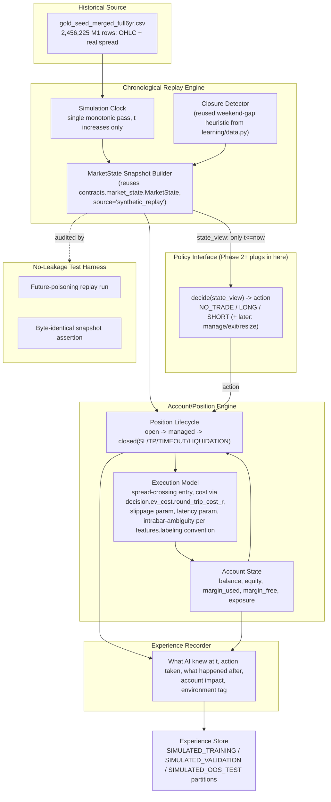
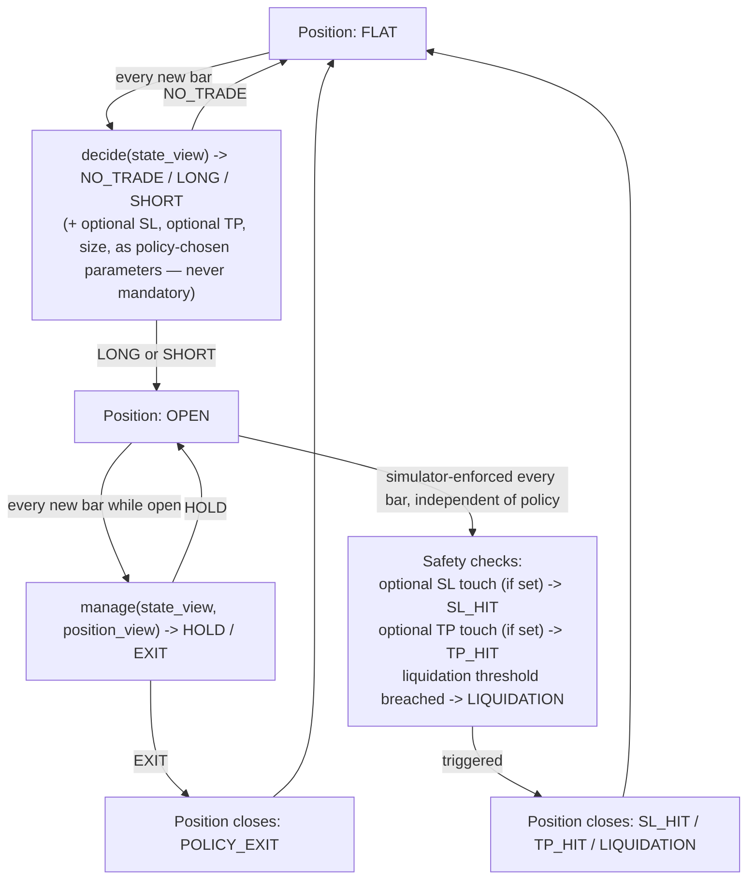

# GOLDEX V4 — Phase 1 Design: Chronological Market/Account Simulator

Status: design only, no code, no production changes. Supersedes nothing — additive new component. Phase 5 Batch 2 and all V3 work preserved untouched at `1fa2507`.

## 0. Repo facts this design is built on (verified this session)

- **Cost model** (`decision/ev_cost.py:23`): `round_trip_cost_r(market_state, candidate_sl_distance_R, max_staleness_seconds=5.0)` → `cost_R = (spread*2) / (sl_distance_R * realized_vol_60s * mid)`. Round-trip (the `*2` covers entry+exit spread). **No slippage term exists in this function at all** — slippage is currently unmodeled anywhere in the codebase.
- **`learning/backtest.py:85-86`** applies cost as a **one-way** `spread_R` subtraction, once — inconsistent with `ev_cost.py`'s round-trip convention. This is a real, pre-existing discrepancy between the two "cost models" that already exist. The simulator must pick one (round-trip, matching the live-path formula) and document why, not silently inherit the backtest's inconsistent version.
- **MarketState** (`contracts/market_state.py:39-71`) is a real canonical Pydantic contract, already has `source: Literal["mt5_live","synthetic_replay"]` — **environment separation is already designed into this contract**, unused so far. Also carries bid/ask/mid/spread, `M1BarState` (open/high/low/close/start_time/end_time/complete), `realized_vol_60s`, feed-health fields.
- **Data**: `data/gold_seed_merged_full6yr.csv`, 2,456,225 M1 rows, columns `time,open,high,low,close,tick_volume,spread,real_volume`. `time` has no explicit timezone marker. **Spread is a real historical column** (points, converted via `*0.01` to price in `learning/backtest.py:60-61`) — but Batch 1/2's research pipeline (`phase5_ev_dataset.py:39-40`) never used it, defaulting to a hardcoded `REPRESENTATIVE_SPREAD=0.015` instead, with an explicit comment admitting Phase 4 never persisted historical tick spread. **The simulator must use the real historical spread column, not the placeholder** — this is a concrete quality upgrade over existing research code, not merely a reuse decision.
- **Intrabar OHLC ambiguity — already has an existing convention** (`features/labeling.py:87-92`, `_triple_barrier_core`): when both SL and TP are touched within the same bar, existing code resolves conservatively — charges the adverse side. The simulator reuses this exact convention for consistency with all existing labels/diagnostics, rather than inventing a different resolution rule.
- **No margin/leverage/liquidation logic exists anywhere in the current codebase** (confirmed by repo-wide grep — only unrelated false-positive matches). This is genuinely new simulator scope.
- **No trading-calendar module.** `learning/data.py:62-93` has a weekend-detection heuristic (`dow==4 and hour>=20` = start of weekend close) used only for gap-diagnostics reporting — reusable as the simulator's closure-detection convention.
- **Bar timestamp convention is not explicitly documented anywhere in the repo.** `M1BarState` has both `start_time` and `end_time`/`complete`, implying bar-open vs bar-close are already distinguished in the live contract shape — but no comment confirms which one the historical CSV's `time` column represents. **This is a real open question the design must resolve explicitly (Section 4), not assume.**
- Live MarketState construction path (`app/engine.py:215-239`) exists but is confirmed **not wired into the production signal loop** — production still runs on a separate CSV-buffer + `build_features()` path. The simulator's job is to produce the *same* MarketState-shaped object as this path would, from historical data, not to duplicate the live feed's own logic.

## 1. Critical principle: mechanically-testable no-future-leakage

The single most important property. Design:

- The simulator exposes state to the policy **only** through a `MarketState`-shaped snapshot built from bars with `end_time <= t` (or `start_time <= t` for the in-progress current bar — resolved by the timestamp-convention decision in Section 4). No field on that snapshot may be derived from any row with a later timestamp.
- **Mechanical test, not a code-review promise**: a dedicated no-leakage test harness runs the full 6.7-year replay twice — once normally, once with all bars *after* each decision point replaced with NaN/poison values before the snapshot-construction call for that step — and asserts the two runs produce byte-identical `MarketState` snapshots and byte-identical policy inputs at every step. Any divergence is a leakage bug, caught automatically, not just architecturally "designed against."
- The `_mae_mfe_core`-style whole-window excursion functions used elsewhere in the research code (`research/audit_edge.py:151-177`) are explicitly **not** reused inside the live simulator loop, because they compute excursions over an entire future window by construction — they are fine for after-the-fact labeling of a *closed* historical trade for diagnostics, but must never be called to give the simulator's live decision loop information about a still-open position's future path.

## 2. Architecture

## 3. Contracts (reused vs. new)

**Reused as-is:**
- `contracts.market_state.MarketState` — the simulator's snapshot builder populates this exact contract, with `source="synthetic_replay"`. This is *why* the field already exists; using it is not a new decision, it closes a gap between an already-designed contract and its first real producer.
- `decision.ev_cost.round_trip_cost_r` — the simulator's execution model calls this unmodified for every position's cost calculation, using the **real historical spread column** (a fix over Batch 1/2's placeholder) and the position's own realized/estimated volatility.
- `features.labeling`'s intrabar-ambiguity convention (adverse-side-wins on same-bar dual touch) — reused for SL/TP resolution, for consistency with every existing label the specialists were trained against.
- `contracts.virtual_trade.VirtualTrade` — a simulated trade's lifecycle record reuses this shape; `execution_metadata` carries simulator-specific fields (slippage applied, latency applied, closure status) rather than inventing a parallel trade contract.
- `contracts.journal` event types (`SignalEvent`/`ManagementEvent`/`ExecutionEvent`/`ResolutionEvent`) — the Experience Recorder emits these, with `payload` extended per this design's Section 5 fields (open dict by existing convention, no schema break).

**New:**
- `AccountState` contract: `balance`, `equity`, `margin_used`, `margin_free`, `exposure`, `open_position_ids: list[str]`, `simulation_timestamp`. New — nothing like it exists (confirmed no margin/leverage/liquidation logic anywhere in the repo).
- `SimulatedExecutionConfig`: explicit, documented, configurable — `slippage_model` (e.g. fixed R or vol-scaled — Section 6), `latency_ms`, `leverage`, `margin_call_threshold`, `liquidation_threshold`, `starting_balance`, `position_sizing_mode`. Every constant lives here, none hardcoded inline in engine logic — directly satisfying your "no silently hardcoded constants" requirement.
- `EnvironmentTag` enum: `SIMULATED_TRAINING | SIMULATED_VALIDATION | SIMULATED_OOS_TEST | LIVE_DEMO | LIVE_REAL` — stamped onto every recorded experience row, checked at Experience Store write time (a write with a tag inconsistent with the currently-active replay partition is rejected, not merely mislabeled).

## 4. Timestamp-convention decision (open question resolved here)

The raw CSV's `time` column has no documented open/close convention. Decision for this design: **treat `time` as bar-open** (the M1 bar starting at that timestamp), and a decision at simulated time `t` may see: all bars with `time + 1min <= t` as fully "completed" (matching `M1BarState.complete=True`), plus the still-forming current bar's `open` only (matching a live tick mid-bar, where high/low/close of the current bar are not yet known). This is the conservative choice — it never lets the policy see a bar's high/low/close before that bar has actually finished, which is the failure mode that would matter most (leaking a future spike). This decision is stated as an explicit, testable assumption (Section 1's harness verifies it mechanically), not asserted by fiat without a mechanism to catch a violation.

## 5. Experience recording — exact fields

Per your Section 11 requirement, each recorded trade/decision-experience includes: market state at decision time (full `MarketState` snapshot, not a summary), specialist/expert outputs available at that time (if any are wired — Phase 1 itself doesn't require experts, but the schema has the slot), action taken, confidence/uncertainty if the policy provides one, entry/SL/TP/size as decided, `SimulatedExecutionConfig` values in effect, realized cost, environment tag, regime label if available, outcome (TP/SL/TIMEOUT/LIQUIDATION), realized R, account balance/equity before and after, and — critically — **what became known only afterward** (the bar-by-bar path the position actually took, recorded separately from what was visible at decision time, so later analysis can compute hindsight/counterfactual comparisons — reusing exactly the D9 Shapley-decomposition instinct from paused Batch 2, now against a real sequential simulator instead of a static replay).

## 6. Execution realism

- **Entry**: spread-crossing (buy at ask, sell at bid — derived from `mid ± spread/2` since raw data doesn't give separate bid/ask columns, only OHLC+spread; documented as a modeling choice, not a hidden assumption).
- **Cost**: `decision.ev_cost.round_trip_cost_r`, unmodified, using real historical spread. Resolves the round-trip-vs-one-way inconsistency found between `ev_cost.py` and `learning/backtest.py` by standardizing on the round-trip formula (matches the live decision path).
- **Slippage**: not modeled anywhere today — new, explicit, configurable (`SimulatedExecutionConfig.slippage_model`), default a documented conservative constant (e.g. a fraction of the current bar's spread), clearly labeled as an assumption pending real-fill-data calibration, never silently zero.
- **Latency**: configurable `latency_ms`, applied as a delay between decision timestamp and the timestamp at which the fill price is sampled — this is what lets the simulator honestly represent "decide now, fill slightly later," relevant when the eventual live agent has real network/processing latency.
- **SL/TP/timeout resolution**: reuses `features.labeling`'s existing same-bar-ambiguity convention (Section 0).
- **Position sizing / margin / leverage / liquidation**: new `AccountState`-driven logic — position size computed from configured risk-per-trade and current equity; margin required computed from configured leverage; a position is force-closed (`LIQUIDATION` outcome, distinct from `SL`) if margin_free would go negative — this is new scope, absent everywhere else in the codebase, and is exactly the class of realism needed before any learned sizing/risk policy (Phase 4) could be trusted.
- **Multiple simultaneous positions**: Phase 1 supports at most one open position at a time (matching `learning/backtest.py`'s existing `greedy_sequential` assumption and avoiding a large new correctness surface — multi-position/portfolio logic deferred, flagged as a documented Phase 1 limitation, not silently assumed away).
- **Rejected orders / partial fills**: not historically representable from OHLC+spread data (no real order-book/fill data exists, confirmed in Section 0) — Phase 1 does not simulate rejections or partial fills, documented as a known simplification versus real MT5 execution, to be revisited only if evidence from demo-stage (Phase 6) shows it materially matters.
- **Market closures**: reuses the existing weekend-gap heuristic (`learning/data.py`'s `dow==4 and hour>=20` convention) to refuse new entries and freeze the clock realistically across closure gaps, rather than treating a closure gap as a normal 1-minute step.

## 7. Environment separation & partitions

- `SIMULATED_TRAINING` / `SIMULATED_VALIDATION` / `SIMULATED_OOS_TEST` are chronological, non-overlapping slices of the 6.7-year replay with purge/embargo gaps at each boundary (extending Batch 1's existing purged walk-forward CV discipline from feature-level to simulator-level).
- The simulator engine itself is identical code across all three partitions and across `LIVE_DEMO`/`LIVE_REAL` (same `decide(state_view) -> action` policy interface) — only the **source** of `MarketState` snapshots differs (`synthetic_replay` from CSV vs. `mt5_live` from the real feed), which is exactly what `MarketState.source`'s existing `Literal["mt5_live","synthetic_replay"]` was built for.
- A hard runtime check: any code path that could construct a `MarketState` with `source="synthetic_replay"` is statically excluded from the live/demo execution path (module-level import boundary, not just a config flag) — this is the mechanical enforcement of your "never let simulated data reach live" requirement, not a policy promise.

## 8. Validation strategy for the simulator itself (Phase 1 has no policy yet, so this validates the environment, not returns)

- No-future-leakage harness (Section 1) — must pass before anything else.
- Cost-model parity check: run the simulator's execution model against a small set of known historical trades already scored by the live path's `decision/ev_engine.py`/`ev_cost.py`, confirm matching cost figures.
- Sanity-check against `learning/backtest.py`'s existing published numbers, using the same fixed hypothetical strategy (not a target — a regression check that the new simulator doesn't produce wildly incompatible results under an equivalent simple rule, given it now includes previously-absent slippage/margin effects that should explain any divergence).
- Closure-handling test: verify no phantom 1-minute bar is synthesized across a real weekend/holiday gap, and no position silently sits open across a closure without an explicit modeled decision (hold-through-weekend must be a real, recorded state, not an accidental artifact).

## 9. Failure modes

- Timestamp-convention mistake (Section 4) silently leaking a future high/low — caught by Section 1's harness, not by review alone.
- Slippage/cost assumptions being wrong in a way that only demo-stage (Phase 6) reveals — documented as a known, explicit, revisitable assumption rather than hidden.
- Liquidation/margin logic bugs producing an unrealistic "never liquidates" or "liquidates too eagerly" simulator — validated against the configured leverage/threshold constants via targeted unit tests with constructed extreme-move scenarios.
- Reusing `features.labeling`'s conservative same-bar convention could differ from what would happen with real tick data (true intrabar order might favor the AI's side sometimes) — documented as a known conservative bias (never favors the simulator's outcome over reality), not asserted as ground truth.

## 10. Performance requirements

A full 6.7-year (2,456,225-row) single-pass chronological replay with no policy attached (Phase 1's own validation runs) must complete in a bounded, practical time (target: comparable to Batch 1's existing full-history diagnostic runs, on the order of hours, not multi-day) — achieved by vectorizing the snapshot/cost/labeling-reuse pieces where already vectorized upstream (numba-backed `_triple_barrier_core`) and keeping the per-bar Python loop only where genuinely stateful (account/position updates cannot be vectorized away, by nature of sequential dependency).

## 11. Migration from current V3 system

Nothing in production changes. `decision/signal.py`/`app/engine.py`'s live path is untouched. The simulator is a wholly new module tree (proposed: `simulator/` at repo root, mirroring `decision/`'s structure) that *imports* `decision.ev_cost`, `contracts.market_state`, `contracts.virtual_trade`, `contracts.journal`, and `features.labeling`'s ambiguity convention, but is never imported *by* any live/production path. This satisfies "reuse existing V3 contracts and cost-model logic where valid" while guaranteeing zero production blast radius.

## 12. What Phase 1 explicitly does NOT include

No decision policy, no MoE, no RL, no specialist wiring, no learned trade management, no champion/challenger, no demo/live changes — all deferred to Phase 2+ per the approved roadmap. Phase 1's only deliverable is a validated, leak-proof, cost-and-execution-realistic environment that Phase 2's policy competition will run inside.

---

## 13. REVISION — self-review against the autonomy mandate (2026-08-26, second pass)

The mandate is explicit: Phase 1 must not accidentally re-encode V3's fixed-horizon, fixed-barrier, single-decision-then-wait thinking into the simulator's architecture, because that would force a rebuild once Phase 2's agent needs continuous sequential control. Reviewing the v1 design above against that risk found real problems, corrected here.

### A. Design challenges found

1. **Section 6's outcome enum (`TP/SL/TIMEOUT/LIQUIDATION`) and its dependence on `features.labeling`'s triple-barrier logic silently imported the V3 fixed-horizon barrier model into the simulator's core position lifecycle.** `features.labeling`'s `_triple_barrier_core` is a *labeling* function built for a fixed `max_holding` window — reusing it as the simulator's actual exit-resolution mechanism would mean every simulated position implicitly has a hardcoded max holding time and a mandatory TP/SL pair, exactly what Section "TRADING STYLE" of your mandate forbids.
2. **The design only defined a single `decide(state_view) -> action` call at flat-position time.** There was no interface for the policy to be re-invoked bar-by-bar *while a position is open* to decide "hold vs exit now" — the architecture as written was implicitly `ENTRY -> WAIT FOR SL/TP -> EXIT`, the exact reduction your mandate explicitly prohibits.
3. **`greedy_sequential`-style thinking was not explicitly excluded.** V3's `learning/backtest.py` enforces a gap between trades (`t0[i] >= last_t1`); nothing in the Phase 1 doc said the simulator must allow immediate FLAT→TRADE re-entry the instant a position closes, so this V3 habit could silently carry forward.
4. **SL/TP were treated as always-present, mandatory fields on every trade.** A future agent that wants to run without a fixed TP (pure discretionary-exit trading) would be architecturally blocked.
5. **No reward-shaping decision was made explicit** — good, in that v1 doc didn't hardcode a reward formula, but it also didn't *say* Phase 1 must record raw ingredients only (realized/unrealized PnL, cost, equity path) and leave reward-function design to Phase 2 — leaving this implicit risked a future implementer inventing an R-multiple-only reward, again a V3 habit (all of Batch 1/2 diagnostics are R-multiple framed).
6. **The no-leakage harness (Section 1) only poison-tested decision points at entry**, not the per-bar monitoring calls a continuously-observing agent needs — a real gap now that continuous monitoring is required.
7. Section 8 (Section 6 in v1) and performance requirements were fine and need no correction; MarketState/cost-model/spread/environment-tag/contract reuse choices were fine and need no correction — these are not V3-specific assumptions, they're just infrastructure.

### B. Required corrections

- Replace the fixed-horizon triple-barrier exit mechanism with a **continuous per-bar monitoring loop**: while a position is open, the simulator calls the policy interface's `manage(state_view, position_view) -> HOLD | EXIT` at every new bar, in addition to the flat-state `decide(state_view) -> NO_TRADE | LONG | SHORT` call. SL and liquidation remain as **safety-net checks the simulator itself enforces every bar independent of the policy** (a position is never allowed to run past a hard liquidation threshold even if the policy says HOLD) — but SL is now an *optional, policy-supplied risk parameter*, not a mandatory triple-barrier field, and TP is entirely optional (a policy may run with no TP at all, exiting purely via `manage()` decisions).
- Reuse `features.labeling`'s same-bar ambiguity convention **only** as a low-level fill-resolution rule (if a policy-set SL and a policy-set TP are both touched within one bar, and neither has been resolved by an explicit `manage()` exit first, charge the adverse side) — not as the position's entire lifecycle model. This keeps the one genuinely reusable piece of V3 logic (a conservative same-bar tie-break) without inheriting V3's fixed-barrier framing.
- Explicitly forbid an inter-trade cooldown: the instant a position closes (any reason), the very next bar is eligible for a new `decide()` call. FLAT→TRADE→EXIT→FLAT may repeat as often as the policy chooses, unconstrained by any `greedy_sequential`-style gap.
- Experience recording (Section 5) is corrected to capture the **full per-bar trajectory of an open position** (each `manage()` call's state_view, decision, and the account/position deltas that followed) — not just entry-state and final-outcome snapshots. This is what makes the experience model usable for future RL/offline-RL/imitation research as well as simpler supervised approaches — satisfying mandate point 5 (sufficiency for RL, offline RL, imitation, discovery).
- Account/reward information (Section 5/6) is corrected to record **raw ingredients only**: realized PnL, unrealized PnL at every monitored bar, transaction cost, balance/equity path, drawdown-to-date — with no baked-in reward formula. Reward shaping (R-multiple, Sharpe-like, drawdown-penalized, etc.) is explicitly deferred to Phase 2's research loop, per mandate point 6's distinction between prediction accuracy and risk-adjusted profitability, which requires the option to try more than one reward definition later.
- No-leakage harness (Section 1) extended: poison-testing runs at every `manage()` call during an open position, not only at `decide()` calls at flat state.
- Explicit statement: **Phase 1 does not choose or hardcode a decision horizon, holding-period distribution, trade frequency, or risk/reward ratio anywhere in the engine.** These are Phase 2+ policy-learned quantities; the simulator must be indifferent to whether a position lasts 3 bars or 3000.

### C. Final Phase 1 architecture (corrected)

Same overall diagram as Section 2, with the Policy Interface subgraph corrected to:

Outcome enum corrected to: `POLICY_EXIT | SL_HIT | TP_HIT | LIQUIDATION | END_OF_REPLAY_FORCED_CLOSE` (the last one handles the dataset boundary, not a market condition — documented as a data-boundary artifact, not a trading outcome, and excluded from any performance statistic by construction).

All other sections (0, 1 as extended, 3, 4, 5 as extended, 7, 8, 9, 10, 11) stand as corrected/extended above.

### D. What Phase 1 enables

A genuinely continuous OBSERVE→DECIDE→EXECUTE→MONITOR→EXIT→LEARN loop with no fixed horizon, no mandatory TP/SL, no inter-trade cooldown, full per-bar experience capture (entry and every subsequent management step), raw account/reward ingredients (not a pre-chosen reward formula), and an environment/policy interface identical in shape whether the source is historical replay or live XM MT5 — so Phase 2's agent can be developed once and connected to either without an interface change.

### E. What Phase 1 deliberately does not attempt

No decision policy or learning algorithm of any kind (still Phase 2+). No reward-function choice (Phase 2+ research question). No multi-position/portfolio/hedging/scaling (explicitly out per your "one position at a time" instruction, revisit only with new evidence and new instruction). No rejected-order/partial-fill modeling (no historical fill data exists to base it on). No demo/live wiring (Phase 6).

### F. Risks and limitations

Continuous per-bar `manage()` calls mean a future complex policy could face millions of inference calls across the 6.7-year replay — a real Phase 2+ performance concern, not a Phase 1 blocker, since Phase 1 itself runs no policy; flagged now so Phase 2's policy-interface implementation budgets for call-count, not just per-call cost. The corrected design's optional-SL/optional-TP flexibility increases the space of possible policy behaviors the simulator must handle safely (e.g., a policy that opens a position with no SL at all relies entirely on the liquidation safety-net, which must therefore be trustworthy from day one, not a later hardening pass). The same-bar ambiguity tie-break, now used only as a low-level fill rule rather than the whole lifecycle model, is still a conservative approximation of unknown real intrabar order — documented, not eliminated.

### G. Exact implementation-plan scope (for your approval before planning begins)

Only the corrected Phase 1 simulator: `AccountState`, `SimulatedExecutionConfig`, `EnvironmentTag`, the replay clock, `MarketState` snapshot builder, closure detector, position lifecycle with `decide()`/`manage()`/simulator-enforced safety checks, execution model (spread-crossing entry, `round_trip_cost_r` reuse, configurable slippage/latency), experience recorder capturing full per-bar trajectories, and the no-leakage test harness (now covering both `decide()` and `manage()` call sites). No policy, no Phase 2 research-loop code, no production/live changes, no Batch 2 resumption.

---

Awaiting your approval of this corrected design before writing_plans/implementation. No code written.
