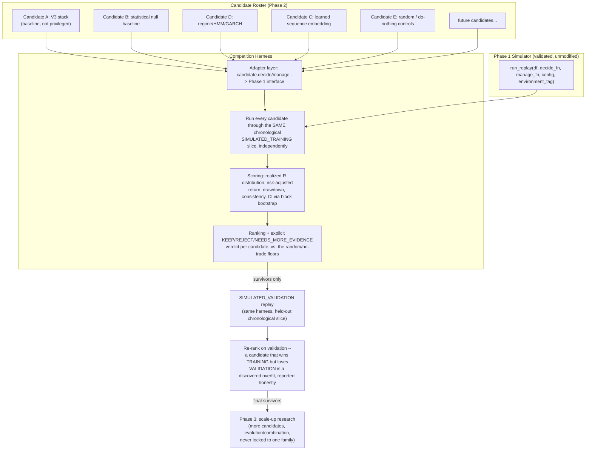

# GOLDEX V4 — Phase 2 Design: Candidate Intelligence Research Environment

Status: design only. Builds on the completed Phase 1 simulator (`simulator/`, branch `goldex-v4-phase1-simulator`, HEAD `2d30be7`, 40/40 tests, mechanically leak-audited). No code yet.

## 0. The correction this design is built around

V3's 125-feature fabric + five CatBoost specialists + fixed EV formula is **one candidate intelligence**, not the default brain V4 upgrades from. Phase 2's job is to build the research environment that lets *any* candidate — V3's stack, a completely different feature set, a completely different model family, a completely different decision mechanism — compete on equal footing inside the Phase 1 simulator, and lets the evidence decide which one is worth keeping. If Phase 2 shipped with only V3's stack wired in and called it "the V4 agent," it would silently repeat the exact mistake this whole pivot was meant to fix.

Concretely, this means Phase 2 does not build "a policy." It builds a **competition harness** with a stable interface, and populates it with an initial, deliberately small and diverse *roster* of candidates — one of which happens to be V3's stack, wired in unmodified as a baseline, with no privileged status over the others.

## 1. What a "candidate" is

A candidate is anything that implements two functions with the exact shapes Phase 1's simulator already expects:

```
decide(market_state, account) -> (action: "NO_TRADE"|"LONG"|"SHORT", sl_price: Optional[float], tp_price: Optional[float])
manage(market_state, position_view, account) -> "HOLD"|"EXIT"
```

Nothing else about a candidate is constrained. A candidate may:
- use any subset or superset of features (V3's 125, a handful of raw OHLC derivatives, a learned sequence embedding, none at all);
- use any model family (gradient boosting, a simple rule, a Bayesian model, a sequence model, an ensemble, a hand-written statistical test);
- use any decision logic (a fixed threshold, a learned gate, a lookup table);
- reuse V3 infrastructure (`decision.ev_formula`, `research.phase4_regime`, calibration code) or none of it at all.

The competition harness never inspects *how* a candidate decides — only *what* it did and *what happened*. This is what keeps the roster genuinely open-ended rather than secretly biased toward whichever candidate reuses the most existing code.

## 2. Roster for Phase 2 (initial, not final — the point is diversity, not completeness)

Deliberately small and deliberately varied, so the competition harness itself gets exercised against real differences in behavior, not five near-identical CatBoost variants:

- **Candidate A — V3 baseline (unmodified reuse)**: the existing Direction/Opportunity/Barrier/MAE/MFE specialists + `decision.ev_formula`'s fixed EV gate, wired to Phase 1's `decide()`/`manage()` interface via a thin adapter. This is a baseline for comparison, not a seed the other candidates are built from.
- **Candidate B — minimal statistical baseline**: a simple, fully transparent rule (e.g. a volatility-normalized momentum/mean-reversion test on raw OHLC, no ML) — exists specifically so "no real edge" has a legitimate, cheap-to-compute null hypothesis to be compared against, per your standing "if there's no edge, say so" principle.
- **Candidate C — learned representation, different feature family**: a sequence-model-derived state embedding (e.g. a small GRU/TCN encoder over recent OHLC) feeding a simple downstream classifier — genuinely different inputs from V3's hand-engineered 125 features, testing whether hand-engineered features are actually necessary.
- **Candidate D — regime-conditioned statistical model**: an HMM or GARCH-family volatility-regime model gating a simple directional rule — tests whether classical quant methods (Section 7 of the V4 architecture doc) outperform ML-based approaches on this data without any learned feature representation at all.
- **Candidate E — random/do-nothing controls**: a uniform-random action generator and a permanently-NO_TRADE generator — mandatory sanity floors; any candidate that doesn't clearly beat both isn't worth taking further, and their presence prevents the validation math itself from being trusted blindly (a subtle bug that made everything look profitable would make even the random candidate look profitable too).

Nothing here excludes future candidates — the roster is a starting set proving the harness works on genuinely different candidates, not a ceiling.

## 3. Architecture



## 4. Why this structure and not a single "pick the best one" step

Two chronological passes (`SIMULATED_TRAINING` then `SIMULATED_VALIDATION`, both already defined as partitions in Phase 1) are required before any candidate is called a winner — a candidate that looks strong purely on the slice it was designed/tuned against is exactly the "manufactured profitability" failure mode your V4 mandate explicitly warns against. `SIMULATED_OOS_TEST` remains untouched through all of Phase 2, reserved for the eventual Phase 5 champion/challenger gate — Phase 2 never touches it, so nothing here can quietly become the OOS-validated system.

## 5. Scoring — an evidence profile, not a composite score

**Correction (2026-08-27 review)**: Phase 2 does NOT compute a single magic profitability number and rank by it — that would be a new V3-style universal threshold in disguise (the exact pattern `MIN_EDGE_THRESHOLD`/`DEFAULT_K` represent in V3, which this pivot explicitly rejects as a permanent law). Instead, each candidate's full sequence of `POSITION_CLOSED` experience records (already timestamped, already environment-tagged from Phase 1) is reduced to a **multi-dimensional evidence profile**, reusing Batch 1's existing statistical discipline (`_stats_utils.py`'s CI reporting, block bootstrap) per dimension:

- realized P&L (absolute, and per-trade R-multiple distribution)
- drawdown (max, and time-to-recover)
- tail risk (worst-decile outcomes, not just mean/variance)
- cost sensitivity (performance recomputed at 1.5x and 2x the configured `SimulatedExecutionConfig` cost/slippage parameters — a candidate whose edge evaporates under mildly worse cost assumptions is flagged, not silently ranked as if robust)
- trade frequency (how often it acts at all — needed to interpret every other number; five trades and five thousand trades need different confidence treatment)
- consistency across chronological sub-periods (split `SIMULATED_TRAINING` into contiguous blocks, report per-block outcome, not just the aggregate)
- training→validation degradation (the same metric computed on `SIMULATED_TRAINING` vs `SIMULATED_VALIDATION`, reported as a delta, not hidden inside a single blended number)
- regime/sub-period robustness (performance conditioned on realized-volatility terciles, reusing Batch 1 D6's existing long/short/regime-conditioning pattern)
- execution sensitivity (as cost sensitivity, but varying `latency_ms` instead)
- confidence intervals on every one of the above, never a bare point estimate

No hardcoded pass/fail cutoff is applied to any single dimension. A candidate's verdict (`KEEP`/`REJECT`/`NEEDS_MORE_EVIDENCE`) is a documented judgment call made by comparing its full profile against the mandatory controls (Section 2) and against the other candidates' profiles — the harness's job is to compute and report the profile honestly, not to auto-decide. Which dimensions turn out decisive is itself a Phase 2 finding, not a Phase 2 assumption.

## 6. Controls are sanity floors, not competitors

**Correction**: Candidate E (random, do-nothing) is never ranked *as* a candidate — it is a validity gate on the harness itself. If the random-action generator shows meaningful, persistent profitability after realistic costs (i.e. its evidence profile clears the same bar a real candidate would need to clear), the correct response is to **halt all ranking and investigate the simulator/harness for a bug**, not to report "random trading works." This check runs before any other candidate's profile is trusted.

## 7. What Phase 2 does NOT do

Does not pick a permanent winner or compute a single composite score (Phase 2 produces evidence profiles + a documented `KEEP`/`REJECT`/`NEEDS_MORE_EVIDENCE` verdict per candidate, not a final architecture decision — that's Phase 3+ after more evidence accumulates). Does not implement autonomous RL/evolution itself unless the design below requires it for the experience-loop foundation (it doesn't — see Section 9). Does not implement learned trade management (Phase 4). Does not touch `SIMULATED_OOS_TEST`. Does not modify the Phase 1 simulator's core contracts (candidates adapt to the simulator's interface, not the reverse). Does not privilege Candidate A (V3 stack) in scoring, ordering, or code structure — its adapter lives in the same `candidates/` directory, under the same interface, subject to the same control-gated evaluation, as every other candidate. Does not turn into a neural-network project — the initial roster's purpose is proving genuinely different intelligence forms can compete fairly, not maximizing any one family's sophistication.

## 7. File structure (for the eventual plan)

- `candidates/base.py` — the `Candidate` protocol (`decide`/`manage` signatures), shared by every entrant.
- `candidates/v3_baseline.py` — Candidate A, a thin adapter wrapping existing V3 specialists + `decision.ev_formula`, zero modification to the underlying V3 code.
- `candidates/statistical_null.py` — Candidate B.
- `candidates/sequence_embedding.py` — Candidate C.
- `candidates/regime_conditioned.py` — Candidate D.
- `candidates/controls.py` — Candidate E (random, do-nothing).
- `research/phase2_tournament.py` — the competition harness: runs every candidate through `simulator.replay.run_replay` on `SIMULATED_TRAINING`, then `SIMULATED_VALIDATION`, scores, ranks, emits verdicts.
- Reused unmodified: `simulator/*` (Phase 1), `research/phase5b_diagnostics/_stats_utils.py` (scoring statistics).

## 9. Experience-loop foundation (addition, 2026-08-27 review)

Phase 2 is both a competition harness (Sections 1-7) AND the foundation of the eventual learning laboratory. This does not mean implementing RL or evolutionary search now — it means the harness's data model and storage must not force every candidate into "trained once, frozen forever." Concretely:

- Every candidate run's full experience trajectory (every `DECIDE`/`MANAGE`/`POSITION_CLOSED` record from Phase 1, not a summary) is persisted keyed by `(candidate_id, run_id, environment_tag)` — not discarded after scoring. This is what lets a future candidate be *retrained or modified using a prior run's actual experience* instead of only fresh replay, closing the loop your Section 5 diagram specifies (`EXPERIENCE → ANALYSIS → LEARNING/MODIFICATION → NEW CANDIDATE → REPLAY`).
- A candidate is identified by a stable `candidate_id` plus a `version` — re-running the harness against a *modified* version of an existing candidate (e.g. Candidate C's encoder retrained on its own prior experience) is a first-class supported action, not a special case requiring harness changes.
- The competition harness's analysis step (evidence-profile computation, Section 5) is a separable function of stored experience, callable independently of a live replay run — so future "analyze failure, modify, retrain" cycles can run against already-collected experience without re-executing the simulator.
- Nothing in the harness assumes a candidate is stateless between calls — `decide()`/`manage()` are plain callables, so a candidate implementation is free to be a closure/object carrying internal learned state, updated between replay runs (not within a single run, which stays fully causal per Phase 1's no-leakage guarantee).

This is intentionally *architectural allowance*, not new functionality: Phase 2 ships the harness, the persisted-experience schema, and the roster; it does not ship an automated "propose a new candidate from experience" step. That first learning/modification cycle is Phase 3, exercised manually against Phase 2's stored experience to prove the loop before automating it.

## 10. Self-challenge: does anything block future learning, adaptation, or a new architecture?

- **Candidate interface** (`decide`/`manage`, Section 1): imposes no assumption about internal structure — confirmed compatible with ML, statistical, probabilistic, sequence, RL, MoE, Bayesian, hybrid, or evolutionary candidates, since the harness only ever calls these two functions and only ever observes their outputs plus the resulting experience. Nothing here would block a not-yet-conceived architecture either, since the interface makes no reference to any specific mechanism.
- **Persisted experience** (Section 9): stores full trajectories, not aggregated features, so a future RL/offline-RL/imitation-learning approach has the raw sequential data it needs, not merely a summary a supervised approach could suffice with.
- **Evidence profile, not composite score** (Section 5): avoids baking today's notion of "good" into a number a future, differently-shaped candidate could not be fairly compared against (e.g. a candidate that trades rarely but with very high per-trade R needs frequency reported alongside R, not folded into one blended figure that assumes a particular trading style is normal).
- **No candidate-count or roster-size limit is hardcoded anywhere in the harness** — adding a sixth, twentieth, or hundredth candidate later is adding a file, not modifying the harness.
- **One risk identified and accepted, not designed away**: persisting full trajectories for many candidates across full chronological replay is a real storage/compute cost that will grow with roster size and replay length. Phase 2 accepts this cost now (explicit, documented, not hidden) rather than pre-optimizing storage in a way that could quietly drop information a future learning method needs — a performance concern for Phase 3+ to address with evidence about which fields are actually reused, not a Phase 2 design compromise.

No blocker found. Design passes the challenge.

## 11. Risks specific to this phase

A candidate roster that's accidentally all-similar (e.g. five gradient-boosting variants) would make the "discover something different" mandate hollow even with a correct harness — mitigated by Section 2's deliberately varied initial roster (tree-based, rule-based, regime-based, and representation-learning candidates all present from day one). A harness bug that silently favors one candidate (e.g. an adapter that leaks Phase 1 safety-net behavior differently per candidate) would corrupt every ranking — mitigated by the random/do-nothing controls (Candidate E): if a harness bug ever makes the random candidate look non-trivially profitable, that's the harness lying, not a real result, and blocks trusting any other candidate's score until fixed.

---

Awaiting your review before writing the implementation plan.
